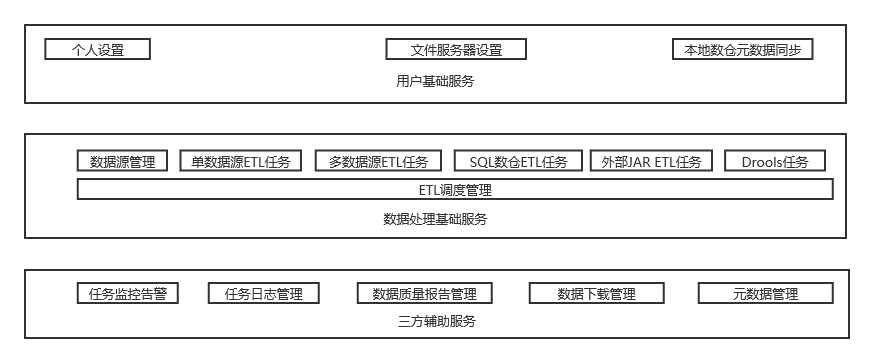
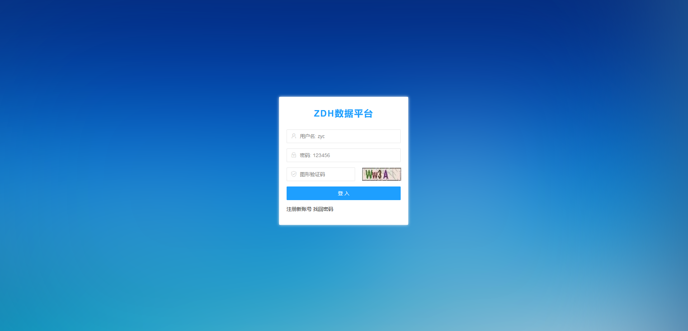
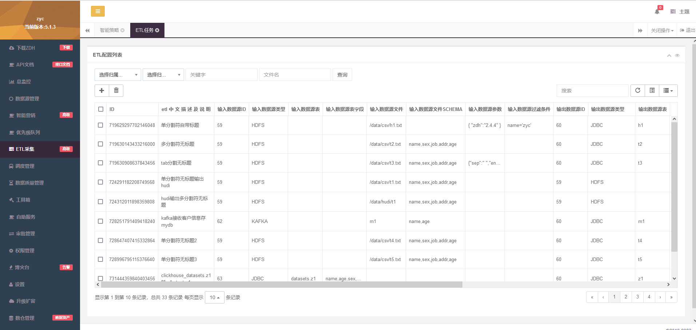
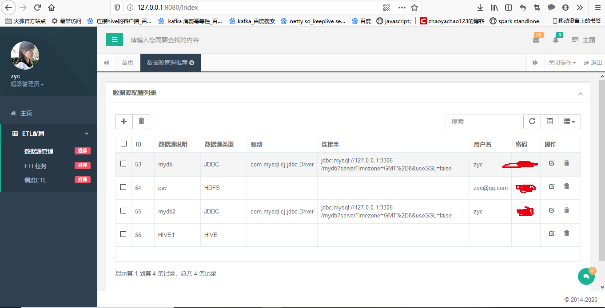
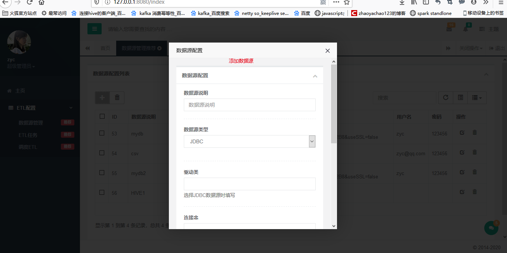
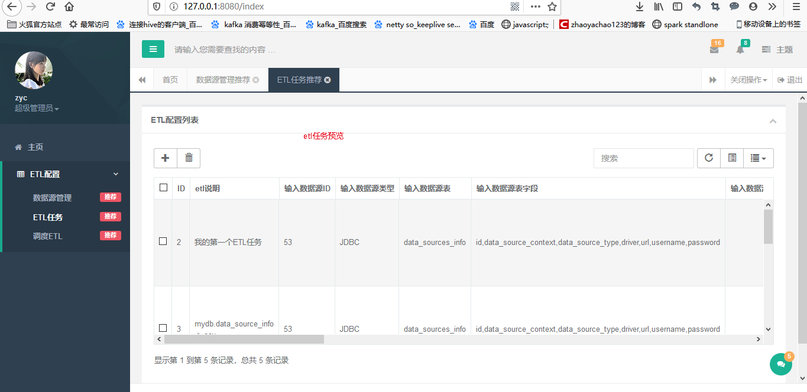
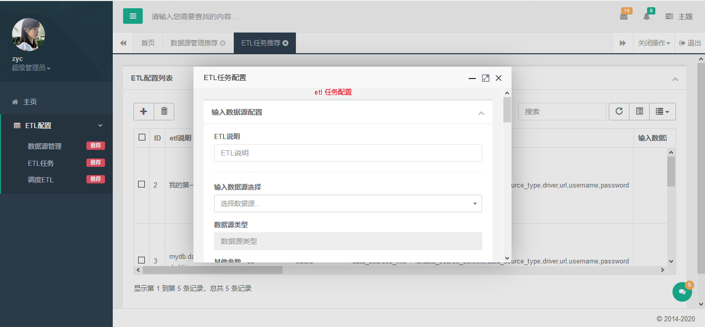

# 数据采集,处理,监控,调度,管理一体化平台

# 提示
   
    zdh 分2部分,前端配置+后端数据ETL处理,此部分只包含前端配置
    后端数据etl 请参见项目 https://github.com/zhaoyachao/zdh_server.git
    zdh_web 和zdh_server 保持同步 大版本会同步兼容 如果zdh_web 选择版本1.0 ,zdh_server 使用1.x 都可兼容

# 特色
    开箱即用
    支持多数据源
    高性能数据采集
    单独的调度器,调度也可和三方调度器对接airflow,azkaban
    二次开发
    
   
# 使用场景
  + 数据采集(本地上传数据,hdfs,jdbc,http,cassandra,mongodb,redis,kafka,hbase,es,sftp,hive)
  + 数据加密
  + 数据转换,数据离线同步,实时数据同步
  + 质量检测
  + 元数据,指标管理
  + drools灵活动态的数据清洗
  
  
  
# 主要功能
 zdh 主要的作用 是从hdfs,hive,jdbc,http-json接口 等数据源拉取数据,并转存到hdfs,hive,jdbc等其他数据源
 支持集群式部署
 
 
  + 支持sql标准函数
  + 支持界面选择配置
  + 支持快速复制已有任务
  + 支持外部调度工具(需要修改,新增特定接口)
  + 弹性扩展(可单机,可集群)
  + 支持客户级权限
  + 简单易用支持二次开发
  + 自带简单调度工具,可配置定时任务,时间序列任务,设定次数
  + 调度依赖
  + SQL数据仓库数据处理(单一数仓)
  + 质量检测,及对应报告
  + 支持SHELL 命令,SHELL 脚本,JDBC查询调度,HDFS查询调度
  + 支持本地上传,下载文件
  + 支持多源ETL
  + 任务监控
  + 灵活动态drools规则清理
  
# 功能图
  
  
# 版本更新说明
  + v1.0 支持常用数据jdbc,hive,kafka,http,flume,redis,es,kudu,mongodb,hbase,cassandra,hdfs(csv,json,orc,parquet,xml,excel...),本地上传数据(csv)
  + v1.0 调度支持任务依赖等
 
  + v1.1 支持clickhouse-jdbc
  
  + v1.2 支持外部jar etl任务(任务状态需要外部jar 自己跟踪)
  
  + v1.3 支持drools 数据清理
  
  
# FAQ
    shell 脚本格式
    
    window:
    @echo off
    ping -c 4 www.baidu.com1
    :throw
    if %ERRORLEVEL% EQU 1 exit 1 goto end //此处捕获不可少,异常 输出exit 1
    :end
    echo "success"
    exit 0 //此处不可少 正常输出 exit 0
    
    linux
    ping -c 4 www.baidu.com1
    if [ $? -eq 0 ];then
    exit 0
    else
    exit 1
    fi
 
 # 支持的数据源
   + 本地文件
   + hive(单集群使用多个远程hive,以及内外部表)
   + hdfs(csv,txt,json,orc,parquet,avro)
   + jdbc (所有的jdbc,包含特殊jdbc如hbase-phoenix,spark-jdbc,click-house)
   + hbase
   + mongodb
   + es
   + kafka
   + http
   + sftp
   + cassandra
   + redis
   + flume

# 支持的调度对象
   + shell 命令
   + 数据库查询
   + 特色开发jar
   
# 支持的调度器模式
   + 时间序列(时间限制,次数限制)
   + 单次执行
   + 重复执行(次数限制,时间限制)
   
# 支持调度动态日期参数   
   详见说明文档
 
# 用到的技术体系

    前端：Bootstrap
    后端：Springboot+shiro+redis+mybatis
    数据ETL引擎:Spark(hadoop,hive 可选择部署)
    
# 下载修改基础配置

    打开resources/application-dev.properties
     1 修改服务器端口默认8081
     2 修改数据源连接(默认支持mysql8),外部数据库必须引入
     3 修改redis配置

    创建需要的数据库配置
     1 执行sql脚本db.sql
     
    依赖
     1 必须提前安装redis 

# 下载编译好的包

    1 找到项目目录下的release 目录 直接将release 目录拷贝
    2 到relase的bin 目录下执行start 脚本(启动脚本必须到bin 目录下执行)
    3 执行编译好的包需要提前安装mysql8,redis

# 源码自定义打包
    
    清理命令 mvn clean
    打包命令 mvn package -Dmaven.test.skip=true

# 运行
    在target 目录下找到zdh.jar
    执行 java  -Dfile.encoding=utf-8 -jar zdh.jar
   
# 版本计划
  + 1.1 计划支持FTP 调度
  + 1.1 计划支持HFILE 直接读取功能
  + 1.1 docker 部署
  + 2.X 单任务多数据源处理
    

 
# 个人联系方式
    邮件：1209687056@qq.com
    
    在线寻求一位前端码友,因个人不善前端,所以无法完成数据处理任务的拖拉拽操作,如果那个码友感兴趣,可以联系我

#  在线预览
    http://zycblog.cn:8081/login
    用户名：zyc
    密码：123456
    
    服务器资源有限,界面只供预览,不包含数据处理部分,谢码友们手下留情
    
# 界面预览   

 
 