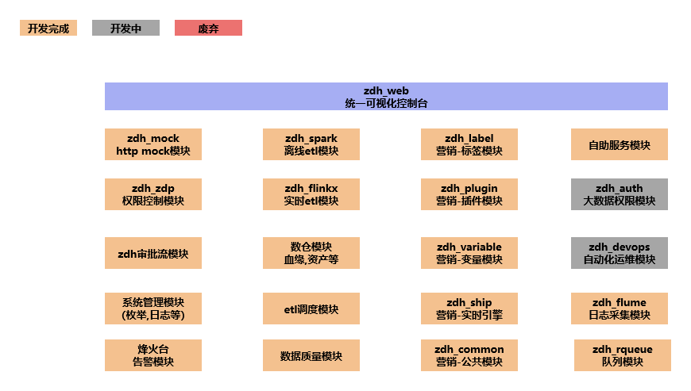
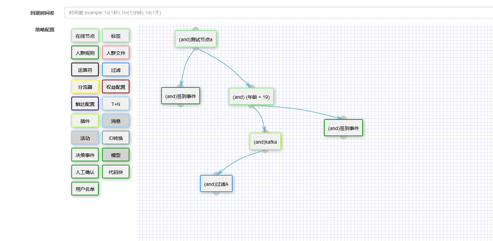

<!-- START doctoc generated TOC please keep comment here to allow auto update -->
<!-- DON'T EDIT THIS SECTION, INSTEAD RE-RUN doctoc TO UPDATE -->
**Table of Contents**  *generated with [DocToc](https://github.com/thlorenz/doctoc)*

- [READ MORE](#read-more)
- [数据采集,处理,监控,调度,管理一体化平台](#%E6%95%B0%E6%8D%AE%E9%87%87%E9%9B%86%E5%A4%84%E7%90%86%E7%9B%91%E6%8E%A7%E8%B0%83%E5%BA%A6%E7%AE%A1%E7%90%86%E4%B8%80%E4%BD%93%E5%8C%96%E5%B9%B3%E5%8F%B0)
- [项目模块划分](#%E9%A1%B9%E7%9B%AE%E6%A8%A1%E5%9D%97%E5%88%92%E5%88%86)
- [开源/闭源版本](#%E5%BC%80%E6%BA%90%E9%97%AD%E6%BA%90%E7%89%88%E6%9C%AC)
- [下载编译包](#%E4%B8%8B%E8%BD%BD%E7%BC%96%E8%AF%91%E5%8C%85)
- [在线预览](#%E5%9C%A8%E7%BA%BF%E9%A2%84%E8%A7%88)
- [快速开始](#%E5%BF%AB%E9%80%9F%E5%BC%80%E5%A7%8B)
  - [基础环境](#%E5%9F%BA%E7%A1%80%E7%8E%AF%E5%A2%83)
  - [配置修改(最少修改如下配置)](#%E9%85%8D%E7%BD%AE%E4%BF%AE%E6%94%B9%E6%9C%80%E5%B0%91%E4%BF%AE%E6%94%B9%E5%A6%82%E4%B8%8B%E9%85%8D%E7%BD%AE)
  - [源码编译](#%E6%BA%90%E7%A0%81%E7%BC%96%E8%AF%91)
  - [运行](#%E8%BF%90%E8%A1%8C)
- [FAQ](#faq)
- [提示](#%E6%8F%90%E7%A4%BA)
- [特色](#%E7%89%B9%E8%89%B2)
- [使用场景](#%E4%BD%BF%E7%94%A8%E5%9C%BA%E6%99%AF)
- [主要功能](#%E4%B8%BB%E8%A6%81%E5%8A%9F%E8%83%BD)
- [用到的技术体系](#%E7%94%A8%E5%88%B0%E7%9A%84%E6%8A%80%E6%9C%AF%E4%BD%93%E7%B3%BB)
- [功能图](#%E5%8A%9F%E8%83%BD%E5%9B%BE)
- [版本更新说明](#%E7%89%88%E6%9C%AC%E6%9B%B4%E6%96%B0%E8%AF%B4%E6%98%8E)
- [版本迁移步骤](#%E7%89%88%E6%9C%AC%E8%BF%81%E7%A7%BB%E6%AD%A5%E9%AA%A4)
  - [4.7.15迁移4.7.16](#4715%E8%BF%81%E7%A7%BB4716)
  - [4.7.16迁移4.7.17](#4716%E8%BF%81%E7%A7%BB4717)
  - [4.7.17迁移4.7.18](#4717%E8%BF%81%E7%A7%BB4718)
  - [4.7.18迁移5.0.0](#4718%E8%BF%81%E7%A7%BB500)
  - [5.0.0迁移5.1.0](#500%E8%BF%81%E7%A7%BB510)
  - [5.1.0迁移5.1.1](#510%E8%BF%81%E7%A7%BB511)
  - [5.1.1迁移5.1.2](#511%E8%BF%81%E7%A7%BB512)
  - [5.1.2迁移5.1.3](#512%E8%BF%81%E7%A7%BB513)
  - [5.1.3迁移5.2.0](#513%E8%BF%81%E7%A7%BB520)
  - [5.2.0迁移5.2.1](#520%E8%BF%81%E7%A7%BB521)
  - [5.2.1迁移5.2.2](#521%E8%BF%81%E7%A7%BB522)
  - [5.2.2迁移5.2.3](#522%E8%BF%81%E7%A7%BB523)
  - [5.2.3迁移5.3.0](#523%E8%BF%81%E7%A7%BB530)
  - [5.3.0迁移5.3.1](#530%E8%BF%81%E7%A7%BB531)
  - [5.3.1迁移5.3.2](#531%E8%BF%81%E7%A7%BB532)
  - [5.3.2迁移5.3.3](#532%E8%BF%81%E7%A7%BB533)
- [未完成的功能](#%E6%9C%AA%E5%AE%8C%E6%88%90%E7%9A%84%E5%8A%9F%E8%83%BD)
- [支持的数据源](#%E6%94%AF%E6%8C%81%E7%9A%84%E6%95%B0%E6%8D%AE%E6%BA%90)
- [支持的调度对象](#%E6%94%AF%E6%8C%81%E7%9A%84%E8%B0%83%E5%BA%A6%E5%AF%B9%E8%B1%A1)
- [支持的调度器模式](#%E6%94%AF%E6%8C%81%E7%9A%84%E8%B0%83%E5%BA%A6%E5%99%A8%E6%A8%A1%E5%BC%8F)
- [支持调度动态日期参数](#%E6%94%AF%E6%8C%81%E8%B0%83%E5%BA%A6%E5%8A%A8%E6%80%81%E6%97%A5%E6%9C%9F%E5%8F%82%E6%95%B0)
- [版本计划](#%E7%89%88%E6%9C%AC%E8%AE%A1%E5%88%92)
- [个人联系方式](#%E4%B8%AA%E4%BA%BA%E8%81%94%E7%B3%BB%E6%96%B9%E5%BC%8F)
- [权益](#%E6%9D%83%E7%9B%8A)
- [界面预览](#%E7%95%8C%E9%9D%A2%E9%A2%84%E8%A7%88)

<!-- END doctoc generated TOC please keep comment here to allow auto update -->

# READ MORE
[English description](README_en.md)

# 数据采集,处理,监控,调度,管理一体化平台
    因本项目没有其他文档,请使用者及开发者详细阅读完本readme 文档,后期会以博客的形式对本项目进行详细功能说明
   博客目录地址：  [https://blog.csdn.net/zhaoyachao123/article/details/113913947](https://blog.csdn.net/zhaoyachao123/article/details/113913947)
   

   欢迎你对本项目提出相关issue
   
   本平台主要目的
   + 高效的进行数据采集,构建自己的大数据平台
   + 统一数据管理,对数据进行高效分析及对外输出
   + 通过工具完成大部分工作,减少开发者的工作量
   + 降低使用者标准,通过拖拉拽实现数据的采集(任务依赖关系由自带调度完成-优势)
   + 本平台的初衷及目的尽量减少开发者的工作量及降低数据开发者的使用门槛
   + 基于当前大数据平台开发智能营销系统
   + 记录平时工作中遇到的挑战
   
# 项目模块划分
      项目涉及方向较多,技术杂乱
      包含以下几个项目,以下几个项目都是单独的git仓库
      zdh_web: zdh系列项目web管理端,提供可视化配置,比如ETL,调度,mock服务,权限管理,数仓模块等
      zdh_spark: 基于spark的etl处理,必须依赖zdh_web github: https://github.com/zhaoyachao/zdh_server
      zdh_flinkx: 基于flink sql的etl处理,必须依赖zdh_web github: https://github.com/zhaoyachao/zdh_flinkx
      zdh_mock: 基于netty的http-mock服务,必须依赖zdh_web github: https://github.com/zhaoyachao/zdh_mock
      zdh_rqueue: 计划开发一个非高性能的优先级可控队列(用于etl任务优先级控制),github: https://github.com/zhaoyachao/zdh_rqueue
      zdh_auth: 大数据统一权限管理(hadoop,hive,hbase,presto),开发中
      zdh_magic_mirror: 是一个客户管理模块,客户画像,智能营销等服务,主要包括common,label, plugin, ship, variable, 5个模块 github: https://github.com/zhaoyachao/zdh_magic_mirror
         common: 公共模块
         label: 客户管理-标签服务,必须依赖zdh_web,主要提供离线批量圈人功能
         plugin: 客户管理-通用插件服务,提供id_mapping,过滤,触达用户(发送短信,邮件等)
         ship: 客户管理-实时经营服务,实时接入用户流量,对用户做经营
         variable: 客户管理-变量服务,和label服务能力一样,区别在于一个离线处理,一个实时处理
     
   
    
   
# 开源/闭源版本
   + 全部开放源代码
   
# 下载编译包   
   + 编译包下载地址(只提供最新编译包下载,历史版本需要手动从源码构建)：
   + 执行编译好的包需要提前安装mysql8,redis
   
   + 历史版本不进行维护,可下载历史版本, 建议使用最新版本(功能更多)
     
   + 4.7.18版本全部采用maven管理,并重构quartz源码,4.7.18不可和之前任何历史版本重用
   + 4.7.18为4.x最后一个版本,5.x版本会重构所有代码,自2022-02-06~2022-06-01不进行新功能开发,此段时间会完善使用文档
     
   + 5.1.0之后版本不提供编译包下载,需要用户在github上自行编译
     

#  在线预览
   [http://zycblog.cn:8081/login](http://zycblog.cn:8081/login)
   
    用户名：zyc
    密码：123456
    
    服务器资源有限,界面只供预览,不包含数据处理部分,谢码友们手下留情

# 快速开始

## 基础环境
    1 执行编译好的包需要提前安装mysql8,redis
    2 jdk1.8
    
## 配置修改(最少修改如下配置)
    1 修改服务器端口默认8081
       对应参数server.port = 8081
    2 修改数据源连接(默认支持mysql8),外部数据库必须引入
       
    3 修改redis配置
        spring.redis.开头参数
        
    4 修改application-*配置文件中myid(多个服务依次1,2,3,...)
       对应参数myid=1
    
## 源码编译
    sh build.sh

## 运行
    4.7.13 之前
      在target 目录下找到zdh_web.jar
      执行 java  -Dfile.encoding=utf-8 -jar zdh_web.jar  
    4.7.13及之后5.1.1之前
      进入在xxx-RELEASE 目录下
      执行 java -jar -Dfile.encoding=utf-8 -Dloader.path=libs/,conf zdh_web.jar 
      
    5.1.1及之后
      进入在xxx-RELEASE 目录下
      启动执行 sh bin/start.sh 或者 sh bin/zdh_web.sh start
      关闭执行 sh bin/stop.sh 或者 sh bin/zdh_web.sh stop
      
    idea开发工具运行源码须知
       需要提前设置环境变量,edit configurations->enviorment variables-> 新增ZDH_RUN_MODE=prod, 可选值tmp,prod,dev

# FAQ

   + sql结构报错
     quartz 相关的表必须大写
     
   + 日志级别修改
     修改日志文件logback 相关等级即可
     
   + 调度串行并行模式
     串行模式:会判断上次任务运行状态
     并行模式:不判断上次任务状态,时间会自动生成 
     
   + 数据表结构以release/db/zdh_xxx.sql 为准
   
   + 暂不支持读取kerberos 认证的hadoop,hive,hbase 服务,预计在5.x 版本实现kerberos 认证      
    
# 提示
   
    zdh 分2部分,前端配置+后端数据ETL处理,此部分只包含前端配置
    后端数据etl 请参见项目 https://github.com/zhaoyachao/zdh_server.git
    zdh_web 和zdh_server 保持同步 大版本会同步兼容 如果zdh_web 选择版本1.0 ,zdh_server 使用1.x 都可兼容
    二次开发同学 请选择dev 分支,dev 分支只有测试通过才会合并master,所以master 可能不是最新的,但是可保证可用性
    
    zdh 智能营销模块-还为完全开发完成,只有部分功能可用,之后可能会是一个类似saas服务的平台

# 特色
    开箱即用
    支持多数据源
    高性能数据采集
    单独的调度器,调度也可和三方调度器对接airflow,azkaban
    二次开发
    
   
# 使用场景
  + 数据采集(本地上传数据,hdfs,jdbc,http,cassandra,mongodb,redis,kafka,hbase,es,sftp,hive)
  + 数据加密
  + 数据转换,数据离线同步,实时数据同步
  + 数据迁移
  + 质量检测
  + 元数据,指标管理
  + drools灵活动态的数据清洗(废弃)
  
  
  
# 主要功能
 zdh 主要的作用 是从hdfs,hive,jdbc,http-json接口 等数据源拉取数据,并转存到hdfs,hive,jdbc等其他数据源
 支持集群式部署
 
 
  + 支持sql标准函数
  + 支持界面选择配置
  + 支持快速复制已有任务
  + 支持外部调度工具(需要修改,新增特定接口)
  + 弹性扩展(可单机,可集群)
  + 支持客户级权限
  + 简单易用支持二次开发
  + 自带简单调度工具,可配置定时任务,时间序列任务,设定次数
  + 调度依赖
  + SQL数据仓库数据处理(单一数仓)
  + 质量检测,及对应报告
  + 支持SHELL 命令,SHELL 脚本,JDBC查询调度,HDFS查询调度
  + 支持本地上传,下载文件
  + 支持多源ETL
  + 任务监控
  + 灵活动态drools规则清理
  
# 用到的技术体系

    前端：Bootstrap
    后端：Springboot+shiro+redis+mybatis
    数据ETL引擎:Spark(hadoop,hive 可选择部署)
    
  
# 功能图
  
  
# 版本更新说明
  + v1.0 支持常用数据jdbc,hive,kafka,http,flume,redis,es,kudu,mongodb,hbase,cassandra,hdfs(csv,json,orc,parquet,xml,excel...),本地上传数据(csv)
  + v1.0 调度支持任务依赖等
 
  + v1.1 支持clickhouse-jdbc
  
  + v1.2 支持外部jar etl任务(任务状态需要外部jar 自己跟踪)
  
  + v1.3 支持drools 数据清理
  
  + v1.4 支持greenplum-jdbc
  
  + v2.0 删除外部jar 任务使用ssh 任务代替,ssh任务功能新增
  + v2.0 drools 任务增加支持多源和sql任务
  + v2.0 clickhouse,hive spark数据源优化
  + v2.0 spark sftp数据框架改动,增加sftp excel 和多分隔符支持
  + v2.0 调度重试机制优化,增加节点失败重发功能(任务重启)
  + v2.0 增加调度单独告警机制
  + v2.0 server 模块高可用机制改动为负载高可用
  + v2.0 hbase,drools jar冲突bug 修复
  + v2.0 支持ssh 任务静态脚本,动态脚本
  + v2.0 kafka,flume实时数据源删除必须使用jdbc输出源限制
  + v2.0 修复spark 监控bug,移动spark监控到总监控

  + v2.1 zdh_web 添加redis cluster 支持
  + v2.1 增加jdbc支持presto,mariadb,memsql,华为dws,阿里AnalyticDB,kylin,gbase,kingbase,redshift
  
  + v2.2 调度机制增加ack,无感故障转移
  + v2.2 优化所有前端界面,增加状态高亮
  + v2.2 sql 编辑支持高亮显示
  + v2.2 手动执行调度改为异步执行
  + v2.2 任务日志获取方式改变（时间获取改为标识符+时间获取）
  
  + v3.0 前端界面状态可视化优化
  + v3.0 去除task_logs 任务日志表,增加task_log_instance 表作为替换(大变动2.0 版本和3.0 完全不兼容)
  + v3.0 修复favicon显示bug
  + v3.0 增加调度器端的故障转移
  + v3.0 监控界面增加手动重试功能
  + v3.0 拆分quartz_job_info 调度任务表,每次执行调度任务会生成一个当前状态的实例表(重试,故障转移,ack等都基于实例表完成逻辑操作)
  + v3.0 增加单任务并行处理机制接口(只留了实现接口,并未做具体实现,暂不支持单任务并行)
  + v3.0 zdh_web项目增加调度器id(主要用做故障转移,判断任务是否是故障转移触发)
  + v3.0 手动执行删除重置功能(会生成一个实例,所以去掉重置功能)
  + v3.0 手动执行,调度执行都会删除之前的实例依赖(手动执行后,必须手动设置正确的调度时间)
  + v3.0 增加数据采集后端任务杀死功能
  + v3.0 增加超时告警任务-只告警不杀死
  + v3.0 hbase 删除jersey相关jar,解决jar冲突
  + v3.0 批量删除增加确认删除弹框
  + v3.0 修改spark 任务job组说明格式
  
  + v3.1 任务依赖检查实现方式修改
  + v3.1 增加cron 表达式生成页面
  + v3.1 文件名增加动态设置(根据时间生成特定规则文件名)
  + v3.1 启动时基础参数校验
  + v3.1 quartz 任务优先级设定
  + v3.1 增加支持quartz时间触发(串行+并行方式都支持)
  + v3.1 新增dag 工具类(计划3.2版本支持dag调度)
  
  + v4.0 实现调度拖拉拽
  + v4.0 重新实现任务发现机制
  + v4.0 增加任务组,子任务概念实现组任务
  + v4.0 实现dag调度
  + v4.0 实现调度流程图
  + v4.0 重新实现任务类型(4.x之前版本不兼容)
  + v4.0 增加greenplum-spark连接器
  + v4.0 全新逻辑,值得一试
  
  + v4.1 修复4.0 调度重试bug
  + v4.1 修复4.0 调度界面bug
  + v4.1 重新实现时间选取机制,调度性能提高
  + v4.1 修改监控界面去除组任务监控按钮添加子任务监控界面
  
  + v4.2 修复4.1bug
  + v4.2 sql脚本增加中文说明
  
  + v4.3 增加部分子任务重试机制
  + v4.3 增加手动执行部分子任务机制
  + v4.3 增加子任务运行时依赖图展示
  + v4.3 任务状态增加跳过状态
  + v4.3 优化logback日志配置
  + v4.3 修复手动重试新版bug
  + v4.3 删除zookeeper工具包
  + v4.3 删除[重复执行]调度任务模式
  + v4.3 删除mq配置信息
  + v4.3 删除netty工具包
  
  + v4.4 优化前端界面,日志界面每次打开新标签页
  + v4.4 优化超时告警
  + v4.4 修复SSH未结束异常
  + v4.4 删除多余的debug
  + v4.4 调整quartz延迟启动60s->20s
  + v4.4 删除线程池(影响SSH任务-待优化)
  
  + v4.5 修复检查任务组时空类型异常
  
  + v4.6 优化日志记录界面,增加日志下载,优化日志展示风格
  + v4.6 补充tidb任务说明
  + v4.6 增加自定义时间参数(高级使用)
  + v4.6 优化调度拖拽逻辑,简化数据结构
  + v4.6 修改jinjava 版本为2.5.6
  + v4.6 增加调度任务禁用功能
  + v4.6 增加调度任务组模块
  + v4.6 增加权限管理功能,功能菜单权限
  + v4.6 增加外部jdbc任务依赖检查

  + v4.7 修复4.6jdbc依赖检查杀死问题
  + v4.7 修复执行器死亡检测不到问题
  + v4.7 修复监控主界面杀死任务组问题
  + v4.7 计划支持滚动升级(目前滚动升级只完成了一键部署和扩容功能,未实现动态管理web节点上下线)
  + v4.7 升级jsch 版本为0.1.55
  + v4.7 优化任务界面模糊查询
  + v4.7 优化日志界面时间
  + v4.7 优化shell脚本特殊符号
  
  + v4.7.1 新增一键部署及优化
  + v4.7.2 修复js中多余alert
  + v4.7.2 修复jdbc任务依赖时无效bug
  + v4.7.3 增加任务触发模式(上游成功触发?上游失败触发)
  + v4.7.3 task_log_instance 增加depend_level 字段(作用判断任务触发状态)
  + v4.7.3 优化任务组监控界面进度中文注释信息
  + v4.7.4 修复任务组杀死时部分任务依旧显示运行中bug
  + v4.7.5 增加采集任务指定集群执行(仅支持etl采集任务,对jdbc,shell,group等检查依赖任务无此功能,切换调度集群更方便如yarn)
  + v4.7.6 无大修改,优化logback 配置文件启用滚动日志
  + v4.7.7 优化jdbc任务禁用按钮
  + v4.7.7 增加jdbc依赖任务写入功能(之前版本只支持查询不支持写入-指标完成标识功能衍化)
  + v4.7.8 增加给作者提bug(联系作者)功能
  + v4.7.9 废弃JdbcJob,HdfsJob,以任务流依赖检查模块实现依赖检查
  + v4.7.9 废弃InstanceStatus,统一使用JobStatus 管理任务状态
  + v4.7.9 优化jinjava 参数,统一时间参数
  + v4.7.9 优化shell job 时间参数,增加实时日志展示
  + v4.7.10 优化数据表字段注释
  + v4.7.10 优化生成server端任务日志
  + v4.7.10 前端增加数据源可空功能
  + v4.7.10 新增数据源逻辑删除功能(数据源表结构变动)
  
  + v4.7.11 优化spark-jdbc性能增加提前过滤功能
  + v4.7.11 增加请求版本号url(http://xxx:port/version)
  + v4.7.11 调度界面优化-增加默认值,及不可为空校验
  + v4.7.11 增加hdfs调度组件解决检查hdfs文件是否存在
  + v4.7.11 优化通知界面,显示通知信息
  + v4.7.11 优化杀死任务时异常
  + v4.7.11 增加数据发布,申请,审批功能
  + v4.7.11 新增申请源ETL(使用他人发布的数据作为输入数据源)
  + v4.7.11 增加新的表结构apply_info,etl_apply_task_info
  + v4.7.11 优化串行作业组杀死功能,上游杀死,则对应下游任务直接杀死
  + v4.7.11 增加发布数据-增删改查功能
  + v4.7.11 增加quartz并发参数配置
  + v4.7.11 开启调度时超过最大调度时间弹框提示
  + v4.7.11 作业组为空时,优化作业组结束状态
  + v4.7.11 告警作业限制只检查最近2天内的失败作业
  + v4.7.11 优化shell脚本前端编辑器
  + v4.7.11 修复调度自定义表达式天级表达式
  + v4.7.11 修复空作业组杀死时状态未改变bug
  + v4.7.11 修复shell任务ping命令杀死异常
  + v4.7.11 手动执行任务,重试任务不限制调度日期检查
  + v4.7.11 db.sql脚本增加菜单表,权限表数据
  + v4.7.11 task_log_instance,task_group_log_instance 增加调度来源字段标识任务触发来源
  + v4.7.11 数据源逻辑删除修复更新时异常bug
  + v4.7.11 优化日志界面状态外观
  + v4.7.11 增加etl任务配置时,数据倾斜,分区,合并小文件,写入模式参数
  + v4.7.11 修复etl任务表达式列表多次增加问题(前端优化)
  + v4.7.11 修复shell任务调度死掉自动重试
  + v4.7.11 子任务界面显示job_id
  + v4.7.11 zdh_server增加hdfs输出数据源zk路径解析功能
  + v4.7.11 修改多源任务临时表实现
  + v4.7.11 修复多源任务前端bug(表头信息更新不成功)
  + v4.7.11 优化子任务界面状态显示
  + v4.7.11 优化权限界面统一返回值数据结构
  + v4.7.11 优化etl任务界面统一返回值数据结构
  + v4.7.11 优化告警模块-增加失败告警,完成通知,超时通知
  + v4.7.11 平台消息通知重构,统一增加消息管理模块
  + v4.7.11 修复shiro 获取用户信息异常
  + v4.7.11 统一返回数据结构,并重构controller层
  + v4.7.11 增加FLINK采集模块
  + v4.7.11 优化登陆模块-增加验证码shiro整合
  + v4.7.11 FLINK增加checkpoint机制
  + v4.7.11 重构html引入项目根目录
  + v4.7.11 升级springboot版本1.5.7至1.5.22
  + v4.7.11 重构登陆页面,注册页面
  + v4.7.11 增加账户禁用启用功能
  + v4.7.11 废弃旧版权限模块-改动为 用户->角色->资源 模型模式
  + v4.7.11 调度任务配置首页增加cron表达式生成链接
  + v4.7.11 首页去除角色显示,使用签名替换
  + v4.7.11 菜单管理-新增资源类型,支持接口权限
  + v4.7.11 重构审批流-支持多人审批,删除旧版数据审批模块
  + v4.7.11 修复shiro 查询用户信息时无效bug
  + v4.7.11 增加我发起的流程,流程进度信息
  + v4.7.11 数据申请使用审批流重构
  + v4.7.11 修复通知信息-重复显示问题(删除页面下拉面板)
  + v4.7.11 禁用shiro授权缓存
  + v4.7.11 更新发布数据时,通知下游具体修改内容
  + v4.7.11 修改菜单类型,增加内置页面类型
  + v4.7.11 统一controller层映射规则
  + v4.7.11 开启接口权限验证
  + v4.7.11 flink状态监控及更新
  + v4.7.11 修复server_ack机制
  + v4.7.11 修复重试-显示禁用任务bug
  + v4.7.11 web支持flink增加杀死,重试机制
  + v4.7.11 重试时,至少有一个子任务,否则无法重试
  + v4.7.11 flink端判定任务状态检查
  
  + v4.7.12 优化quartz 超大量任务引起的重复执行问题
  + v4.7.12 增加【jdbc引擎ETL】,使用presto,clickhouse等jdbc引擎ETL时,可单独使用zdh_web完成,不集成zdh_server
  + v4.7.12 历史【jdbc依赖】优化
  
  + v4.7.13 springboot jar 分离
  
  + v4.7.14 增加【datax引擎】,通过调度实现可视化配置
  + v4.7.14 调度页面告警用户账户由输入框改为多选下拉框(模糊匹配)
  + v4.7.14 优化任务组更新时间,任务更新时间
  + v4.7.14 优化mybatis-generator插件配置,启用自动生成
  + v4.7.14 修复数据源新增权限问题
  
  + v4.7.15 修复数据源字段获取权限,上传文件权限
  + v4.7.15 单独拆分数据质量检测模块,新增数据质量规则
  + v4.7.15 修复v4.7.12至4.7.14中发送任务模块到server(spark)失败bug
  + v4.7.15 优化加载通知有每10秒改为每60秒加载
  
  + v4.7.16 检查是否存在log4j2漏洞(无)
  + v4.7.16 优化调度新增页面,增加告警账号不可为空限制
  + v4.7.16 增加血源分析(目前只支持1层上下游关系-待优化)
  + v4.7.16 修复task_group_logs_delete权限
  + v4.7.16 新增权限dispatch_task_execute_time
  + v4.7.16 新增调度时间预查看
  + v4.7.16 增加数据源逻辑删除
  + v4.7.16 菜单资源页面,角色配置页面 增加树查询功能
  + v4.7.16 调度页面-复制功能bug修复
  + v4.7.16 数据源增加更新字段
  + v4.7.16 删除历史数据源逻辑层,使用Dao层代替
  + v4.7.16 修复ssh页面关闭无效bug
  + v4.7.16 单源ETL,多源ETL,SSH,SQL,FLINK_SQL,JDBC_SQL,申请源ETL 增加逻辑删除和更新时间
  
  + v4.7.17 接口无权限-增加ZDH告警
  + v4.7.17 修复every_day_notice接口,无数据异常bug
  + v4.7.17 修复操作日志写入字符个数
  + v4.7.17 增加批量任务生成工具
  + v4.7.17 优化ZDH目录生成,支持多层级目录生成
  + v4.7.17 新增工具箱目录,迁移Cron,操作日志,整库迁移到工具箱下
  + v4.7.17 取消所有dataSourcesService层,直接使用dao层代替
  + v4.7.17 优化通知信息,增加逻辑删除
  + v4.7.17 优化目录-增加提示语
  + v4.7.17 修复调度页面Shell显示bug
  + v4.7.17 替换全局editor为monaco editor(界面更加清晰美观)
  + v4.7.17 优化调度新增页面js(删除无用js)
  + v4.7.17 申请源ETL增加明细查询权限
  + v4.7.17 删除所有日志打印,统一使用logger管理
  + v4.7.17 增加ZDH项目下载地址
  
  + v4.7.18 替换编辑器为monaco editor
  + v4.7.18 修改fastjson:1.2.44升级为1.2.69
  + v4.7.18 修改shiro:1.4.0升级1.7.1
  + v4.7.18 mysql:8.0.11升级为8.0.13
  + v4.7.18 commons-io:2.6升级2.7
  + v4.7.18 httpclient:4.5.5升级4.5.13
  + v4.7.18 删除shiro自动session验证,采用zdh自带quartz任务重写session校验
  + v4.7.18 增加调度器管理-可对线上已开启的调度器-自动上线下线
  + v4.7.18 新增菜单时-增加图标查看网址
  + v4.7.18 修复flink任务杀死bug
  + v4.7.18 zdh_server更名为zdh_spark,zdh_flink更名为zdh_flinkx 项目管理工具使用maven代替gradle
  + v4.7.18 重构zdh_flinkx 项目架构
  + v4.7.18 调度任务-调度时间策略-使用quartz触发时间为默认策略
  + v4.7.18 实现自定义quartz instance_id 生成策略
  + v4.7.18 调度任务增加quartz miss策略
  + v4.7.18 调度任务修改quartz触发逻辑-修复quartz触发时间和quartz逻辑调度时间
  + v4.7.18 增加系统监控api
  + v4.7.18 优化审批流-动态使用审批节点
  + v4.7.18 增加枚举管理
  + v4.7.18 SSH,SFTP增加免密登录
  + v4.7.18 修复数据质量检测提示错误
  + v4.7.18 废弃js/jsplumb/index2.js
  + v4.7.18 增加tomcat线程配置参数
  + v4.7.18 修改mysql8默认密码验证为mysql_native_password模式
  + v4.7.18 修复用户中心接口地址请求,支持多项目名
  + v4.7.18 修复数据仓库信息更新时,发布状态异常bug
  + v4.7.18 优化资源配置页面,交互更加友好
  + v4.7.18 修复增加根项目名,部分页面无法获取数据bug
  + v4.7.18 数据源增加权限控制
  + v4.7.18 系统限流等动态参数配置
  
  + v5.0.0 增加数据资产导出功能
  + v5.0.0 增加调度器自动启动配置
  + v5.0.0 增加数据资产查询
  + v5.0.0 日志下载增加白名单
  + v5.0.0 实现非结构化数据录入-并自动生成对应关系
  + v5.0.0 实现非结构化数据录入数据源-只支持sftp,ftp,hdfs
  + v5.0.0 [zdh_spark]修复hbase写入动态更新进度bug
  + v5.0.0 [zdh_spark]修复hbase写入时,原始数据为空时无法写入bug
  + v5.0.0 [zdh_spark]优化kafka数据写入
  + v5.0.0 优化404页面,增加403无权限页面
  + v5.0.0 功能权限(角色,资源)-增加产品绑定
  + v5.0.0 [zdh_spark]升级hudi-spark版本0.5.1==>0.10.1
  + v5.0.0 重构zdh_spark 进度监控
  + v5.0.0 优化登录页面-验证码,及验证码无效提示
  + v5.0.0 优化列表页面无权限提示
  + v5.0.0 修复web端登录后,再次使用login页面无跳转首页bug
  + v5.0.0 删除自定义StringUtils使用common-lang3.StringUtils
  + v5.0.0 requestmapping注解中补全请求类型
  + v5.0.0 整合springdoc,当前不完善,因json解析冲突,会出现json错误日志(不影响系统)
  + v5.0.0 优化枚举,增加枚举类别显示
  + v5.0.0 增加系统监控任务列表,启用,禁用
  + v5.0.0 优化日志打印
  + v5.0.0 数据资产页面增加分页大小
  + v5.0.0 优化数据资产获取标签逻辑,改用通过获取枚举类别获取数据资产的标签
  + v5.0.0 迁移验证码接口到LoginController层
  + v5.0.0 操作日志增加耗时
  + v5.0.0 无权限增加操作日志
  + v5.0.0 日志打开时间条件查询,修复监控页面组日志日期无效bug
  + v5.0.0 审批页面-增加跳过流程,申请页面-增加跳过流程
  + v5.0.0 申请页面bug修复
  + v5.0.0 优化登录页面背景
  + v5.0.0 appication相关配置文件修改编码为utf-8
  + v5.0.0 增加spark数据源解析
  + v5.0.0 pom增加screw数据库文档生成插件
  + v5.0.0 增加系统访问限制(zdh_is_pass)
  + v5.0.0 优化系统参数配置,同步redis增加失效限制
  + v5.0.0 优化mybatis like 查询
  + v5.0.0 修复部分页面查询条件无效
  + v5.0.0 修复审批流配置-查询条件无效
  + v5.0.0 数据库timestamp类型改为datetime类型
  + v5.0.0 优化数据资产分页
  + v5.0.0 增加首页公告弹框,及展示类型(弹框,文字)
  + v5.0.0 增加ip黑名单限制访问
  + v5.0.0 操作日志增加ip记录
  + v5.0.0 增加系统名可修改
  + v5.0.0 优化首页主题,增加主题记住功能
  + v5.0.0 增加http,email任务调度功能
  + v5.0.0 修复资源更新父节点,层级未修改bug
  + v5.0.0 增加自助SQL查询服务
  + v5.0.0 开启druid监控
  + v5.0.0 优化controller层所有接口,增加请求类型
  + v5.0.0 删除jdbc任务输出源配置
  + v5.0.0 优化调度配置JDBC模块-替换编辑器组件
  + v5.0.0 优化重试任务组页面-增加图关系展示
  + v5.0.0 修复组日志查看时时间为空问题
  + v5.0.0 优化日志打印-增加用户名,拆分sql日志
  + v5.0.0 增加用户黑名单限制
  + v5.0.0 删除quartz模块切面
  + v5.0.0 优化调度重试界面,杀死任务增加默认重试
  + v5.0.0 重试最新执行,增加任务信息最新版
  
  + v5.0.1 [zdh_web] 修复greenplum链接时无法获取表名问题
  + v5.0.1 [zdh_web] 验证gbase链接时是否获取表名问题
  
  + v5.1.0 [zdh_web]增加标签模块(为用户画像,智能营销做基础)
  + v5.1.0 [zdh_web]优化数据源查询,区分下拉框和列表
  + v5.1.0 [zdh_web]新增权限用户信息表和用户表分离、
  + v5.1.0 [zdh_web]分离用户认证和权限校验
  + v5.1.0 [zdh_web]修复审批管理-审批人配置用户组刷新问题
  + v5.1.0 [zdh_web]审批人配置-用户id改为用户账户
  + v5.1.0 [zdh_web]生成审批流和获取审批信息改为通过账户获取
  + v5.1.0 [zdh_web]数据源用户组获取逻辑重构
  + v5.1.0 [zdh_web]用户验证后同步权限信息
  + v5.1.0 [zdh_web]权限管理-角色资源增加更新时间
  + v5.1.0 [zdh_web]增加权限接口-方便其他系统使用权限管理
  + v5.1.0 [zdh_web]获取账号逻辑变更,改为从权限系统获取
  + v5.1.0 [zdh_spark]修复配置文件名错误
  + v5.1.0 [zdh_web]优化调度ETL配置时禁用实时反显
  + v5.1.0 [zdh_web]更换登录和注册页背景图,删除多余图片
  + v5.1.0 [zdh_web]调度手动执行增加图展示
  + v5.1.0 [zdh_web]调度模块jdbc增加数据源选择
  + v5.1.0 [zdh_web]新增通用角色
  + v5.1.0 [zdh_web]新增流程审批api-方便其他系统使用流程管理
  + v5.1.0 [zdh_web]流程管理owner 由用户id改为用户名
  + v5.1.0 [zdh_web]新增人群规则模块[标签+人群文件]
  + v5.1.0 [zdh_web]删除检查任务依赖时,多余日志
  + v5.1.0 [zdh_web]新增分流模块[定义多种分流规则]
  + v5.1.0 [zdh_web]注册时自动关联权限模块,并使用默认基础角色
  + v5.1.0 [zdh_web]修复查询操作日志时,部分日志获取失败
  + v5.1.0 [zdh_web]通知模块增加不展示功能
  + v5.1.0 [zdh_web]认证模块增加加密方式-自定义加密
  + v5.1.0 [zdh_web]优化登录失败提示
  + v5.1.0 [zdh_web]审批流-新增外部系统处理标识
  + v5.1.0 [zdh_web]新增权限申请功能
  + v5.1.0 [zdh_web]修复数据权限-数据标识和数据组标识前端异常bug
  + v5.1.0 [zdh_web]优化角色编辑模块-角色code不可更改
  + v5.1.0 [zdh_web]策略组增加过滤分流组实现,禁用分流code,这样下游就不用关心分流code,只需按流程图走向进行处理即可
  + v5.1.0 [zdh_web]aop日志记录404跳转日志未打印日志修复
  + v5.1.0 [zdh_web]参数配置模块-优化owner,增加日志存储类型参数
  + v5.1.0 [zdh_web]新增redis_params配置文件,用于系统恢复系统级参数
  + v5.1.0 [zdh_web][zdh_spark]支持mongodb日志
  + v5.1.0 [zdh_web]操作日志增加分页
  + v5.1.0 [zdh_web]修复redis接口权限认证
  + v5.1.0 [zdh_web]优化owner为用户名
  + v5.1.0 [zdh_web]任务实例表增加索引
  + v5.1.0 [zdh_web]二次重构审批流-增加图形可视化配置,废弃【审批人配置】,新增【审批流配置】,新增默认审批人
  + v5.1.0 [zdh_web]审批人配置表增加产品代码,审批说明信息,产品和审批code不可更改
  + v5.1.0 [zdh_web]数据资产-新增通知下游功能(邮件通知)
  + v5.1.0 [zdh_web]修复403页面显示问题
  + v5.1.0 [zdh_web]数据标识 增加产品过滤功能
  + v5.1.0 [zdh_web]新增组增加产品标识
  + v5.1.0 [zdh_web]调度模块-http组件增加header,cookie参数
  + v5.1.0 [zdh_web]多源ETL增加雪花算法生成唯一ID
  + v5.1.0 [zdh_web]ssh类型任务,优化杀死算法
  + v5.1.0 [zdh_web]修复查询数据标识-增加产品代码限制
  + v5.1.0 [zdh_web]人群规则使用流程图可多父/多子节点实现
  + v5.1.0 [zdh_web]整合优先级队列
  + v5.1.0 [zdh_web]新增任务手动跳过功能
  + v5.1.0 [zdh_web]日志采集-flume【待优化】
  + v5.1.0 [zdh_web]接口文档生成功能
  + v5.1.0 [zdh_web]修复pom文件三方jdbc未打包问题
  + v5.1.0 [zdh_web]新增达梦jdbc驱动
  + v5.1.0 [zdh_web]新增接口文档说明smart-doc
  + v5.1.0 [zdh_web]修复v5.10调度任务选择spark集群无效bug
  + v5.1.0 [zdh_web]增加spark集群任务校验,是否超过最大任务量
  + v5.1.0 [zdh_web]修复aop记录返回类型
  
  
  + v5.1.1 [zdh_web]增加wemock实现,单独新增zdh_mock模块(基于netty的实现的http服务)
  + v5.1.1 [zdh_web]增加 资源信息根节点不可删除 校验
  + v5.1.1 [zdh_web]优化pom文件,删除非必须jar配置
  + v5.1.1 [zdh_web]优化日志查询开始时间
  + v5.1.1 [zdh_web]优化登录获取系统名接口,新增系统背景图配置
  + v5.1.1 [zdh_web]ak,sk增加时间校验
  + v5.1.1 [zdh_web]调度检查类增加接口CheckDepJobInterface,自定义调度类必须实现此接口
  + v5.1.1 [zdh_web]优化label项目
  + v5.1.1 [zdh_web]修复智能营销客群执行接口异常
  + v5.1.1 [zdh_web]智能营销增加推送类型,可选则数据库,消息队列2种交互方式
  + v5.1.1 [zdh_web]智能营销-标签参数配置增加参数类型
  + v5.1.1 [zdh_web]智能营销-策略增加是否base数据(做排除时必须指定一个base数据)
  + v5.1.1 [zdh_web]智能营销模块-优化策略
  + v5.1.1 [zdh_web]智能营销模块-新增过滤规则配置,优化策略组配置过滤规则反显
  + v5.1.1 [zdh_web]jsplumb插件优化,修复部分反显问题(涉及调度可视化,策略组可视化)
  + v5.1.1 [zdh_web]mybatis generator优化增加mapper继承(主要解决自定义sql覆盖问题,当前方案并非最优)
  + v5.1.1 [zdh_web]策略组,策略新增字段,优化divId
  + v5.1.1 [zdh_web]策略组增加执行记录
  + v5.1.1 [zdh_web]优化jdbc schema查询接口
  + v5.1.1 [zdh_web]优化日志格式,增加logId
  + v5.1.1 [zdh_web]修复分流字段错误
  + v5.1.1 [zdh_web]智能营销-实现过滤,分流功能
  + v5.1.1 [zdh_web]标签筛选实现相对时间
  + v5.1.1 [zdh_web]智能营销-标签增加数据源
  + v5.1.1 [zdh_web]智能营销-修复禁用反显问题
  + v5.1.1 [zdh_web]智能营销-人群文件实现增删改查,文件增加数据类型字段
  + v5.1.1 [zdh_web]智能营销-增加not_use可截断上游数据操作
  + v5.1.1 [zdh_web]新增selectInput组件
  + v5.1.1 [zdh_web]重新规划日志,增加request日志
  + v5.1.1 [zdh_web]优化数据源下拉框格式
  + v5.1.1 [zdh_web]datax_web升级版开发
  + v5.1.1 [zdh_web]修复历史datax任务节点死亡未自动重试bug
  + v5.1.1 [zdh_web]修复配置文件获取python_home参数自动获取到环境变量问题,修改参数python_home为python_engine(当前解决方案不太合理,使用者尽量避免使用python_engine做环境变量)
  + v5.1.1 [zdh_web]新增系统管理员邮件告警
  + v5.1.1 [zdh_web]优化权限管理-用户角色绑定关系-code代替id绑定(影响以下模块模块,角色管理,审批流,权限申请,查询个人资源权限)
  + v5.1.1 [zdh_web]触达配置-增加短信签名,模板,平台信息
  + v5.1.1 [zdh_web]智能营销-实现触达模块【开发中】
  + v5.1.1 [zdh_web]优化pom文件smart-doc插件配置
  + v5.1.1 [zdh_web]智能营销-人群文件上传优化
  + v5.1.1 [zdh_web]修复权限管理-用户配置产品线为空异常
  + v5.1.1 [zdh_web]单独增加用户组配置功能
  + v5.1.1 [zdh_web]支持hadoop权限可视化配置
  + v5.1.1 [zdh_web]支持hive权限可视化配置
  + v5.1.1 [zdh_web][zdh_mock]支持接口禁用,增加mock日志查询
  + v5.1.1 [zdh_web]增加限流控制(自定义redis实现),优化aop操作日志,增加ip解析
  + v5.1.1 [zdh_web]修复智能营销-禁用控制,标签任务禁用结果直接设置为空,非标签的其他流程处理任务禁用结果复用上游结果
  + v5.1.1 [zdh_web]优化标签配置格式,抽象出operate和value
  + v5.1.1 [zdh_web]修复etl调度状态初始化异常(百万分之一的概率触发)
  + v5.1.1 [zdh_web]etl调度增加最后一次结束判断
  + v5.1.1 [zdh_web]修复email,http任务机器挂掉导致未自动重试bug
  + v5.1.1 [zdh_web]优化用户账号session过期检查
  + v5.1.1 [zdh_web]调度支持指定调度器执行(需要优化,目前指定调度器执行,如果调度器死亡,则不会使用自动故障转移)
  + v5.1.1 [zdh_web]审批流增加代理人审批
  + v5.1.1 [zdh_web]优化quartz配置-采用配置文件替换代码格式
  + v5.1.1 [zdh_web]权限模块-资源管理增加title提示资源类型
  + v5.1.1 [zdh_web]增加mybatis自定义生成代码(非通用,只适合当前项目)
  + v5.1.1 [zdh_web]修复审批流更新时bug
  + v5.1.1 [zdh_web]优化日志滚动格式,改为只按小时滚动,sql日志增加uuid日志标识
  + v5.1.1 [zdh_web]新增过滤模块【过滤列表】
  + v5.1.1 [zdh_web]新增策略组模块
  + v5.1.1 [zdh_web]标签新增状态能力-为之后标签数据调度提供状态机
  + v5.1.1 [zdh_web]新增ID MAPPING配置能力
  + v5.1.1 [zdh_web]使用redisson模块实现限流功能
  
  + v5.1.2 [zdh_web]新增账号禁用
  + v5.1.2 [zdh_web]智能营销模块新增risk插件,用于实时风控
  + v5.1.2 [zdh_ship]修复经营策略执行图解析功能
  + v5.1.2 [zdh_web] 数据标识,产品标识,系统设置,血缘分析,审批管理controller层,统一返回数据结构【进行中】
  + v5.1.2 [zdh_web]修复etl获取数据schema时bug
  + v5.1.2 [zdh_web]优化代码生成工具,controller层统一返回数据结构
  + v5.1.2 [zdh_web]智能营销模块-策略重试功能(不重新生成任务)
  + v5.1.2 [zdh_web]修复idmaping编辑后展示问题
  + v5.1.2 [zdh_web]智能营销模块-杀死策略组实例
  + v5.1.2 [zdh_web]智能营销模块-成功策略新增重新执行功能
  + v5.1.2 [zdh_web]智能营销模块-跳过策略逻辑修改(修改逻辑,跳过策略状态会设置为初始化太,coustomer模块会根据is_disenable判断是否复用上游数据)
  + v5.1.2 [zdh_web]智能营销模块-增加实时日志
  + v5.1.2 [zdh_web]模块增加功能说明(每个列表右上方的小眼睛)
  + v5.1.2 [zdh_web]etl任务执行线程增加线程名称
  + v5.1.2 [zdh_web]智能营销模块-优化杀死逻辑,coustomer模块增加杀死功能
  + v5.1.2 [zdh_web]智能营销模块-新增手动确认插件
  + v5.1.2 [zdh_web]权限模块-产品增加权限校验,新增产品管理员,修复产品删除bug
  + v5.1.2 [zdh_web]权限模块-新增产品管理员申请,审批
  + v5.1.2 [zdh_web]修复注册失败bug,优化注册时默认增加角色,注册时增加全局检查账号是否存在
  + v5.1.2 [zdh_web]get相关请求增加去除缓存
  + v5.1.2 [zdh_web]审批模块优化,增加产品限制
  + v5.1.2 [zdh_web]权限模块-新增维度模型,用于实现数据权限(历史上使用数据标识模型实现数据权限)
  + v5.1.2 [zdh_web]智能营销模块-部分插件补充运算符
  + v5.1.2 [zdh_web]修复获取schema时获取失败bug
  + v5.1.2 [zdh_web]智能营销-标签管理标签参数验证
  + v5.1.2 [zdh_web]重新生成banner图标
  + v5.1.2 [zdh_web]智能营销-完善自动化调度
  + v5.1.2 [zdh_web]etl模块-调度优化状态机
  + v5.1.2 [zdh_web]目录修复展示bug
  + v5.1.2 [zdh_web]启动脚本增加多pfofiles选择
  + v5.1.2 [zdh_web]智能营销-实现数据下载
  + v5.1.2 [zdh_web]新增filter初始化参数
  + v5.1.2 [zdh_web]新增sentinel流量控制(结合zdh权限控制实现动态流控-未使用sentinel控制台,之后版本会考虑整合)
  + v5.1.2 [zdh_web]智能营销模块-增加数据权限控制(基于oa系统ABAC模式权限改造)
  
  + v5.1.3 [zdh_web]审批流模块接入数据权限控制
  + v5.1.3 [zdh_web]优化mybatis使用
  + v5.1.3 [zdh_web]etl,调度模块接入数据权限控制
  + v5.1.3 [zdh_web]优化数据insert/update逻辑,并修复数据库新增字段异常
  + v5.1.3 [zdh_web]数据权限控制-为什么需要选择归属产品和归属组,归属产品可以认为是公司所属平台分类,归属组是平台下业务线的分类
  + v5.1.3 [zdh_web]多数模块接入数据权限,简单做saas服务雏形,目前还不完善
  + v5.1.3 [zdh_web]优化shiro-redis集成,删除多余的引用包
  
  + v5.2.0 [zdh_web]策略组增加小流量支持
  + v5.2.0 [zdh_web]优化数据mapper层insert/update
  + v5.2.0 [zdh_web]修复审批流bug,新增产品线导致
  + v5.2.0 [zdh_web]新增多种角色控制
  + v5.2.0 [zdh_web]新注册用户增加默认角色
  + v5.2.0 [zdh_web]新增烽火台告警模块
  + v5.2.0 [zdh_web]优化pom引入版本变量
  + v5.2.0 [zdh_web]修复列表插件多选bug
  + v5.2.0 [zdh_web]智能营销模块-执行流程修复bug
  
  + v5.2.1 [zdh_web]优化代码controller层优化引用,增加变量作用域限制
  + v5.2.1 [zdh_web]优化代码basemapper层增加默认表名实现
  + v5.2.1 [zdh_web]数据权限-支持新增/更新/删除,查询在5.1.3版本以支持,查询权限支持缓存
  + v5.2.1 [zdh_web]智能营销-tn插件支持跳过功能
  + v5.2.1 [zdh_web]自动生成basemapper模板更新
  + v5.2.1 [zdh_web]智能营销-在线策略跳过功能-优化策略组状态(原来跳过更新策略组状态为新建,当前改为在线策略组原状态不变动)
  + v5.2.1 [zdh_web]依赖三方版本升级
  + v5.2.1 [zdh_web]智能营销-idmapping模块支持数据引擎
  
  + v5.2.2 [zdh_web]优化小流量管理
  + v5.2.2 [zdh_web]新增函数管理模块
  + v5.2.2 [zdh_web]优化代码
  + v5.2.2 [zdh_web]支持短链mock
  + v5.2.2 [zdh_web]智能营销模块流程执行引擎优化
  + v5.2.2 [zdh_web]智能营销-子任务日志状态显示优化
  
  + v5.2.3 [zdh_web]智能营销-标签管理-新增用户标签值修改
  + v5.2.3 [zdh_web]智能营销-新增根据数据状态流转功能
  + v5.2.3 [zdh_web]数据源管理-删除密码展示
  
  + v5.3.0 [zdh_web]权限模块-用户配置新增创建,更新时间
  + v5.3.0 [zdh_web]智能营销-在线策略组增加自动结束
  + v5.3.0 [zdh_web]智能营销-策略配置标签新增场景选择(离线策略支持实时标签)
  + v5.3.0 [zdh_web]智能营销-新增人群同步redis
  + v5.3.0 [zdh_web]新增参数版本-灰度上线时,解决参数多版本冲突
  + v5.3.0 [zdh_web]etl新增kettle类任务(新增kettle相关jar)
  + v5.3.0 [zdh_web]代码生成模板优化
  + v5.3.0 [zdh_web]调度任务禁用
  + v5.3.0 [zdh_web]统一参数获取工具类
  + v5.3.0 [zdh_web]新增策略版本日志
  
  + v5.3.1 [zdh_web]重构zdh_queue(为后期实时经营做基础)
  
  + v5.3.2 [zdh_web]所有模块优化代码
  + v5.3.2 [zdh_web]新增ZDH_RUN_MODE环境变量
  + v5.3.2 [zdh_web]营销模块调度执行完成状态未更新bug修复
  + v5.3.2 [zdh_web]营销模块新增自动同步小流量
  + v5.3.2 [zdh_web]使用mapstruct代替apache beanutils工具
  
  + v5.3.3 [zdh_web]优化营销展示提示
  + v5.3.3 [zdh_web]新增代码块demo
  + v5.3.3 [zdh_magic_mirror] 同步优化代码块执行逻辑,修复历史bug
  + v5.3.3 [zdh_magic_mirror] 修复内存泄漏bug
  
  + v5.3.4 [zdh_web]修复调度etl对象复制bug
  + v5.3.4 [zdh_web]优化营销模块展示配置
  + v5.3.4 [zdh_magic_mirror]优化function模块
  + v5.3.4 [zdh_web]etl任务新增队列方式,优化excutor重试机制,增加有效时间内重试限制
  + v5.3.4 [zdh_web]优化移动端展示
  + v5.3.4 [zdh_web]权限管理-优化图标库展示
  + v5.3.4 [zdh_web]优化告警模块,新增语法例子
  + v5.3.4 [zdh_web]新增客户管理-客户画像
  
  + v5.1.1 [zdh_web]支持hadoop,hive,hbase大数据权限(用户认证,数据权限)【未完成】
  + v5.1.0 [zdh_web]验证kingbase链接时是否获取表名问题【未完成】
  + v5.1.0 [zdh_web]验证sqlserver链接时是否获取表名问题【未完成】
  + v5.1.0 [zdh_web]历史遗留支持spark-greenplum 链接器【未完成】
  + v5.1.0 标签模块-增加标签加工任务【开发中】
 
  
  
  
# 版本迁移步骤  
## 4.7.15迁移4.7.16
    alter table data_sources_info add column update_time timestamp default null comment '更新时间';
    alter table etl_task_info add column update_time timestamp default current_timestamp() comment '更新时间';
    alter table etl_task_info add column is_delete varchar(16) default "0" comment '是否删除,0:未删除,1:删除';
    
    alter table etl_more_task_info add column update_time timestamp default current_timestamp() comment '更新时间';
    alter table etl_more_task_info add column is_delete varchar(16) default "0" comment '是否删除,0:未删除,1:删除';
    
    alter table sql_task_info add column update_time timestamp default current_timestamp() comment '更新时间';
    alter table sql_task_info add column is_delete varchar(16) default "0" comment '是否删除,0:未删除,1:删除';
    
    alter table ssh_task_info add column update_time timestamp default current_timestamp() comment '更新时间';
    alter table ssh_task_info add column is_delete varchar(16) default "0" comment '是否删除,0:未删除,1:删除';
    
    
    alter table etl_task_flink_info add column is_delete varchar(16) default "0" comment '是否删除,0:未删除,1:删除';
    
    alter table etl_task_jdbc_info add column update_time timestamp default current_timestamp() comment '更新时间';
    alter table etl_task_jdbc_info add column is_delete varchar(16) default "0" comment '是否删除,0:未删除,1:删除';
    
    alter table etl_task_datax_info add column update_time timestamp default current_timestamp() comment '更新时间';
    alter table etl_task_datax_info add column is_delete varchar(16) default "0" comment '是否删除,0:未删除,1:删除';
    
    alter table etl_apply_task_info add column update_time timestamp default current_timestamp() comment '更新时间';
    
    CREATE TABLE `alarm_sms_info` (
      `id` bigint NOT NULL AUTO_INCREMENT,
      `title` varchar(500) DEFAULT NULL COMMENT '任务说明',
      `msg` text COMMENT '信息',
      `msg_type` varchar(100) DEFAULT NULL COMMENT '信息类型，通知,营销',
      `msg_url` varchar(500) DEFAULT NULL COMMENT '短信附带连接',
      `phone` varchar(100) DEFAULT NULL COMMENT '手机号',
      `status` varchar(8) DEFAULT '0' COMMENT '状态,0:未处理,1:处理中,2:失败,3:成功,4:不处理',
      `create_time` timestamp NULL DEFAULT NULL COMMENT '创建时间',
      `update_time` timestamp NULL DEFAULT NULL COMMENT '更新时间',
      PRIMARY KEY (`id`)
    ) ENGINE=InnoDB DEFAULT CHARSET=utf8mb4 ;
    
    CREATE TABLE `user_operate_log` (
      `id` bigint NOT NULL AUTO_INCREMENT,
      `owner` varchar(500) DEFAULT NULL COMMENT '账号',
      `user_name` varchar(500) DEFAULT NULL COMMENT '用户名',
      `operate_url` varchar(500) COMMENT '操作url',
      `operate_context` varchar(500) COMMENT '操作说明',
      `operate_input` text  COMMENT '输入参数',
      `operate_output` text COMMENT '输出结果',
      `create_time` timestamp NULL DEFAULT NULL COMMENT '创建时间',
      `update_time` timestamp NULL DEFAULT NULL COMMENT '更新时间',
      PRIMARY KEY (`id`)
    ) ENGINE=InnoDB DEFAULT CHARSET=utf8mb4 ;
  
  
## 4.7.16迁移4.7.17
     CREATE TABLE `etl_task_batch_info` (
       `id` bigint NOT NULL AUTO_INCREMENT,
       `etl_pre_context` varchar(200) DEFAULT NULL COMMENT '任务说明',
       `etl_suffix_context` varchar(200) DEFAULT NULL COMMENT '任务说明',
       `data_sources_choose_input` varchar(100) DEFAULT NULL COMMENT '输入数据源id',
       `data_source_type_input` varchar(100) DEFAULT NULL COMMENT '输入数据源类型',
       `data_sources_table_name_input` varchar(100) DEFAULT NULL COMMENT '输入数据源表名',
       `data_sources_file_name_input` varchar(100) DEFAULT NULL COMMENT '输入数据源文件名',
       `data_sources_params_input` varchar(500) DEFAULT NULL COMMENT '输入数据源参数',
       `data_sources_filter_input` varchar(500) DEFAULT NULL COMMENT '输入数据源过滤条件',
       `data_sources_choose_output` varchar(100) DEFAULT NULL COMMENT '输出数据源id',
       `data_source_type_output` varchar(100) DEFAULT NULL COMMENT '输出数据源类型',
       `data_sources_table_name_output` varchar(100) DEFAULT NULL COMMENT '输出数据源表名',
       `data_sources_file_name_output` varchar(100) DEFAULT NULL COMMENT '输出数据源文件名',
       `data_sources_params_output` varchar(500) DEFAULT NULL COMMENT '输出数据源参数',
       `data_sources_clear_output` varchar(500) DEFAULT NULL COMMENT '数据源数据源删除条件',
       `owner` varchar(100) DEFAULT NULL COMMENT '拥有者',
       `create_time` timestamp NULL DEFAULT NULL COMMENT '创建时间',
       `company` varchar(100) DEFAULT NULL COMMENT '表所属公司',
       `section` varchar(100) DEFAULT NULL COMMENT '表所属部门',
       `service` varchar(100) DEFAULT NULL COMMENT '表所属服务',
       `update_context` varchar(100) DEFAULT NULL COMMENT '更新说明',
       `file_type_input` varchar(10) DEFAULT NULL COMMENT '输入文件类型',
       `encoding_input` varchar(10) DEFAULT NULL COMMENT '输入文件编码',
       `sep_input` varchar(10) DEFAULT NULL COMMENT '输入分割符',
       `file_type_output` varchar(10) DEFAULT NULL COMMENT '输出文件类型',
       `encoding_output` varchar(10) DEFAULT NULL COMMENT '输出文件编码',
       `sep_output` varchar(10) DEFAULT NULL COMMENT '输出文件分割符',
       `header_input` varchar(10) DEFAULT NULL COMMENT '输入是否包含表头',
       `header_output` varchar(10) DEFAULT NULL COMMENT '输出是否包含表头',
       `repartition_num_input` varchar(64) NOT NULL DEFAULT '' COMMENT '洗牌个数默认空',
       `repartition_cols_input` varchar(256) NOT NULL DEFAULT '' COMMENT '洗牌字段默认空',
       `model_output` varchar(64) NOT NULL DEFAULT '' COMMENT '写入模式默认空',
       `partition_by_output` varchar(256) NOT NULL DEFAULT '' COMMENT '分区字段默认空',
       `merge_output` varchar(256) NOT NULL DEFAULT '-1' COMMENT '合并小文件默认-1 不合并',
       `update_time` timestamp NULL DEFAULT NULL COMMENT '更新时间',
       `is_delete` varchar(16) DEFAULT '0' COMMENT '是否删除,0:未删除,1:删除',
       `status` varchar(8) not null default '0' comment '0:未执行,1:执行中,2:执行失败,3:执行成功',
       PRIMARY KEY (`id`)
     ) ENGINE=InnoDB DEFAULT CHARSET=utf8mb4;

    alter table resource_tree_info add column notice_title varchar(8) not null default '' comment '提示语';
  
## 4.7.17迁移4.7.18
    CREATE TABLE `quartz_executor_info` (
      `id` bigint NOT NULL AUTO_INCREMENT,
      `instance_name` varchar(512) DEFAULT NULL COMMENT '调度器唯一实例名',
      `status` varchar(200) DEFAULT NULL COMMENT '任务说明',
      `is_handle` varchar(100) DEFAULT NULL COMMENT '是否处理过,true/false',
      `create_time` timestamp NULL DEFAULT NULL COMMENT '创建时间',
      `update_time` timestamp NULL DEFAULT NULL COMMENT '更新时间',
      PRIMARY KEY (`id`)
    ) ENGINE=InnoDB DEFAULT CHARSET=utf8mb4;
    
    -- 此处qrtz表名确定是否大写,如果数据库开启不区分大小写,可小写,否则必须使用QRTZ_SCHEDULER_STATE
    alter table qrtz_scheduler_state add column STATUS varchar(16) not null default 'online' comment '状态，下线offline,上线online';

    -- 调度增加策略模式
    alter table quartz_job_info add column misfire varchar(8) not null default '0' comment '恢复策略,0:无操作,1:所有历史重新执行,2:最近一次历史重新执行';
    -- 增加审批流优化
    alter table resource_tree_info add column event_code varchar(64) not null default '' comment '绑定事件';
    update resource_tree_info set event_code='data_pub' where url='issue_data_add';
    update resource_tree_info set event_code='data_apply' where url='data_apply_add';
    
    -- 增加枚举管理
    CREATE TABLE `enum_info` (
      `id` bigint NOT NULL AUTO_INCREMENT,
      `enum_code` varchar(512) DEFAULT NULL COMMENT '枚举标识',
      `enum_context` varchar(200) DEFAULT NULL COMMENT '枚举说明',
      `enum_type` varchar(100) DEFAULT NULL COMMENT '枚举类型',
      `enum_json` text comment '枚举明细',
      `owner` varchar(64) default null COMMENT '拥有者',
      `is_delete` varchar(16) DEFAULT '0' COMMENT '是否删除,0:未删除,1:删除',
      `create_time` timestamp NULL DEFAULT NULL COMMENT '创建时间',
      `update_time` timestamp NULL DEFAULT NULL COMMENT '更新时间',
      PRIMARY KEY (`id`)
    ) ENGINE=InnoDB DEFAULT CHARSET=utf8mb4;
   
    INSERT INTO resource_tree_info
    (id, parent, `text`, `level`, owner, icon, resource_desc, `order`, is_enable, create_time, update_time, url, resource_type, notice_title, event_code)
    VALUES(934820298253930496, '802848818109353984', '枚举管理', '2', '1', 'fa fa-cubes', '', '10', '1', '2022-01-23 14:42:07', '2022-01-23 14:42:41', 'enum_index', '2', '', '');
    INSERT INTOresource_tree_info
    (id, parent, `text`, `level`, owner, icon, resource_desc, `order`, is_enable, create_time, update_time, url, resource_type, notice_title, event_code)
    VALUES(934820739683454976, '934820298253930496', '查询', '3', '1', 'fa fa-coffee', '', '1', '1', '2022-01-23 14:43:52', '2022-01-23 14:43:52', 'enum_list', '5', '', '');
    INSERT INTO resource_tree_info
    (id, parent, `text`, `level`, owner, icon, resource_desc, `order`, is_enable, create_time, update_time, url, resource_type, notice_title, event_code)
    VALUES(934899005698084864, '934820298253930496', '新增页面', '3', '1', 'fa fa-coffee', '', '2', '1', '2022-01-23 19:54:53', '2022-01-23 19:54:53', 'enum_add_index', '3', '', '');
    INSERT INTO resource_tree_info
    (id, parent, `text`, `level`, owner, icon, resource_desc, `order`, is_enable, create_time, update_time, url, resource_type, notice_title, event_code)
    VALUES(934899134614212608, '934820298253930496', '新增', '3', '1', 'fa fa-coffee', '', '3', '1', '2022-01-23 19:55:23', '2022-01-23 19:55:23', 'enum_add', '5', '', '');
    INSERT INTO resource_tree_info
    (id, parent, `text`, `level`, owner, icon, resource_desc, `order`, is_enable, create_time, update_time, url, resource_type, notice_title, event_code)
    VALUES(934899250242785280, '934820298253930496', '删除', '3', '1', 'fa fa-coffee', '', '4', '1', '2022-01-23 19:55:51', '2022-01-23 19:55:51', 'enum_delete', '5', '', '');
    INSERT INTO resource_tree_info
    (id, parent, `text`, `level`, owner, icon, resource_desc, `order`, is_enable, create_time, update_time, url, resource_type, notice_title, event_code)
    VALUES(934899352286007296, '934820298253930496', '更新', '3', '1', 'fa fa-coffee', '', '5', '1', '2022-01-23 19:56:15', '2022-01-23 19:56:15', 'enum_update', '5', '', '');
    INSERT INTO resource_tree_info
    (id, parent, `text`, `level`, owner, icon, resource_desc, `order`, is_enable, create_time, update_time, url, resource_type, notice_title, event_code)
    VALUES(934926419119575040, '934820298253930496', '明细', '3', '1', 'fa fa-coffee', '', '6', '1', '2022-01-23 21:43:48', '2022-01-23 21:43:48', 'enum_detail', '5', '', '');

    CREATE TABLE `param_info` (
      `id` bigint NOT NULL AUTO_INCREMENT,
      `param_name` varchar(512) DEFAULT NULL COMMENT '参数名称',
      `param_value` text COMMENT '参数名称',
      `param_context` varchar(200) DEFAULT NULL COMMENT '参数说明',
      `param_type` varchar(100) DEFAULT NULL COMMENT '参数类型',
      `param_timeout` varchar(200) DEFAULT NULL COMMENT '缓存超时时间,单位秒',
      `owner` varchar(64) default null COMMENT '拥有者',
      `status` varchar(64) default null COMMENT '状态,启用:on, 关闭:off',
      `is_delete` varchar(16) DEFAULT '0' COMMENT '是否删除,0:未删除,1:删除',
      `create_time` timestamp  DEFAULT NULL COMMENT '创建时间',
      `update_time` timestamp  DEFAULT NULL COMMENT '更新时间',
      PRIMARY KEY (`id`)
    ) ENGINE=InnoDB DEFAULT CHARSET=utf8mb4;
    
    
    ALTER USER 'zyc'@'%' IDENTIFIED WITH mysql_native_password BY '123456';
    ALTER USER 'zyc'@'127.0.0.1' IDENTIFIED WITH mysql_native_password BY '123456';
    
    FLUSH PRIVILEGES;
    
    alter table issue_data_info add column label_params text  comment '数据标签,多个逗号分割';
    
    CREATE TABLE `data_tag_info` (
      `id` bigint NOT NULL AUTO_INCREMENT,
      `tag_code` varchar(512) DEFAULT NULL COMMENT '标识code',
      `tag_name` varchar(200) DEFAULT NULL COMMENT '标识名称',
      `product_code` varchar(100) DEFAULT NULL COMMENT '产品code',
      `owner` varchar(64) default null COMMENT '拥有者',
      `is_delete` varchar(16) DEFAULT '0' COMMENT '是否删除,0:未删除,1:删除',
      `create_time` timestamp NULL DEFAULT NULL COMMENT '创建时间',
      `update_time` timestamp NULL DEFAULT NULL COMMENT '更新时间',
      PRIMARY KEY (`id`)
    ) ENGINE=InnoDB DEFAULT CHARSET=utf8mb4;
    
    CREATE TABLE `product_tag_info` (
      `id` bigint NOT NULL AUTO_INCREMENT,
      `product_code` varchar(512) DEFAULT NULL COMMENT '产品标识code',
      `product_name` varchar(200) DEFAULT NULL COMMENT '产品名称',
      `owner` varchar(64) default null COMMENT '拥有者',
      `is_delete` varchar(16) DEFAULT '0' COMMENT '是否删除,0:未删除,1:删除',
      `create_time` timestamp NULL DEFAULT NULL COMMENT '创建时间',
      `update_time` timestamp NULL DEFAULT NULL COMMENT '更新时间',
      PRIMARY KEY (`id`)
    ) ENGINE=InnoDB DEFAULT CHARSET=utf8mb4;
    
    CREATE TABLE `data_tag_group_info` (
      `id` bigint NOT NULL AUTO_INCREMENT,
      `tag_group_code` varchar(512) DEFAULT NULL COMMENT '标识组code',
      `tag_group_name` varchar(200) DEFAULT NULL COMMENT '标识组名称',
      `tag_codes` varchar(512) DEFAULT NULL COMMENT '标识code列表,逗号分割',
      `product_code` varchar(100) DEFAULT NULL COMMENT '产品code',
      `owner` varchar(64) default null COMMENT '拥有者',
      `is_delete` varchar(16) DEFAULT '0' COMMENT '是否删除,0:未删除,1:删除',
      `create_time` timestamp NULL DEFAULT NULL COMMENT '创建时间',
      `update_time` timestamp NULL DEFAULT NULL COMMENT '更新时间',
      PRIMARY KEY (`id`)
    ) ENGINE=InnoDB DEFAULT CHARSET=utf8mb4;
    
    alter table account_info add column tag_group_code varchar(512) not null default ''  comment '数据组标识,多个逗号分割';
    alter table data_sources_info add column tag_group_code varchar(512) not null default ''  comment '数据组标识,多个逗号分割';
    
    INSERT INTO resource_tree_info
    (id, parent, `text`, `level`, owner, icon, resource_desc, `order`, is_enable, create_time, update_time, url, resource_type, notice_title, event_code)
    VALUES(934940905796800512, '802848818109353984', 'WEMOCK', '2', '1', 'fa fa-cube', '', '150', '1', '2022-01-23 22:41:22', '2022-01-23 22:41:22', 'abc.html', '2', '开发中', '');
    INSERT INTO resource_tree_info
    (id, parent, `text`, `level`, owner, icon, resource_desc, `order`, is_enable, create_time, update_time, url, resource_type, notice_title, event_code)
    VALUES(936723230184443904, '802919157430489088', 'SparkSql查询表结构', '4', '1', 'fa fa-coffee', '', '7', '1', '2022-01-28 20:43:42', '2022-01-28 20:43:42', 'desc_table', '5', '', '');
    INSERT INTO resource_tree_info
    (id, parent, `text`, `level`, owner, icon, resource_desc, `order`, is_enable, create_time, update_time, url, resource_type, notice_title, event_code)
    VALUES(936943441596649472, '926763179978002432', '参数配置', '3', '1', 'fa fa-diamond', '', '4', '1', '2022-01-29 11:18:44', '2022-01-29 11:18:44', 'param_index', '2', '管理员', '');
    INSERT INTO resource_tree_info
    (id, parent, `text`, `level`, owner, icon, resource_desc, `order`, is_enable, create_time, update_time, url, resource_type, notice_title, event_code)
    VALUES(936943543832809472, '936943441596649472', '查询', '4', '1', 'fa fa-coffee', '', '1', '1', '2022-01-29 11:19:08', '2022-01-29 11:19:08', 'param_list', '5', '', '');
    INSERT INTO resource_tree_info
    (id, parent, `text`, `level`, owner, icon, resource_desc, `order`, is_enable, create_time, update_time, url, resource_type, notice_title, event_code)
    VALUES(936943806161358848, '936943441596649472', '更新页面', '4', '1', 'fa fa-coffee', '', '2', '1', '2022-01-29 11:20:11', '2022-01-29 11:20:11', 'param_add_index', '3', '', '');
    INSERT INTO resource_tree_info
    (id, parent, `text`, `level`, owner, icon, resource_desc, `order`, is_enable, create_time, update_time, url, resource_type, notice_title, event_code)
    VALUES(936943897400053760, '936943441596649472', '新增', '4', '1', 'fa fa-coffee', '', '3', '1', '2022-01-29 11:20:33', '2022-01-29 11:20:33', 'param_add', '5', '', '');
    INSERT INTO resource_tree_info
    (id, parent, `text`, `level`, owner, icon, resource_desc, `order`, is_enable, create_time, update_time, url, resource_type, notice_title, event_code)
    VALUES(936943979792961536, '936943441596649472', '更新', '4', '1', 'fa fa-coffee', '', '4', '1', '2022-01-29 11:20:52', '2022-01-29 11:20:52', 'param_update', '5', '', '');
    INSERT INTO resource_tree_info
    (id, parent, `text`, `level`, owner, icon, resource_desc, `order`, is_enable, create_time, update_time, url, resource_type, notice_title, event_code)
    VALUES(936944089763418112, '936943441596649472', '删除', '4', '1', 'fa fa-coffee', '', '5', '1', '2022-01-29 11:21:19', '2022-01-29 11:21:19', 'param_delete', '5', '', '');
    INSERT INTO resource_tree_info
    (id, parent, `text`, `level`, owner, icon, resource_desc, `order`, is_enable, create_time, update_time, url, resource_type, notice_title, event_code)
    VALUES(936956093823717376, '936943441596649472', '查询明细', '4', '1', 'fa fa-coffee', '', '6', '1', '2022-01-29 12:09:01', '2022-01-29 12:09:01', 'param_detail', '5', '', '');
    INSERT INTO resource_tree_info
    (id, parent, `text`, `level`, owner, icon, resource_desc, `order`, is_enable, create_time, update_time, url, resource_type, notice_title, event_code)
    VALUES(937123552732123136, '810817759893000192', '数据资产', '3', '1', 'fa fa-coffee', '', '4', '1', '2022-01-29 23:14:26', '2022-01-29 23:14:26', 'data_ware_house_index_plus', '2', '', '');
    INSERT INTO resource_tree_info
    (id, parent, `text`, `level`, owner, icon, resource_desc, `order`, is_enable, create_time, update_time, url, resource_type, notice_title, event_code)
    VALUES(938782846959489024, '802932548165439488', '功能权限', '3', '1', 'fa fa-cog', '', '1', '1', '2022-02-03 13:07:52', '2022-02-03 13:08:07', '', '1', '', '');
    INSERT INTO resource_tree_info
    (id, parent, `text`, `level`, owner, icon, resource_desc, `order`, is_enable, create_time, update_time, url, resource_type, notice_title, event_code)
    VALUES(938783170151583744, '802932548165439488', '数据权限', '3', '1', 'fa fa-cog', '', '2', '1', '2022-02-03 13:09:10', '2022-02-03 13:09:10', '', '1', '', '');
    INSERT INTO resource_tree_info
    (id, parent, `text`, `level`, owner, icon, resource_desc, `order`, is_enable, create_time, update_time, url, resource_type, notice_title, event_code)
    VALUES(938783478181269504, '938783170151583744', '数据标识', '4', '1', 'fa fa-cog', '', '1', '1', '2022-02-03 13:10:23', '2022-02-03 13:11:33', 'data_tag_index', '2', '', '');
    INSERT INTO resource_tree_info
    (id, parent, `text`, `level`, owner, icon, resource_desc, `order`, is_enable, create_time, update_time, url, resource_type, notice_title, event_code)
    VALUES(938783882944188416, '938783478181269504', '查询', '5', '1', 'fa fa-coffee', '', '1', '1', '2022-02-03 13:11:59', '2022-02-03 13:11:59', 'data_tag_list', '5', '', '');
    INSERT INTO resource_tree_info
    (id, parent, `text`, `level`, owner, icon, resource_desc, `order`, is_enable, create_time, update_time, url, resource_type, notice_title, event_code)
    VALUES(938784014171377664, '938783478181269504', '新增页面', '5', '1', 'fa fa-coffee', '', '2', '1', '2022-02-03 13:12:31', '2022-02-03 13:12:31', 'data_tag_add_index', '3', '', '');
    INSERT INTO resource_tree_info
    (id, parent, `text`, `level`, owner, icon, resource_desc, `order`, is_enable, create_time, update_time, url, resource_type, notice_title, event_code)
    VALUES(938784115174412288, '938783478181269504', '新增', '5', '1', 'fa fa-coffee', '', '3', '1', '2022-02-03 13:12:55', '2022-02-03 13:12:55', 'data_tag_add', '5', '', '');
    INSERT INTO resource_tree_info
    (id, parent, `text`, `level`, owner, icon, resource_desc, `order`, is_enable, create_time, update_time, url, resource_type, notice_title, event_code)
    VALUES(938784216877895680, '938783478181269504', '更新', '5', '1', 'fa fa-coffee', '', '4', '1', '2022-02-03 13:13:19', '2022-02-03 13:13:19', 'data_tag_update', '5', '', '');
    INSERT INTO resource_tree_info
    (id, parent, `text`, `level`, owner, icon, resource_desc, `order`, is_enable, create_time, update_time, url, resource_type, notice_title, event_code)
    VALUES(938784333840257024, '938783478181269504', '删除', '5', '1', 'fa fa-coffee', '', '5', '1', '2022-02-03 13:13:47', '2022-02-03 13:13:47', 'data_tag_delete', '5', '', '');
    INSERT INTO resource_tree_info
    (id, parent, `text`, `level`, owner, icon, resource_desc, `order`, is_enable, create_time, update_time, url, resource_type, notice_title, event_code)
    VALUES(938785006883442688, '938783170151583744', '产品标识', '4', '1', 'fa fa-cog', '', '2', '1', '2022-02-03 13:16:27', '2022-02-03 13:19:15', 'product_tag_index', '2', '', '');
    INSERT INTO resource_tree_info
    (id, parent, `text`, `level`, owner, icon, resource_desc, `order`, is_enable, create_time, update_time, url, resource_type, notice_title, event_code)
    VALUES(938785227138928640, '938785006883442688', '查询', '5', '1', 'fa fa-coffee', '', '1', '1', '2022-02-03 13:17:20', '2022-02-03 13:17:20', 'product_tag_list', '5', '', '');
    INSERT INTO resource_tree_info
    (id, parent, `text`, `level`, owner, icon, resource_desc, `order`, is_enable, create_time, update_time, url, resource_type, notice_title, event_code)
    VALUES(938785661765292032, '938785006883442688', '新增页面', '5', '1', 'fa fa-coffee', '', '2', '1', '2022-02-03 13:19:04', '2022-02-03 13:19:04', 'product_tag_add_index', '3', '', '');
    INSERT INTO resource_tree_info
    (id, parent, `text`, `level`, owner, icon, resource_desc, `order`, is_enable, create_time, update_time, url, resource_type, notice_title, event_code)
    VALUES(938785831097733120, '938785006883442688', '新增', '5', '1', 'fa fa-coffee', '', '3', '1', '2022-02-03 13:19:44', '2022-02-03 13:19:44', 'product_tag_add', '5', '', '');
    INSERT INTO resource_tree_info
    (id, parent, `text`, `level`, owner, icon, resource_desc, `order`, is_enable, create_time, update_time, url, resource_type, notice_title, event_code)
    VALUES(938785942548779008, '938785006883442688', '更新', '5', '1', 'fa fa-coffee', '', '4', '1', '2022-02-03 13:20:11', '2022-02-03 13:20:11', 'product_tag_update', '5', '', '');
    INSERT INTO resource_tree_info
    (id, parent, `text`, `level`, owner, icon, resource_desc, `order`, is_enable, create_time, update_time, url, resource_type, notice_title, event_code)
    VALUES(938786051592294400, '938785006883442688', '删除', '5', '1', 'fa fa-coffee', '', '5', '1', '2022-02-03 13:20:37', '2022-02-03 13:20:37', 'product_tag_delete', '5', '', '');
    INSERT INTO resource_tree_info
    (id, parent, `text`, `level`, owner, icon, resource_desc, `order`, is_enable, create_time, update_time, url, resource_type, notice_title, event_code)
    VALUES(938879140692496384, '938783478181269504', '明细', '5', '1', 'fa fa-coffee', '', '6', '1', '2022-02-03 19:30:31', '2022-02-03 19:30:31', 'data_tag_detail', '5', '', '');
    INSERT INTO resource_tree_info
    (id, parent, `text`, `level`, owner, icon, resource_desc, `order`, is_enable, create_time, update_time, url, resource_type, notice_title, event_code)
    VALUES(938879269428269056, '938785006883442688', '明细', '5', '1', 'fa fa-coffee', '', '6', '1', '2022-02-03 19:31:01', '2022-02-03 19:31:01', 'product_tag_detail', '5', '', '');
    INSERT INTO resource_tree_info
    (id, parent, `text`, `level`, owner, icon, resource_desc, `order`, is_enable, create_time, update_time, url, resource_type, notice_title, event_code)
    VALUES(939102606079299584, '938783170151583744', '标识组', '4', '1', 'fa fa-cog', '', '3', '1', '2022-02-04 10:18:29', '2022-02-04 10:18:29', 'data_tag_group_index', '2', '', '');
    INSERT INTO resource_tree_info
    (id, parent, `text`, `level`, owner, icon, resource_desc, `order`, is_enable, create_time, update_time, url, resource_type, notice_title, event_code)
    VALUES(939102720999034880, '939102606079299584', '查询', '5', '1', 'fa fa-coffee', '', '1', '1', '2022-02-04 10:18:56', '2022-02-04 10:18:56', 'data_tag_group_list', '5', '', '');
    INSERT INTO resource_tree_info
    (id, parent, `text`, `level`, owner, icon, resource_desc, `order`, is_enable, create_time, update_time, url, resource_type, notice_title, event_code)
    VALUES(939102954936340480, '939102606079299584', '新增页面', '5', '1', 'fa fa-coffee', '', '2', '1', '2022-02-04 10:19:52', '2022-02-04 10:19:52', 'data_tag_group_add_index', '3', '', '');
    INSERT INTO resource_tree_info
    (id, parent, `text`, `level`, owner, icon, resource_desc, `order`, is_enable, create_time, update_time, url, resource_type, notice_title, event_code)
    VALUES(939103070598467584, '939102606079299584', '新增', '5', '1', 'fa fa-coffee', '', '3', '1', '2022-02-04 10:20:20', '2022-02-04 10:20:20', 'data_tag_group_add', '5', '', '');
    INSERT INTO resource_tree_info
    (id, parent, `text`, `level`, owner, icon, resource_desc, `order`, is_enable, create_time, update_time, url, resource_type, notice_title, event_code)
    VALUES(939103467824222208, '939102606079299584', '更新', '5', '1', 'fa fa-coffee', '', '4', '1', '2022-02-04 10:21:54', '2022-02-04 10:21:54', 'data_tag_group_update', '5', '', '');
    INSERT INTO resource_tree_info
    (id, parent, `text`, `level`, owner, icon, resource_desc, `order`, is_enable, create_time, update_time, url, resource_type, notice_title, event_code)
    VALUES(939103572845400064, '939102606079299584', '删除', '5', '1', 'fa fa-coffee', '', '5', '1', '2022-02-04 10:22:19', '2022-02-04 10:22:19', 'data_tag_group_delete', '5', '', '');
    INSERT INTO resource_tree_info
    (id, parent, `text`, `level`, owner, icon, resource_desc, `order`, is_enable, create_time, update_time, url, resource_type, notice_title, event_code)
    VALUES(939103663475920896, '939102606079299584', '明细', '5', '1', 'fa fa-coffee', '', '6', '1', '2022-02-04 10:22:41', '2022-02-04 10:22:41', 'data_tag_group_detail', '5', '', '');
    INSERT INTO resource_tree_info
    (id, parent, `text`, `level`, owner, icon, resource_desc, `order`, is_enable, create_time, update_time, url, resource_type, notice_title, event_code)
    VALUES(939113343006806016, '938783478181269504', '产品code查询', '5', '1', 'fa fa-coffee', '', '7', '1', '2022-02-04 11:01:09', '2022-02-04 11:01:09', 'data_tag_by_product_code', '5', '', '');
    INSERT INTO resource_tree_info
    (id, parent, `text`, `level`, owner, icon, resource_desc, `order`, is_enable, create_time, update_time, url, resource_type, notice_title, event_code)
    VALUES(939830350585008128, '802918652050411520', '查询数据组标识', '3', '1', 'fa fa-coffee', '', '10', '1', '2022-02-06 10:30:17', '2022-02-06 10:30:17', 'user_tag_group_code', '5', '', '');
    INSERT INTO resource_tree_info
    (id, parent, `text`, `level`, owner, icon, resource_desc, `order`, is_enable, create_time, update_time, url, resource_type, notice_title, event_code)
    VALUES(939848526425231360, '936943441596649472', '同步redis', '4', '1', 'fa fa-coffee', '', '7', '1', '2022-02-06 11:42:30', '2022-02-06 11:42:30', 'param_to_redis', '5', '', '');
## 4.7.18迁移5.0.0

    INSERT INTO resource_tree_info
    (id, parent, `text`, `level`, owner, icon, resource_desc, `order`, is_enable, create_time, update_time, url, resource_type, notice_title, event_code)
    VALUES(942052856712663040, '937123552732123136', '查询', '4', '1', 'fa fa-coffee', '', '1', '1', '2022-02-12 13:41:44', '2022-02-12 13:41:44', 'data_ware_house_list6', '5', '', '');
    INSERT INTO resource_tree_info
    (id, parent, `text`, `level`, owner, icon, resource_desc, `order`, is_enable, create_time, update_time, url, resource_type, notice_title, event_code)
    VALUES(942052978712383488, '937123552732123136', '标签查询', '4', '1', 'fa fa-coffee', '', '2', '1', '2022-02-12 13:42:13', '2022-02-12 13:42:13', 'data_ware_house_label', '5', '', '');
    INSERT INTO resource_tree_info
    (id, parent, `text`, `level`, owner, icon, resource_desc, `order`, is_enable, create_time, update_time, url, resource_type, notice_title, event_code)
    VALUES(942053081317642240, '937123552732123136', '样本数据查询', '4', '1', 'fa fa-coffee', '', '3', '1', '2022-02-12 13:42:37', '2022-02-12 13:43:08', 'data_ware_house_sample', '5', '', '');
    INSERT INTO resource_tree_info
    (id, parent, `text`, `level`, owner, icon, resource_desc, `order`, is_enable, create_time, update_time, url, resource_type, notice_title, event_code)
    VALUES(942053175202942976, '937123552732123136', '样本数据导出', '4', '1', 'fa fa-coffee', '', '4', '1', '2022-02-12 13:42:59', '2022-02-12 13:42:59', 'data_ware_house_export', '5', '', '');

    CREATE TABLE `etl_task_unstructure_info` (
      `id` bigint NOT NULL AUTO_INCREMENT,
      `unstructure_context` varchar(200) DEFAULT NULL COMMENT '任务说明',
      `project_id` varchar(100) DEFAULT NULL,
      `data_sources_choose_file_input` varchar(100) DEFAULT null comment '输入数据源',
      `input_path` varchar(512) DEFAULT null comment '文件读取路径',
      `data_sources_choose_file_output` varchar(100) DEFAULT NULL,
      `data_sources_choose_jdbc_output` varchar(100) DEFAULT NULL,
      `output_path` varchar(512) DEFAULT null comment '文件写入路径',
      `etl_sql` text,
      `unstructure_params_output` varchar(500) DEFAULT NULL,
      `owner` varchar(100) DEFAULT NULL COMMENT '拥有者',
      `create_time` timestamp NULL DEFAULT NULL COMMENT '创建时间',
      `company` varchar(100) DEFAULT NULL COMMENT '表所属公司',
      `section` varchar(100) DEFAULT NULL COMMENT '表所属部门',
      `service` varchar(100) DEFAULT NULL COMMENT '表所属服务',
      `update_context` varchar(100) DEFAULT NULL COMMENT '更新说明',
      `update_time` timestamp NULL DEFAULT NULL COMMENT '更新时间',
      `is_delete` varchar(16) DEFAULT '0' COMMENT '是否删除,0:未删除,1:删除',
      PRIMARY KEY (`id`)
    ) ENGINE=InnoDB DEFAULT CHARSET=utf8mb4;

    CREATE TABLE `etl_task_unstructure_log_info` (
      `id` bigint NOT NULL AUTO_INCREMENT,
      `unstructure_id` varchar(100) DEFAULT null comment '非结构化任务ID',
      `unstructure_context` varchar(200) DEFAULT NULL COMMENT '任务说明',
      `project_id` varchar(100) DEFAULT NULL,
      `data_sources_choose_file_input` varchar(100) DEFAULT null comment '输入数据源',
      `input_path` varchar(512) DEFAULT null comment '文件读取路径',
      `data_sources_choose_file_output` varchar(100) DEFAULT NULL,
      `data_sources_choose_jdbc_output` varchar(100) DEFAULT NULL,
      `output_path` varchar(512) DEFAULT null comment '文件写入路径',
      `etl_sql` text,
      `unstructure_params_output` varchar(500) DEFAULT NULL,
      `msg` text comment '执行日志',
      `status` varchar(64) default null COMMENT '状态,true/false',
      `owner` varchar(100) DEFAULT NULL COMMENT '拥有者',
      `create_time` timestamp NULL DEFAULT NULL COMMENT '创建时间',
      `company` varchar(100) DEFAULT NULL COMMENT '表所属公司',
      `section` varchar(100) DEFAULT NULL COMMENT '表所属部门',
      `service` varchar(100) DEFAULT NULL COMMENT '表所属服务',
      `update_time` timestamp NULL DEFAULT NULL COMMENT '更新时间',
      `is_delete` varchar(16) DEFAULT '0' COMMENT '是否删除,0:未删除,1:删除',
      PRIMARY KEY (`id`)
    ) ENGINE=InnoDB DEFAULT CHARSET=utf8mb4;
    
    INSERT INTO resource_tree_info
    (id, parent, `text`, `level`, owner, icon, resource_desc, `order`, is_enable, create_time, update_time, url, resource_type, notice_title, event_code)
    VALUES(943266657919307776, '802852358580080640', '非结构化采集', '3', '1', 'non', '', '11', '1', '2022-02-15 22:04:56', '2022-02-15 22:05:37', 'etl_task_unstructure_index', '2', '', '');
    INSERT INTO resource_tree_info
    (id, parent, `text`, `level`, owner, icon, resource_desc, `order`, is_enable, create_time, update_time, url, resource_type, notice_title, event_code)
    VALUES(943266905408409600, '943266657919307776', '查询', '4', '1', 'fa fa-coffee', '', '1', '1', '2022-02-15 22:05:55', '2022-02-15 22:05:55', 'etl_task_unstructure_list', '5', '', '');
    INSERT INTO resource_tree_info
    (id, parent, `text`, `level`, owner, icon, resource_desc, `order`, is_enable, create_time, update_time, url, resource_type, notice_title, event_code)
    VALUES(943267015571804160, '943266657919307776', '新增页面', '4', '1', 'fa fa-coffee', '', '2', '1', '2022-02-15 22:06:22', '2022-02-15 22:06:22', 'etl_task_unstructure_add_index', '3', '', '');
    INSERT INTO resource_tree_info
    (id, parent, `text`, `level`, owner, icon, resource_desc, `order`, is_enable, create_time, update_time, url, resource_type, notice_title, event_code)
    VALUES(943267126561476608, '943266657919307776', '新增', '4', '1', 'fa fa-coffee', '', '3', '1', '2022-02-15 22:06:48', '2022-02-15 22:06:48', 'etl_task_unstructure_add', '5', '', '');
    INSERT INTO resource_tree_info
    (id, parent, `text`, `level`, owner, icon, resource_desc, `order`, is_enable, create_time, update_time, url, resource_type, notice_title, event_code)
    VALUES(943267228420149248, '943266657919307776', '更新', '4', '1', 'fa fa-coffee', '', '4', '1', '2022-02-15 22:07:12', '2022-02-15 22:07:12', 'etl_task_unstructure_update', '5', '', '');
    INSERT INTO resource_tree_info
    (id, parent, `text`, `level`, owner, icon, resource_desc, `order`, is_enable, create_time, update_time, url, resource_type, notice_title, event_code)
    VALUES(943267317154844672, '943266657919307776', '删除', '4', '1', 'fa fa-coffee', '', '5', '1', '2022-02-15 22:07:33', '2022-02-15 22:07:33', 'etl_task_unstructure_delete', '5', '', '');
    INSERT INTO resource_tree_info
    (id, parent, `text`, `level`, owner, icon, resource_desc, `order`, is_enable, create_time, update_time, url, resource_type, notice_title, event_code)
    VALUES(943633847528984576, '943266657919307776', '上传文件页面', '4', '1', 'fa fa-coffee', '', '6', '1', '2022-02-16 22:24:01', '2022-02-16 22:24:01', 'etl_task_unstructure_upload_index', '3', '', '');
    INSERT INTO resource_tree_info
    (id, parent, `text`, `level`, owner, icon, resource_desc, `order`, is_enable, create_time, update_time, url, resource_type, notice_title, event_code)
    VALUES(943633913723490304, '943266657919307776', '上传文件', '4', '1', 'fa fa-coffee', '', '7', '1', '2022-02-16 22:24:17', '2022-02-16 22:24:17', 'etl_task_unstructure_upload', '5', '', '');
    INSERT INTO resource_tree_info
    (id, parent, `text`, `level`, owner, icon, resource_desc, `order`, is_enable, create_time, update_time, url, resource_type, notice_title, event_code)
    VALUES(944568364485840896, '943266657919307776', '日志页面', '4', '1', 'fa fa-coffee', '', '8', '1', '2022-02-19 12:17:27', '2022-02-19 12:17:27', 'etl_task_unstructure_log_index', '3', '', '');
    INSERT INTO resource_tree_info
    (id, parent, `text`, `level`, owner, icon, resource_desc, `order`, is_enable, create_time, update_time, url, resource_type, notice_title, event_code)
    VALUES(944568478025650176, '943266657919307776', '日志查询', '4', '1', 'fa fa-coffee', '', '9', '1', '2022-02-19 12:17:54', '2022-02-19 12:17:54', 'etl_task_unstructure_log_list', '5', '', '');
    INSERT INTO resource_tree_info
    (id, parent, `text`, `level`, owner, icon, resource_desc, `order`, is_enable, create_time, update_time, url, resource_type, notice_title, event_code)
    VALUES(944718135569682432, '943266657919307776', '日志删除', '4', '1', 'fa fa-coffee', '', '10', '1', '2022-02-19 22:12:36', '2022-02-19 22:12:36', 'etl_task_unstructure_log_delete', '5', '', '');

    alter table resource_tree_info add column product_code varchar(100) not null default ''  comment '产品code';
    
    update resource_tree_info set product_code='zdh';
    
    alter table role_info add column product_code varchar(100) not null default ''  comment '产品code';
    
    update role_info set product_code='zdh';

    INSERT INTO resource_tree_info
    (id, parent, text, `level`, owner, icon, resource_desc, `order`, is_enable, create_time, update_time, url, resource_type, notice_title, event_code, product_code)
    VALUES(958858421291978752, '930966518835974144', '查询系统任务', '4', '1', 'fa fa-coffee', '', '3', '1', '2022-03-30 22:41:02', '2022-03-30 22:41:02', 'dispatch_system_task_list', '5', '', '', 'zdh');
    INSERT INTO resource_tree_info
    (id, parent, text, `level`, owner, icon, resource_desc, `order`, is_enable, create_time, update_time, url, resource_type, notice_title, event_code, product_code)
    VALUES(958858522265653248, '930966518835974144', '启用系统任务', '4', '1', 'fa fa-coffee', '', '4', '1', '2022-03-30 22:41:26', '2022-03-30 22:41:26', 'dispatch_system_task_create', '5', '', '', 'zdh');
    INSERT INTO resource_tree_info
    (id, parent, text, `level`, owner, icon, resource_desc, `order`, is_enable, create_time, update_time, url, resource_type, notice_title, event_code, product_code)
    VALUES(958858665077510144, '930966518835974144', '禁用系统任务', '4', '1', 'fa fa-coffee', '', '5', '1', '2022-03-30 22:42:00', '2022-03-30 22:42:00', 'dispatch_system_task_delete', '5', '', '', 'zdh');

    alter table user_operate_log add column `time` varchar(100) not null default ''  comment '请求响应耗时';
    alter table user_operate_log add column `ip` varchar(16) not null default ''  comment 'ip';
   
    alter table QRTZ_SCHEDULER_STATE add column RUNNING varchar(16) not null default '' comment '正在执行中的任务数';
  
    alter table approval_event_info add column `update_time` timestamp NULL DEFAULT NULL COMMENT '更新时间'
    alter table approval_event_info add column `skip_account` text  comment '可跳过审批的用户';
    
    INSERT INTO resource_tree_info
    (id, parent, `text`, `level`, owner, icon, resource_desc, `order`, is_enable, create_time, update_time, url, resource_type, notice_title, event_code, product_code)
    VALUES(960131981750833152, '930966518835974144', '新增系统任务页面', '4', '1', 'fa fa-coffee', '', '6', '1', '2022-04-03 11:01:43', '2022-04-03 11:02:13', 'dispatch_system_task_add_index', '3', '', '', 'zdh');
    INSERT INTO resource_tree_info
    (id, parent, `text`, `level`, owner, icon, resource_desc, `order`, is_enable, create_time, update_time, url, resource_type, notice_title, event_code, product_code)
    VALUES(960132057952948224, '930966518835974144', '新增系统任务', '4', '1', 'fa fa-coffee', '', '7', '1', '2022-04-03 11:02:01', '2022-04-03 11:02:01', 'dispatch_system_task_add', '5', '', '', 'zdh');

    alter table blood_source_info add column `input_json` text  comment '输入源配置';
    alter table blood_source_info add column `output_json` text  comment '输出源配置';
    
    INSERT INTO param_info
    (id, param_name, param_value, param_context, param_type, param_timeout, owner, status, is_delete, create_time, update_time)
    VALUES(4, 'zdh_is_pass', 'false', '系统访问控制', '1', '120', '1', 'on', '0', '2022-04-05 18:27:30', '2022-04-05 19:57:47');

    ALTER TABLE apply_info MODIFY COLUMN create_time DATETIME DEFAULT CURRENT_TIMESTAMP NULL COMMENT '创建时间';
    ALTER TABLE apply_info MODIFY COLUMN update_time DATETIME DEFAULT CURRENT_TIMESTAMP NULL COMMENT '更新时间';
    
    
    ALTER TABLE approval_auditor_info MODIFY COLUMN create_time DATETIME DEFAULT CURRENT_TIMESTAMP NULL COMMENT '创建时间';
    
    ALTER TABLE approval_config_info MODIFY COLUMN create_time DATETIME DEFAULT CURRENT_TIMESTAMP NULL COMMENT '创建时间';
    
    ALTER TABLE approval_event_info MODIFY COLUMN create_time DATETIME DEFAULT CURRENT_TIMESTAMP NULL COMMENT '创建时间';
    ALTER TABLE approval_event_info MODIFY COLUMN update_time DATETIME DEFAULT CURRENT_TIMESTAMP NULL COMMENT '更新时间';
    
    ALTER TABLE blood_source_info MODIFY COLUMN create_time DATETIME DEFAULT CURRENT_TIMESTAMP NULL COMMENT '创建时间';
    
    ALTER TABLE data_tag_group_info MODIFY COLUMN create_time DATETIME DEFAULT CURRENT_TIMESTAMP NULL COMMENT '创建时间';
    ALTER TABLE data_tag_group_info MODIFY COLUMN update_time DATETIME DEFAULT CURRENT_TIMESTAMP NULL COMMENT '更新时间';
    
    
    ALTER TABLE data_tag_info MODIFY COLUMN create_time DATETIME DEFAULT CURRENT_TIMESTAMP NULL COMMENT '创建时间';
    ALTER TABLE data_tag_info MODIFY COLUMN update_time DATETIME DEFAULT CURRENT_TIMESTAMP NULL COMMENT '更新时间';
    
    ALTER TABLE enum_info MODIFY COLUMN create_time DATETIME DEFAULT CURRENT_TIMESTAMP NULL COMMENT '创建时间';
    ALTER TABLE enum_info MODIFY COLUMN update_time DATETIME DEFAULT CURRENT_TIMESTAMP NULL COMMENT '更新时间';
    
    ALTER TABLE etl_task_update_logs MODIFY COLUMN update_time DATETIME DEFAULT CURRENT_TIMESTAMP NULL COMMENT '更新时间';
    
    ALTER TABLE issue_data_info MODIFY COLUMN create_time DATETIME DEFAULT CURRENT_TIMESTAMP NULL COMMENT '创建时间';
    
    ALTER TABLE jar_file_info MODIFY COLUMN create_time DATETIME DEFAULT CURRENT_TIMESTAMP NULL COMMENT '创建时间';
    
    ALTER TABLE jar_task_info MODIFY COLUMN create_time DATETIME DEFAULT CURRENT_TIMESTAMP NULL COMMENT '创建时间';
    
    ALTER TABLE notice_info MODIFY COLUMN create_time DATETIME DEFAULT CURRENT_TIMESTAMP NULL COMMENT '创建时间';
    ALTER TABLE notice_info MODIFY COLUMN update_time DATETIME DEFAULT CURRENT_TIMESTAMP NULL COMMENT '更新时间';
    
    ALTER TABLE param_info MODIFY COLUMN create_time DATETIME DEFAULT CURRENT_TIMESTAMP NULL COMMENT '创建时间';
    ALTER TABLE param_info MODIFY COLUMN update_time DATETIME DEFAULT CURRENT_TIMESTAMP NULL COMMENT '更新时间';
    
    
    ALTER TABLE process_flow_info MODIFY COLUMN create_time DATETIME DEFAULT CURRENT_TIMESTAMP NULL COMMENT '创建时间';
    
    ALTER TABLE product_tag_info MODIFY COLUMN create_time DATETIME DEFAULT CURRENT_TIMESTAMP NULL COMMENT '创建时间';
    ALTER TABLE product_tag_info MODIFY COLUMN update_time DATETIME DEFAULT CURRENT_TIMESTAMP NULL COMMENT '更新时间';
    
    ALTER TABLE quality MODIFY COLUMN create_time DATETIME DEFAULT CURRENT_TIMESTAMP NULL COMMENT '创建时间';
    
    ALTER TABLE quality_rule_info MODIFY COLUMN create_time DATETIME DEFAULT CURRENT_TIMESTAMP NULL COMMENT '创建时间';
    ALTER TABLE quality_rule_info MODIFY COLUMN update_time DATETIME DEFAULT CURRENT_TIMESTAMP NULL COMMENT '更新时间';
    
    ALTER TABLE quality_task_info MODIFY COLUMN create_time DATETIME DEFAULT CURRENT_TIMESTAMP NULL COMMENT '创建时间';
    ALTER TABLE quality_task_info MODIFY COLUMN update_time DATETIME DEFAULT CURRENT_TIMESTAMP NULL COMMENT '更新时间';
    
    ALTER TABLE quartz_executor_info MODIFY COLUMN create_time DATETIME DEFAULT CURRENT_TIMESTAMP NULL COMMENT '创建时间';
    ALTER TABLE quartz_executor_info MODIFY COLUMN update_time DATETIME DEFAULT CURRENT_TIMESTAMP NULL COMMENT '更新时间';
    
    ALTER TABLE quartz_job_info MODIFY COLUMN start_time DATETIME DEFAULT CURRENT_TIMESTAMP NULL COMMENT '开始时间';
    ALTER TABLE quartz_job_info MODIFY COLUMN end_time DATETIME DEFAULT CURRENT_TIMESTAMP NULL COMMENT '结束时间';
    ALTER TABLE quartz_job_info MODIFY COLUMN last_time DATETIME DEFAULT CURRENT_TIMESTAMP NULL COMMENT '上次调度时间';
    ALTER TABLE quartz_job_info MODIFY COLUMN next_time DATETIME DEFAULT CURRENT_TIMESTAMP NULL COMMENT '下次调度时间';
    ALTER TABLE quartz_job_info MODIFY COLUMN quartz_time DATETIME DEFAULT CURRENT_TIMESTAMP NULL COMMENT '实例触发时间';
    
    ALTER TABLE resource_tree_info MODIFY COLUMN create_time DATETIME DEFAULT CURRENT_TIMESTAMP NULL COMMENT '创建时间';
    ALTER TABLE resource_tree_info MODIFY COLUMN update_time DATETIME DEFAULT CURRENT_TIMESTAMP NULL COMMENT '更新时间';
    
    ALTER TABLE role_info MODIFY COLUMN create_time DATETIME DEFAULT CURRENT_TIMESTAMP NULL COMMENT '创建时间';
    ALTER TABLE role_info MODIFY COLUMN update_time DATETIME DEFAULT CURRENT_TIMESTAMP NULL COMMENT '更新时间';
    
    ALTER TABLE role_resource_info MODIFY COLUMN create_time DATETIME DEFAULT CURRENT_TIMESTAMP NULL COMMENT '创建时间';
    ALTER TABLE role_resource_info MODIFY COLUMN update_time DATETIME DEFAULT CURRENT_TIMESTAMP NULL COMMENT '更新时间';
    
    ALTER TABLE server_task_info MODIFY COLUMN create_time DATETIME DEFAULT CURRENT_TIMESTAMP NULL COMMENT '创建时间';
    ALTER TABLE server_task_info MODIFY COLUMN update_time DATETIME DEFAULT CURRENT_TIMESTAMP NULL COMMENT '更新时间';
    
    ALTER TABLE server_task_instance MODIFY COLUMN create_time DATETIME DEFAULT CURRENT_TIMESTAMP NULL COMMENT '创建时间';
    ALTER TABLE server_task_instance MODIFY COLUMN update_time DATETIME DEFAULT CURRENT_TIMESTAMP NULL COMMENT '更新时间';
    
    ALTER TABLE task_group_log_instance MODIFY COLUMN cur_time DATETIME DEFAULT CURRENT_TIMESTAMP NULL COMMENT '实例逻辑调度时间';
    ALTER TABLE task_group_log_instance MODIFY COLUMN run_time DATETIME DEFAULT CURRENT_TIMESTAMP NULL COMMENT '实例开始执行时间';
    ALTER TABLE task_group_log_instance MODIFY COLUMN update_time DATETIME DEFAULT CURRENT_TIMESTAMP NULL COMMENT '实例更新时间';
    ALTER TABLE task_group_log_instance MODIFY COLUMN start_time DATETIME DEFAULT CURRENT_TIMESTAMP NULL COMMENT '开始时间';
    ALTER TABLE task_group_log_instance MODIFY COLUMN end_time DATETIME DEFAULT CURRENT_TIMESTAMP NULL COMMENT '结束时间';
    ALTER TABLE task_group_log_instance MODIFY COLUMN last_time DATETIME DEFAULT CURRENT_TIMESTAMP NULL COMMENT '上次调度时间';
    ALTER TABLE task_group_log_instance MODIFY COLUMN next_time DATETIME DEFAULT CURRENT_TIMESTAMP NULL COMMENT '下次调度时间';
    ALTER TABLE task_group_log_instance MODIFY COLUMN quartz_time DATETIME DEFAULT CURRENT_TIMESTAMP NULL COMMENT '实例触发时间';
    
    ALTER TABLE task_log_instance MODIFY COLUMN cur_time DATETIME DEFAULT CURRENT_TIMESTAMP NULL COMMENT '实例逻辑调度时间';
    ALTER TABLE task_log_instance MODIFY COLUMN run_time DATETIME DEFAULT CURRENT_TIMESTAMP NULL COMMENT '实例开始执行时间';
    ALTER TABLE task_log_instance MODIFY COLUMN update_time DATETIME DEFAULT CURRENT_TIMESTAMP NULL COMMENT '实例更新时间';
    ALTER TABLE task_log_instance MODIFY COLUMN start_time DATETIME DEFAULT CURRENT_TIMESTAMP NULL COMMENT '开始时间';
    ALTER TABLE task_log_instance MODIFY COLUMN end_time DATETIME DEFAULT CURRENT_TIMESTAMP NULL COMMENT '结束时间';
    ALTER TABLE task_log_instance MODIFY COLUMN last_time DATETIME DEFAULT CURRENT_TIMESTAMP NULL COMMENT '上次调度时间';
    ALTER TABLE task_log_instance MODIFY COLUMN next_time DATETIME DEFAULT CURRENT_TIMESTAMP NULL COMMENT '下次调度时间';
    ALTER TABLE task_log_instance MODIFY COLUMN quartz_time DATETIME DEFAULT CURRENT_TIMESTAMP NULL COMMENT '实例触发时间';
    
    ALTER TABLE user_group_info MODIFY COLUMN create_time DATETIME DEFAULT CURRENT_TIMESTAMP NULL COMMENT '创建时间';
    ALTER TABLE user_group_info MODIFY COLUMN update_time DATETIME DEFAULT CURRENT_TIMESTAMP NULL COMMENT '更新时间';
    
    
    ALTER TABLE user_operate_log MODIFY COLUMN create_time DATETIME DEFAULT CURRENT_TIMESTAMP NULL COMMENT '创建时间';
    ALTER TABLE user_operate_log MODIFY COLUMN update_time DATETIME DEFAULT CURRENT_TIMESTAMP NULL COMMENT '更新时间';
    
    ALTER TABLE zdh_download_info MODIFY COLUMN create_time DATETIME DEFAULT CURRENT_TIMESTAMP NULL COMMENT '创建时间';
    
    ALTER TABLE zdh_logs MODIFY COLUMN log_time DATETIME DEFAULT CURRENT_TIMESTAMP NULL COMMENT '日志生成时间';
  
    INSERT INTO resource_tree_info
    (id, parent, `text`, `level`, owner, icon, resource_desc, `order`, is_enable, create_time, update_time, url, resource_type, notice_title, event_code, product_code)
    VALUES(962422175220895744, '937123552732123136', '申请人查询', '4', '1', 'fa fa-coffee', '', '5', '1', '2022-04-09 18:42:08', '2022-04-09 18:42:08', 'data_ware_house_apply', '5', '', '', 'zdh');

    INSERT INTO resource_tree_info
    (id, parent, `text`, `level`, owner, icon, resource_desc, `order`, is_enable, create_time, update_time, url, resource_type, notice_title, event_code, product_code)
    VALUES(962774453505232896, '904058054746574848', 'HTTP页面', '5', '1', 'fa fa-coffee', '', '7', '1', '2022-04-10 18:01:57', '2022-04-10 18:01:57', 'http_detail.html', '3', '', '', 'zdh');
    INSERT INTO resource_tree_info
    (id, parent, `text`, `level`, owner, icon, resource_desc, `order`, is_enable, create_time, update_time, url, resource_type, notice_title, event_code, product_code)
    VALUES(962774552792797184, '904058054746574848', 'EMAIL页面', '5', '1', 'fa fa-coffee', '', '8', '1', '2022-04-10 18:02:21', '2022-04-10 18:02:21', 'email_detail.html', '3', '', '', 'zdh');
    INSERT INTO resource_tree_info
    (id, parent, `text`, `level`, owner, icon, resource_desc, `order`, is_enable, create_time, update_time, url, resource_type, notice_title, event_code, product_code)
    VALUES(963925904835219456, '802848818109353984', '智能营销', '2', '1', 'fa fa-coffee', '', '1', '1', '2022-04-13 22:17:25', '2022-04-13 22:56:59', '', '1', '高级', '', 'zdh');
    INSERT INTO resource_tree_info
    (id, parent, `text`, `level`, owner, icon, resource_desc, `order`, is_enable, create_time, update_time, url, resource_type, notice_title, event_code, product_code)
    VALUES(963926116140060672, '963925904835219456', '标签管理', '3', '1', 'fa fa-coffee', '', '1', '1', '2022-04-13 22:18:15', '2022-04-13 22:41:37', '', '1', '', '', 'zdh');
    INSERT INTO resource_tree_info
    (id, parent, `text`, `level`, owner, icon, resource_desc, `order`, is_enable, create_time, update_time, url, resource_type, notice_title, event_code, product_code)
    VALUES(963932648793706496, '963925904835219456', '智能策略', '3', '1', 'fa fa-coffee', '', '5', '1', '2022-04-13 22:44:12', '2022-04-13 22:49:01', '', '1', '', '', 'zdh');
    INSERT INTO resource_tree_info
    (id, parent, `text`, `level`, owner, icon, resource_desc, `order`, is_enable, create_time, update_time, url, resource_type, notice_title, event_code, product_code)
    VALUES(963933243336298496, '963925904835219456', '智能调度', '3', '1', 'fa fa-coffee', '', '8', '1', '2022-04-13 22:46:34', '2022-04-13 22:49:09', '', '1', '', '', 'zdh');
    INSERT INTO resource_tree_info
    (id, parent, `text`, `level`, owner, icon, resource_desc, `order`, is_enable, create_time, update_time, url, resource_type, notice_title, event_code, product_code)
    VALUES(963933821948923904, '963925904835219456', '智能圈人', '3', '1', 'fa fa-coffee', '', '2', '1', '2022-04-13 22:48:52', '2022-04-13 22:48:52', '', '1', '', '', 'zdh');
    INSERT INTO resource_tree_info
    (id, parent, `text`, `level`, owner, icon, resource_desc, `order`, is_enable, create_time, update_time, url, resource_type, notice_title, event_code, product_code)
    VALUES(963934828250533888, '963925904835219456', '效果分析', '3', '1', 'fa fa-coffee', '', '9', '1', '2022-04-13 22:52:52', '2022-04-13 22:53:12', '', '1', '', '', 'zdh');
    INSERT INTO resource_tree_info
    (id, parent, `text`, `level`, owner, icon, resource_desc, `order`, is_enable, create_time, update_time, url, resource_type, notice_title, event_code, product_code)
    VALUES(964797665709658112, '802848818109353984', '自助服务', '2', '1', 'fa fa-coffee', '', '5', '1', '2022-04-16 08:01:29', '2022-04-16 08:14:44', 'self_service_index.html', '2', '', '', 'zdh');
    INSERT INTO resource_tree_info
    (id, parent, `text`, `level`, owner, icon, resource_desc, `order`, is_enable, create_time, update_time, url, resource_type, notice_title, event_code, product_code)
    VALUES(964801146247974912, '964797665709658112', '新增页面', '3', '1', 'fa fa-coffee', '', '1', '1', '2022-04-16 08:15:18', '2022-04-16 08:15:18', 'self_service_add_index', '3', '', '', 'zdh');
    INSERT INTO resource_tree_info
    (id, parent, `text`, `level`, owner, icon, resource_desc, `order`, is_enable, create_time, update_time, url, resource_type, notice_title, event_code, product_code)
    VALUES(964801241953603584, '964797665709658112', '新增', '3', '1', 'fa fa-coffee', '', '2', '1', '2022-04-16 08:15:41', '2022-04-16 08:15:41', 'self_service_add', '5', '', '', 'zdh');
    INSERT INTO resource_tree_info
    (id, parent, `text`, `level`, owner, icon, resource_desc, `order`, is_enable, create_time, update_time, url, resource_type, notice_title, event_code, product_code)
    VALUES(964801341513797632, '964797665709658112', '更新', '3', '1', 'fa fa-coffee', '', '3', '1', '2022-04-16 08:16:05', '2022-04-16 08:16:05', 'self_service_update', '5', '', '', 'zdh');
    INSERT INTO resource_tree_info
    (id, parent, `text`, `level`, owner, icon, resource_desc, `order`, is_enable, create_time, update_time, url, resource_type, notice_title, event_code, product_code)
    VALUES(964801483776200704, '964797665709658112', '删除', '3', '1', 'fa fa-coffee', '', '4', '1', '2022-04-16 08:16:39', '2022-04-16 08:16:39', 'self_service_delete', '5', '', '', 'zdh');
    INSERT INTO resource_tree_info
    (id, parent, `text`, `level`, owner, icon, resource_desc, `order`, is_enable, create_time, update_time, url, resource_type, notice_title, event_code, product_code)
    VALUES(964801562897551360, '964797665709658112', '查询', '3', '1', 'fa fa-coffee', '', '5', '1', '2022-04-16 08:16:58', '2022-04-16 08:16:58', 'self_service_list', '5', '', '', 'zdh');
    INSERT INTO resource_tree_info
    (id, parent, `text`, `level`, owner, icon, resource_desc, `order`, is_enable, create_time, update_time, url, resource_type, notice_title, event_code, product_code)
    VALUES(965011294216261632, '964797665709658112', '明细', '3', '1', 'fa fa-coffee', '', '6', '1', '2022-04-16 22:10:22', '2022-04-16 22:10:22', 'self_service_detail', '4', '', '', 'zdh');
    INSERT INTO resource_tree_info
    (id, parent, `text`, `level`, owner, icon, resource_desc, `order`, is_enable, create_time, update_time, url, resource_type, notice_title, event_code, product_code)
    VALUES(965206803035983872, '964797665709658112', '执行SQL', '3', '1', 'fa fa-coffee', '', '7', '1', '2022-04-17 11:07:15', '2022-04-17 11:07:15', 'self_service_execute', '5', '', '', 'zdh');

    CREATE TABLE `self_history` (
      `id` bigint NOT NULL AUTO_INCREMENT,
      `history_context` varchar(200) DEFAULT NULL COMMENT '说明',
      `etl_sql` text COMMENT 'sql',
      `data_sources_choose_input` varchar(100) DEFAULT NULL COMMENT '输入数据源id',
      `owner` varchar(500) DEFAULT NULL COMMENT '账号',
      `is_delete` varchar(16) DEFAULT '0' COMMENT '是否删除,0:未删除,1:删除',
      `create_time` datetime DEFAULT CURRENT_TIMESTAMP COMMENT '创建时间',
      `update_time` datetime DEFAULT CURRENT_TIMESTAMP COMMENT '更新时间',
      PRIMARY KEY (`id`)
    ) ENGINE=InnoDB DEFAULT CHARSET=utf8mb4;
    
    INSERT INTO resource_tree_info
    (id, parent, `text`, `level`, owner, icon, resource_desc, `order`, is_enable, create_time, update_time, url, resource_type, notice_title, event_code, product_code)
    VALUES(967380640318099456, '802852358580080640', '日志采集', '3', '1', 'non', '', '13', '1', '2022-04-23 11:05:18', '2022-04-23 11:05:52', 'etl_task_log_index.html', '2', '', '', 'zdh');
    INSERT INTO resource_tree_info
    (id, parent, `text`, `level`, owner, icon, resource_desc, `order`, is_enable, create_time, update_time, url, resource_type, notice_title, event_code, product_code)
    VALUES(967465655009808384, '926763179978002432', '数据库监控', '3', '1', 'fa fa-coffee', '', '5', '1', '2022-04-23 16:43:07', '2022-04-23 16:43:07', 'druid', '2', '', '', 'zdh');
    INSERT INTO resource_tree_info
    (id, parent, `text`, `level`, owner, icon, resource_desc, `order`, is_enable, create_time, update_time, url, resource_type, notice_title, event_code, product_code)
    VALUES(969710130591436800, '964797665709658112', '导出', '3', '1', 'fa fa-coffee', '', '8', '1', '2022-04-29 21:21:51', '2022-04-29 21:21:51', 'self_service_export', '5', '', '', 'zdh');
## 5.0.0迁移5.1.0

     INSERT INTO resource_tree_info
     (id, parent, `text`, `level`, owner, icon, resource_desc, `order`, is_enable, create_time, update_time, url, resource_type, notice_title, event_code, product_code)
     VALUES(974986583612592128, '963926116140060672', '查询', '4', '1', 'fa fa-coffee', '', '1', '1', '2022-05-14 10:48:36', '2022-05-14 10:48:36', 'label_list', '5', '', '', 'zdh');
     INSERT INTO resource_tree_info
     (id, parent, `text`, `level`, owner, icon, resource_desc, `order`, is_enable, create_time, update_time, url, resource_type, notice_title, event_code, product_code)
     VALUES(974987038673604608, '963926116140060672', '新增页面', '4', '1', 'fa fa-coffee', '', '2', '1', '2022-05-14 10:50:24', '2022-05-14 10:50:24', 'label_add_index', '3', '', '', 'zdh');
     INSERT INTO resource_tree_info
     (id, parent, `text`, `level`, owner, icon, resource_desc, `order`, is_enable, create_time, update_time, url, resource_type, notice_title, event_code, product_code)
     VALUES(974987097733599232, '963926116140060672', '新增', '4', '1', 'fa fa-coffee', '', '3', '1', '2022-05-14 10:50:38', '2022-05-14 10:50:38', 'label_add', '5', '', '', 'zdh');
     INSERT INTO resource_tree_info
     (id, parent, `text`, `level`, owner, icon, resource_desc, `order`, is_enable, create_time, update_time, url, resource_type, notice_title, event_code, product_code)
     VALUES(974987174132846592, '963926116140060672', '更新', '4', '1', 'fa fa-coffee', '', '4', '1', '2022-05-14 10:50:57', '2022-05-14 10:50:57', 'label_update', '5', '', '', 'zdh');
     INSERT INTO resource_tree_info
     (id, parent, `text`, `level`, owner, icon, resource_desc, `order`, is_enable, create_time, update_time, url, resource_type, notice_title, event_code, product_code)
     VALUES(974987256076963840, '963926116140060672', '删除', '4', '1', 'fa fa-coffee', '', '5', '1', '2022-05-14 10:51:16', '2022-05-14 10:51:16', 'label_delete', '5', '', '', 'zdh');
     INSERT INTO resource_tree_info
     (id, parent, `text`, `level`, owner, icon, resource_desc, `order`, is_enable, create_time, update_time, url, resource_type, notice_title, event_code, product_code)
     VALUES(974987629709758464, '963933821948923904', '查询', '4', '1', 'fa fa-coffee', '', '1', '1', '2022-05-14 10:52:45', '2022-05-14 10:52:45', 'crowd_rule_list', '5', '', '', 'zdh');
     INSERT INTO resource_tree_info
     (id, parent, `text`, `level`, owner, icon, resource_desc, `order`, is_enable, create_time, update_time, url, resource_type, notice_title, event_code, product_code)
     VALUES(974987770135056384, '963933821948923904', '新增页面', '4', '1', 'fa fa-coffee', '', '2', '1', '2022-05-14 10:53:19', '2022-05-14 10:53:19', 'crowd_rule_add_index', '3', '', '', 'zdh');
     INSERT INTO resource_tree_info
     (id, parent, `text`, `level`, owner, icon, resource_desc, `order`, is_enable, create_time, update_time, url, resource_type, notice_title, event_code, product_code)
     VALUES(974987840259624960, '963933821948923904', '新增', '4', '1', 'fa fa-coffee', '', '3', '1', '2022-05-14 10:53:36', '2022-05-14 10:53:36', 'crowd_rule_add', '5', '', '', 'zdh');
     INSERT INTO resource_tree_info
     (id, parent, `text`, `level`, owner, icon, resource_desc, `order`, is_enable, create_time, update_time, url, resource_type, notice_title, event_code, product_code)
     VALUES(974987907989245952, '963933821948923904', '更新', '4', '1', 'fa fa-coffee', '', '4', '1', '2022-05-14 10:53:52', '2022-05-14 10:53:52', 'crowd_rule_update', '5', '', '', 'zdh');
     INSERT INTO resource_tree_info
     (id, parent, `text`, `level`, owner, icon, resource_desc, `order`, is_enable, create_time, update_time, url, resource_type, notice_title, event_code, product_code)
     VALUES(974988002122010624, '963933821948923904', '删除', '4', '1', 'fa fa-coffee', '', '5', '1', '2022-05-14 10:54:14', '2022-05-14 10:54:14', 'crowd_rule_delete', '5', '', '', 'zdh');
     INSERT INTO resource_tree_info
     (id, parent, `text`, `level`, owner, icon, resource_desc, `order`, is_enable, create_time, update_time, url, resource_type, notice_title, event_code, product_code)
     VALUES(987426332449181696, '802932548165439488', '权限申请', '3', '1', 'fa fa-coffee', '', '4', '1', '2022-06-17 18:39:43', '2022-06-18 14:30:39', 'permission_apply_index', '2', '', '', 'zdh');
     INSERT INTO resource_tree_info
     (id, parent, `text`, `level`, owner, icon, resource_desc, `order`, is_enable, create_time, update_time, url, resource_type, notice_title, event_code, product_code)
     VALUES(988020939167895552, '963926116140060672', '明细', '4', '1', 'fa fa-coffee', '', '6', '1', '2022-06-19 10:02:28', '2022-06-19 10:02:28', 'label_detail', '5', '', '', 'zdh');
     INSERT INTO resource_tree_info
     (id, parent, `text`, `level`, owner, icon, resource_desc, `order`, is_enable, create_time, update_time, url, resource_type, notice_title, event_code, product_code)
     VALUES(988021168218836992, '963926116140060672', '标签code查询标签信息', '4', '1', 'fa fa-coffee', '', '7', '1', '2022-06-19 10:03:23', '2022-06-19 10:03:23', 'label_detail_by_code', '5', '', '', 'zdh');
     INSERT INTO resource_tree_info
     (id, parent, `text`, `level`, owner, icon, resource_desc, `order`, is_enable, create_time, update_time, url, resource_type, notice_title, event_code, product_code)
     VALUES(988023428319547392, '963933821948923904', '明细', '4', '1', 'fa fa-coffee', '', '6', '1', '2022-06-19 10:12:22', '2022-06-19 10:12:22', 'crowd_rule_detail', '5', '', '', 'zdh');
     INSERT INTO resource_tree_info
     (id, parent, `text`, `level`, owner, icon, resource_desc, `order`, is_enable, create_time, update_time, url, resource_type, notice_title, event_code, product_code)
     VALUES(988023698587914240, '963933821948923904', '标签规则明细页面', '4', '1', 'fa fa-coffee', '', '7', '1', '2022-06-19 10:13:26', '2022-06-19 10:17:09', 'rule_detail', '3', '', '', 'zdh');
     INSERT INTO resource_tree_info
     (id, parent, `text`, `level`, owner, icon, resource_desc, `order`, is_enable, create_time, update_time, url, resource_type, notice_title, event_code, product_code)
     VALUES(988023855152893952, '963933821948923904', '规则手动执行页', '4', '1', 'fa fa-coffee', '', '9', '1', '2022-06-19 10:14:04', '2022-06-19 10:14:04', 'crowd_task_exe_detail_index', '3', '', '', 'zdh');
     INSERT INTO resource_tree_info
     (id, parent, `text`, `level`, owner, icon, resource_desc, `order`, is_enable, create_time, update_time, url, resource_type, notice_title, event_code, product_code)
     VALUES(988024141342838784, '963933821948923904', '规则手动执行', '4', '1', 'fa fa-coffee', '', '10', '1', '2022-06-19 10:15:12', '2022-06-19 10:15:12', 'crowd_task_execute', '5', '', '', 'zdh');
     INSERT INTO resource_tree_info
     (id, parent, `text`, `level`, owner, icon, resource_desc, `order`, is_enable, create_time, update_time, url, resource_type, notice_title, event_code, product_code)
     VALUES(988024587952328704, '963932648793706496', '人群文件页面', '4', '1', 'fa fa-coffee', '', '11', '1', '2022-06-19 10:16:58', '2022-06-19 10:16:58', 'crowd_file_detail', '3', '', '', 'zdh');
     INSERT INTO resource_tree_info
     (id, parent, `text`, `level`, owner, icon, resource_desc, `order`, is_enable, create_time, update_time, url, resource_type, notice_title, event_code, product_code)
     VALUES(988025722125684736, '963932648793706496', '人群规则页面', '4', '1', 'fa fa-coffee', '', '12', '1', '2022-06-19 10:21:29', '2022-06-19 10:21:29', 'crowd_rule_detail', '3', '', '', 'zdh');
     INSERT INTO resource_tree_info
     (id, parent, `text`, `level`, owner, icon, resource_desc, `order`, is_enable, create_time, update_time, url, resource_type, notice_title, event_code, product_code)
     VALUES(988025838093996032, '963932648793706496', '过滤页面', '4', '1', 'fa fa-coffee', '', '13', '1', '2022-06-19 10:21:56', '2022-06-19 10:21:56', 'filter_detail', '3', '', '', 'zdh');
     INSERT INTO resource_tree_info
     (id, parent, `text`, `level`, owner, icon, resource_desc, `order`, is_enable, create_time, update_time, url, resource_type, notice_title, event_code, product_code)
     VALUES(988027167994548224, '963932648793706496', '分流页面', '4', '1', 'fa fa-coffee', '', '15', '1', '2022-06-19 10:27:14', '2022-06-19 10:27:14', 'filter_detail', '3', '', '', 'zdh');
     INSERT INTO resource_tree_info
     (id, parent, `text`, `level`, owner, icon, resource_desc, `order`, is_enable, create_time, update_time, url, resource_type, notice_title, event_code, product_code)
     VALUES(988027328611225600, '963932648793706496', '人群文件查询', '4', '1', 'fa fa-coffee', '', '16', '1', '2022-06-19 10:27:52', '2022-06-19 10:27:52', 'crowd_file_list', '5', '', '', 'zdh');
     INSERT INTO resource_tree_info
     (id, parent, `text`, `level`, owner, icon, resource_desc, `order`, is_enable, create_time, update_time, url, resource_type, notice_title, event_code, product_code)
     VALUES(988027429379379200, '963932648793706496', '过滤查询', '4', '1', 'fa fa-coffee', '', '17', '1', '2022-06-19 10:28:16', '2022-06-19 10:28:16', 'filter_list', '5', '', '', 'zdh');
     INSERT INTO resource_tree_info
     (id, parent, `text`, `level`, owner, icon, resource_desc, `order`, is_enable, create_time, update_time, url, resource_type, notice_title, event_code, product_code)
     VALUES(988027741334933504, '963932648793706496', '查询', '4', '1', 'fa fa-coffee', '', '1', '1', '2022-06-19 10:29:30', '2022-06-19 10:29:30', 'strategy_group_list', '5', '', '', 'zdh');
     INSERT INTO resource_tree_info
     (id, parent, `text`, `level`, owner, icon, resource_desc, `order`, is_enable, create_time, update_time, url, resource_type, notice_title, event_code, product_code)
     VALUES(988027835996180480, '963932648793706496', '新增页面', '4', '1', 'fa fa-coffee', '', '2', '1', '2022-06-19 10:29:53', '2022-06-19 10:29:53', 'strategy_group_add_index', '3', '', '', 'zdh');
     INSERT INTO resource_tree_info
     (id, parent, `text`, `level`, owner, icon, resource_desc, `order`, is_enable, create_time, update_time, url, resource_type, notice_title, event_code, product_code)
     VALUES(988027976589250560, '963932648793706496', '新增', '4', '1', 'fa fa-coffee', '', '3', '1', '2022-06-19 10:30:26', '2022-06-19 10:30:26', 'strategy_group_add', '5', '', '', 'zdh');
     INSERT INTO resource_tree_info
     (id, parent, `text`, `level`, owner, icon, resource_desc, `order`, is_enable, create_time, update_time, url, resource_type, notice_title, event_code, product_code)
     VALUES(988028025406754816, '963932648793706496', '更新', '4', '1', 'fa fa-coffee', '', '4', '1', '2022-06-19 10:30:38', '2022-06-19 10:30:38', 'strategy_group_update', '5', '', '', 'zdh');
     INSERT INTO resource_tree_info
     (id, parent, `text`, `level`, owner, icon, resource_desc, `order`, is_enable, create_time, update_time, url, resource_type, notice_title, event_code, product_code)
     VALUES(988028086198996992, '963932648793706496', '删除', '4', '1', 'fa fa-coffee', '', '5', '1', '2022-06-19 10:30:52', '2022-06-19 10:30:52', 'strategy_group_delete', '5', '', '', 'zdh');
     INSERT INTO resource_tree_info
     (id, parent, `text`, `level`, owner, icon, resource_desc, `order`, is_enable, create_time, update_time, url, resource_type, notice_title, event_code, product_code)
     VALUES(988028170500313088, '963932648793706496', '明细', '4', '1', 'fa fa-coffee', '', '6', '1', '2022-06-19 10:31:13', '2022-06-19 10:31:13', 'strategy_group_detail', '5', '', '', 'zdh');
     INSERT INTO resource_tree_info
     (id, parent, `text`, `level`, owner, icon, resource_desc, `order`, is_enable, create_time, update_time, url, resource_type, notice_title, event_code, product_code)
     VALUES(988028688685600768, '802848818109353984', '获取登录页错误信息', '2', '1', 'fa fa-coffee', '', '111', '1', '2022-06-19 10:33:16', '2022-06-19 10:33:16', 'get_error_msg', '5', '', '', 'zdh');
     INSERT INTO resource_tree_info
     (id, parent, `text`, `level`, owner, icon, resource_desc, `order`, is_enable, create_time, update_time, url, resource_type, notice_title, event_code, product_code)
     VALUES(988029269500235776, '802848818109353984', '获取系统名', '2', '1', 'fa fa-coffee', '', '111', '1', '2022-06-19 10:35:35', '2022-06-19 10:35:35', 'get_platform_name', '5', '', '', 'zdh');
     INSERT INTO resource_tree_info
     (id, parent, `text`, `level`, owner, icon, resource_desc, `order`, is_enable, create_time, update_time, url, resource_type, notice_title, event_code, product_code)
     VALUES(988029562510118912, '987426332449181696', '查询', '4', '1', 'fa fa-coffee', '', '1', '1', '2022-06-19 10:36:44', '2022-06-19 10:36:44', 'permission_apply_list', '5', '', '', 'zdh');
     INSERT INTO resource_tree_info
     (id, parent, `text`, `level`, owner, icon, resource_desc, `order`, is_enable, create_time, update_time, url, resource_type, notice_title, event_code, product_code)
     VALUES(988029673092943872, '987426332449181696', '新增页面', '4', '1', 'fa fa-coffee', '', '2', '1', '2022-06-19 10:37:11', '2022-06-19 10:37:11', 'permission_apply_add_index', '3', '', '', 'zdh');
     INSERT INTO resource_tree_info
     (id, parent, `text`, `level`, owner, icon, resource_desc, `order`, is_enable, create_time, update_time, url, resource_type, notice_title, event_code, product_code)
     VALUES(988029759902453760, '987426332449181696', '新增', '4', '1', 'fa fa-coffee', '', '3', '1', '2022-06-19 10:37:31', '2022-06-19 10:37:31', 'permission_apply_add', '5', '', '', 'zdh');
     INSERT INTO resource_tree_info
     (id, parent, `text`, `level`, owner, icon, resource_desc, `order`, is_enable, create_time, update_time, url, resource_type, notice_title, event_code, product_code)
     VALUES(988029991528697856, '987426332449181696', '删除', '4', '1', 'fa fa-coffee', '', '4', '1', '2022-06-19 10:38:27', '2022-06-19 10:38:27', 'permission_apply_delete', '5', '', '', 'zdh');
     INSERT INTO resource_tree_info
     (id, parent, `text`, `level`, owner, icon, resource_desc, `order`, is_enable, create_time, update_time, url, resource_type, notice_title, event_code, product_code)
     VALUES(988030101989888000, '987426332449181696', '明细', '4', '1', 'fa fa-coffee', '', '5', '1', '2022-06-19 10:38:53', '2022-06-19 10:38:53', 'permission_apply_detail', '5', '', '', 'zdh');
     INSERT INTO resource_tree_info
     (id, parent, `text`, `level`, owner, icon, resource_desc, `order`, is_enable, create_time, update_time, url, resource_type, notice_title, event_code, product_code)
     VALUES(988030254691913728, '987426332449181696', '获取申请对象参数', '4', '1', 'fa fa-coffee', '', '6', '1', '2022-06-19 10:39:29', '2022-06-19 10:39:29', 'permission_apply_by_product_code', '5', '', '', 'zdh');
     INSERT INTO resource_tree_info
     (id, parent, `text`, `level`, owner, icon, resource_desc, `order`, is_enable, create_time, update_time, url, resource_type, notice_title, event_code, product_code)
     VALUES(988031774011428864, '934820298253930496', '根据code查询枚举', '3', '1', 'fa fa-coffee', '', '7', '1', '2022-06-19 10:45:32', '2022-06-19 10:45:32', 'enum_by_code', '5', '', '', 'zdh');

     CREATE TABLE `permission_user_info` (
       `id` int NOT NULL AUTO_INCREMENT,
       `user_account` varchar(50) DEFAULT NULL COMMENT '用户账号',
       `user_name` varchar(50) DEFAULT NULL COMMENT '用户名',
       `user_password` varchar(100) DEFAULT NULL COMMENT '密码',
       `email` varchar(100) DEFAULT NULL COMMENT '电子邮箱',
       `is_use_email` varchar(10) DEFAULT NULL COMMENT '是否开启邮箱告警',
       `phone` varchar(11) DEFAULT NULL COMMENT '手机号',
       `is_use_phone` varchar(10) DEFAULT NULL COMMENT '是否开启手机告警',
       `enable` varchar(8) DEFAULT 'false' COMMENT '是否启用true/false',
       `user_group` varchar(8) DEFAULT '' COMMENT '用户所在组',
       `product_code` varchar(128) DEFAULT '' COMMENT '用户所属产品',
       `roles` text COMMENT '角色列表',
       `signature` varchar(64) DEFAULT NULL COMMENT '签名',
       `tag_group_code` varchar(512) NOT NULL DEFAULT '' COMMENT '数据组标识,多个逗号分割',
       PRIMARY KEY (`id`)
     ) ENGINE=InnoDB DEFAULT CHARSET=utf8mb4;
     
     ALTER TABLE product_tag_info add COLUMN status varchar(128) not null default '0' COMMENT '0:启用,1:不可申请,2:禁用';
     ALTER TABLE product_tag_info add COLUMN ak varchar(128) not null default '' COMMENT '产品ak';
     ALTER TABLE product_tag_info add COLUMN sk varchar(128) not null default '' COMMENT '产品sk';
     
    INSERT INTO permission_user_info
    (id, user_account, user_name, user_password, email, is_use_email, phone, is_use_phone, enable, user_group, product_code, roles, signature, tag_group_code)
    VALUES(1, 'zyc', 'zyc', '123456', '1209687056@qq.com', NULL, '', NULL, 'true', '6', 'zdh', '894201076759138304', '', 'test_group1');
    INSERT INTO permission_user_info
    (id, user_account, user_name, user_password, email, is_use_email, phone, is_use_phone, enable, user_group, product_code, roles, signature, tag_group_code)
    VALUES(2, 'admin', 'admin', '1', '', NULL, '', NULL, 'true', '6', 'zdh', '894201076759138304', '', 'test_group1');

     ALTER TABLE user_group_info add COLUMN product_code varchar(128) not null default '' COMMENT '所属产品';
     ALTER TABLE approval_auditor_info modify COLUMN auditor_id varchar(128) not null default '' COMMENT '用户账户';
     
     update user_group_info set product_code = 'zdh';
     
     update process_flow_info set auditor_id = 'zyc' where auditor_id =1;
     update process_flow_info set owner = 'zyc' where owner  ='1';
     update process_flow_info set owner = "admin" where owner='2';
     
     CREATE TABLE `strategy_group_info` (
       `id` bigint NOT NULL AUTO_INCREMENT,
       `group_context` varchar(256) DEFAULT NULL COMMENT '策略组说明',
       `start_time` DATETIME DEFAULT NULL COMMENT '开始时间',
       `end_time` DATETIME DEFAULT NULL COMMENT '结束时间',
       `jsmind_data` text  COMMENT '策略关系',
       `owner` varchar(500) DEFAULT NULL COMMENT '账号',
       `is_delete` varchar(16) DEFAULT '0' COMMENT '是否删除,0:未删除,1:删除',
       `create_time` datetime DEFAULT CURRENT_TIMESTAMP COMMENT '创建时间',
       `update_time` datetime DEFAULT CURRENT_TIMESTAMP COMMENT '更新时间',
       PRIMARY KEY (`id`)
     ) ENGINE=InnoDB DEFAULT CHARSET=utf8mb4;
     
     
     CREATE TABLE `crowd_file_info` (
       `id` int NOT NULL AUTO_INCREMENT,
       `file_name` varchar(256) DEFAULT NULL COMMENT '文件名',
       `file_url` varchar(2048) DEFAULT NULL COMMENT '文件地址',
       `owner` varchar(500) DEFAULT NULL COMMENT '账号',
       `is_delete` varchar(16) DEFAULT '0' COMMENT '是否删除,0:未删除,1:删除',
       `create_time` datetime DEFAULT CURRENT_TIMESTAMP COMMENT '创建时间',
       `update_time` datetime DEFAULT CURRENT_TIMESTAMP COMMENT '更新时间',
       PRIMARY KEY (`id`)
     ) ENGINE=InnoDB DEFAULT CHARSET=utf8mb4;
     
     update account_info set `user_password`='4280d89a5a03f812751f504cc10ee8a5' where `user_password`='123456';
     
     
     CREATE TABLE `permission_apply_info` (
       `id` bigint NOT NULL AUTO_INCREMENT,
       `product_code` varchar(100) DEFAULT NULL COMMENT '产品code',
       `apply_type` varchar(512) DEFAULT NULL COMMENT '申请类型',
       `apply_code` varchar(200) DEFAULT NULL COMMENT '申请对象标识',
       `reason` varchar(512) DEFAULT NULL COMMENT '申请原因',
       `status` varchar(8) DEFAULT '0' COMMENT '状态,0:未处理,1:处理中,2:不通过,3:通过,4:撤销',
       `flow_id` varchar(64) NOT NULL DEFAULT '0' COMMENT '流程标识id',
       `owner` varchar(64) default null COMMENT '拥有者',
       `is_delete` varchar(16) DEFAULT '0' COMMENT '是否删除,0:未删除,1:删除',
       `create_time` timestamp NULL DEFAULT NULL COMMENT '创建时间',
       `update_time` timestamp NULL DEFAULT NULL COMMENT '更新时间',
       PRIMARY KEY (`id`)
     ) ENGINE=InnoDB DEFAULT CHARSET=utf8mb4;
     
     
     ALTER TABLE process_flow_info add COLUMN other_handle varchar(128) default '0' COMMENT '外部系统接入审批流-事件触发标识,0:未处理,1:已处理,2:处理失败';
     
     update process_flow_info set `other_handle`='0' where `other_handle`='' or other_handle is null;
     
     ALTER TABLE process_flow_info modify COLUMN context varchar(1024) not null default '' COMMENT '事件说明';
     
     CREATE TABLE `filter_info` (
       `id` int NOT NULL AUTO_INCREMENT,
       `filter_code` varchar(256) DEFAULT NULL COMMENT '过滤code',
       `filter_name` varchar(2048) DEFAULT NULL COMMENT '过滤名称',
       `owner` varchar(500) DEFAULT NULL COMMENT '账号',
       `enable` varchar(8) DEFAULT '2' COMMENT '启用状态,1:启用,2:未启用',
       `is_delete` varchar(16) DEFAULT '0' COMMENT '是否删除,0:未删除,1:删除',
       `create_time` datetime DEFAULT CURRENT_TIMESTAMP COMMENT '创建时间',
       `update_time` datetime DEFAULT CURRENT_TIMESTAMP COMMENT '更新时间',
       PRIMARY KEY (`id`)
     ) ENGINE=InnoDB DEFAULT CHARSET=utf8mb4;
     
     alter table approval_event_info add column `call_back` text  comment '回调接口';
     
     alter table strategy_group_info add column `expr` varchar(100) DEFAULT NULL COMMENT 'cron表达式/自定义表达式';
     alter table strategy_group_info add column misfire varchar(8) not null default '0' comment '恢复策略，0:无操作,1:所有历史重新执行,2:最近一次历史重新执行';
     alter table strategy_group_info add column `priority` varchar(4) DEFAULT NULL COMMENT '任务优先级';
     alter table strategy_group_info add column `status` varchar(100) DEFAULT NULL COMMENT '调度任务状态,create,running,pause,finish,remove,error';
     
     alter table strategy_group_info add column `quartz_time` datetime DEFAULT CURRENT_TIMESTAMP COMMENT '实例触发时间';
     alter table strategy_group_info add column  `use_quartz_time` varchar(5) DEFAULT NULL COMMENT '是否使用quartz 调度时间';
     alter table strategy_group_info add column   `time_diff` varchar(50) DEFAULT NULL COMMENT '后退时间差';
     
     alter table strategy_group_info add column `schedule_source` varchar(64) NOT NULL DEFAULT '1' COMMENT '调度来源,1:例行,2:手动';
     alter table strategy_group_info add column `cur_time` datetime DEFAULT CURRENT_TIMESTAMP COMMENT '实例逻辑调度时间';
     alter table strategy_group_info add column `run_time` datetime DEFAULT CURRENT_TIMESTAMP COMMENT '实例开始执行时间';
     
     -- zdh.strategy_group_info definition
     drop table strategy_group_instance;
     drop table strategy_instance;
     CREATE TABLE `strategy_group_instance` (
       `id` bigint NOT NULL AUTO_INCREMENT,
       `group_context` varchar(256) DEFAULT NULL COMMENT '策略组说明',
       `start_time` datetime DEFAULT NULL COMMENT '开始时间',
       `end_time` datetime DEFAULT NULL COMMENT '结束时间',
       `jsmind_data` text COMMENT '策略关系',
       `owner` varchar(500) DEFAULT NULL COMMENT '账号',
       `is_delete` varchar(16) DEFAULT '0' COMMENT '是否删除,0:未删除,1:删除',
       `create_time` datetime DEFAULT CURRENT_TIMESTAMP COMMENT '创建时间',
       `update_time` datetime DEFAULT CURRENT_TIMESTAMP COMMENT '更新时间',
       `expr` varchar(100) DEFAULT NULL COMMENT 'cron表达式/自定义表达式',
       `misfire` varchar(8) NOT NULL DEFAULT '0' COMMENT '恢复策略，0:无操作,1:所有历史重新执行,2:最近一次历史重新执行',
       `priority` varchar(4) DEFAULT NULL COMMENT '任务优先级',
       `status` varchar(100) DEFAULT NULL COMMENT '调度任务状态,create,running,pause,finish,remove,error',
       `quartz_time` datetime DEFAULT CURRENT_TIMESTAMP COMMENT '实例触发时间',
       `use_quartz_time` varchar(5) DEFAULT NULL COMMENT '是否使用quartz 调度时间',
       `time_diff` varchar(50) DEFAULT NULL COMMENT '后退时间差',
       `schedule_source` varchar(64) NOT NULL DEFAULT '1' COMMENT '调度来源,1:例行,2:手动',
       `cur_time` datetime DEFAULT CURRENT_TIMESTAMP COMMENT '实例逻辑调度时间',
       `run_time` datetime DEFAULT CURRENT_TIMESTAMP COMMENT '实例开始执行时间',
       `run_jsmind_data` text COMMENT '生成实例血源关系',
       `next_tasks` text COMMENT '下游任务组实例id',
       `pre_tasks` text COMMENT '上游任务组实例id',
       PRIMARY KEY (`id`)
     ) ENGINE=InnoDB DEFAULT CHARSET=utf8mb4;
     
     CREATE TABLE `strategy_instance` (
       `id` bigint NOT NULL AUTO_INCREMENT,
       `strategy_context` varchar(100) DEFAULT NULL COMMENT '策略说明',
       `group_id` varchar(100) DEFAULT NULL COMMENT '组实例id',
       `group_context` varchar(100) DEFAULT NULL COMMENT '组实例说明',
       `start_time` datetime DEFAULT NULL COMMENT '开始时间',
       `end_time` datetime DEFAULT NULL COMMENT '结束时间',
       `jsmind_data` text COMMENT '策略关系',
       `owner` varchar(500) DEFAULT NULL COMMENT '账号',
       `is_delete` varchar(16) DEFAULT '0' COMMENT '是否删除,0:未删除,1:删除',
       `create_time` datetime DEFAULT CURRENT_TIMESTAMP COMMENT '创建时间',
       `update_time` datetime DEFAULT CURRENT_TIMESTAMP COMMENT '更新时间',
       `expr` varchar(100) DEFAULT NULL COMMENT 'cron表达式/自定义表达式',
       `misfire` varchar(8) NOT NULL DEFAULT '0' COMMENT '恢复策略，0:无操作,1:所有历史重新执行,2:最近一次历史重新执行',
       `priority` varchar(4) DEFAULT NULL COMMENT '任务优先级',
       `status` varchar(100) DEFAULT NULL COMMENT '调度任务状态,create,running,pause,finish,remove,error',
       `quartz_time` datetime DEFAULT CURRENT_TIMESTAMP COMMENT '实例触发时间',
       `use_quartz_time` varchar(5) DEFAULT NULL COMMENT '是否使用quartz 调度时间',
       `time_diff` varchar(50) DEFAULT NULL COMMENT '后退时间差',
       `schedule_source` varchar(64) NOT NULL DEFAULT '1' COMMENT '调度来源,1:例行,2:手动',
       `cur_time` datetime DEFAULT CURRENT_TIMESTAMP COMMENT '实例逻辑调度时间',
       `run_time` datetime DEFAULT CURRENT_TIMESTAMP COMMENT '实例开始执行时间',
       `run_jsmind_data` text COMMENT '生成实例血源关系',
       `next_tasks` text COMMENT '下游任务实例id',
       `pre_tasks` text COMMENT '上游任务实例id',
       `is_disenable` varchar(10) DEFAULT NULL COMMENT '是否禁用true:禁用,false:启用',
       `depend_level` varchar(10) NOT NULL DEFAULT '0' COMMENT '判定级别0：成功时运行,1:杀死时运行,2:失败时运行,默认成功时运行',
       PRIMARY KEY (`id`)
     ) ENGINE=InnoDB DEFAULT CHARSET=utf8mb4;
     
     
     
     alter table label_info add column `label_expression` text  COMMENT '运算表达式,仅支持sql';
     alter table label_info add column `label_engine` varchar(16)  default '' COMMENT '标签计算引擎,mysql,hive,spark,presto';
     
     -- 标签依赖数据
     CREATE TABLE `label_depend_data_info` (
       `id` int NOT NULL AUTO_INCREMENT,
       `data_code` varchar(256) DEFAULT NULL COMMENT '过滤code',
       `data_name` varchar(2048) DEFAULT NULL COMMENT '过滤名称',
       `data_time` varchar(2048) DEFAULT NULL COMMENT '过滤名称',
       `owner` varchar(500) DEFAULT NULL COMMENT '账号',
       `is_delete` varchar(16) DEFAULT '0' COMMENT '是否删除,0:未删除,1:删除',
       `create_time` datetime DEFAULT CURRENT_TIMESTAMP COMMENT '创建时间',
       `update_time` datetime DEFAULT CURRENT_TIMESTAMP COMMENT '更新时间',
       PRIMARY KEY (`id`)
     ) ENGINE=InnoDB DEFAULT CHARSET=utf8mb4;
     
     -- 标签计算信息表
     CREATE TABLE `label_compute_info` (
       `id` int NOT NULL AUTO_INCREMENT,u
       `label_code` varchar(256) DEFAULT NULL COMMENT '过滤code',
       `filter_name` varchar(2048) DEFAULT NULL COMMENT '过滤名称',
       `owner` varchar(500) DEFAULT NULL COMMENT '账号',
       `enable` varchar(8) DEFAULT '2' COMMENT '启用状态,1:启用,2:未启用',
       `is_delete` varchar(16) DEFAULT '0' COMMENT '是否删除,0:未删除,1:删除',
       `create_time` datetime DEFAULT CURRENT_TIMESTAMP COMMENT '创建时间',
       `update_time` datetime DEFAULT CURRENT_TIMESTAMP COMMENT '更新时间',
       PRIMARY KEY (`id`)
     ) ENGINE=InnoDB DEFAULT CHARSET=utf8mb4;
     
     
     alter table quartz_job_info add column update_time DATETIME default CURRENT_TIMESTAMP comment '更新时间';
     alter table quartz_job_info add column is_delete varchar(16) default "0" comment '是否删除,0:未删除,1:删除';
     
     update etl_task_info a ,account_info  b set a.owner = b.user_name where a.owner =cast(b.id as char) ;
     update zdh_nginx a ,account_info  b set a.owner = b.user_name where a.owner =cast(b.id as char) ;
     update etl_more_task_info a ,account_info  b set a.owner = b.user_name where a.owner =cast(b.id as char) ;
     update sql_task_info a ,account_info  b set a.owner = b.user_name where a.owner =cast(b.id as char) ;
     update etl_task_update_logs a ,account_info  b set a.owner = b.user_name where a.owner =cast(b.id as char) ;
     update meta_database_info a ,account_info  b set a.owner = b.user_name where a.owner =cast(b.id as char) ;
     update jar_file_info a ,account_info  b set a.owner = b.user_name where a.owner =cast(b.id as char) ;
     update ssh_task_info a ,account_info  b set a.owner = b.user_name where a.owner =cast(b.id as char) ;
     update etl_task_flink_info a ,account_info  b set a.owner = b.user_name where a.owner =cast(b.id as char) ;
     update etl_task_jdbc_info a ,account_info  b set a.owner = b.user_name where a.owner =cast(b.id as char) ;
     update etl_task_datax_info a ,account_info  b set a.owner = b.user_name where a.owner =cast(b.id as char) ;
     update etl_task_unstructure_info a ,account_info  b set a.owner = b.user_name where a.owner =cast(b.id as char) ;
     update etl_task_unstructure_log_info a ,account_info  b set a.owner = b.user_name where a.owner =cast(b.id as char) ;
     update etl_apply_task_info a ,account_info  b set a.owner = b.user_name where a.owner =cast(b.id as char) ;
     update etl_drools_task_info a ,account_info  b set a.owner = b.user_name where a.owner =cast(b.id as char) ;
     update quartz_job_info a ,account_info  b set a.owner = b.user_name where a.owner =cast(b.id as char) ;
     update data_sources_info a ,account_info  b set a.owner = b.user_name where a.owner = cast(b.id as char) ;
     update quality_rule_info a ,account_info  b set a.owner = b.user_name where a.owner =cast(b.id as char) ;
     update quality_task_info a ,account_info  b set a.owner = b.user_name where a.owner =cast(b.id as char) ;
     update etl_task_batch_info a ,account_info  b set a.owner = b.user_name where a.owner =cast(b.id as char) ;
     update enum_info a ,account_info  b set a.owner = b.user_name where a.owner =cast(b.id as char) ;
     update notice_info a ,account_info  b set a.owner = b.user_name where a.owner =cast(b.id as char) ;
     update zdh_download_info a ,account_info  b set a.owner = b.user_name where a.owner =cast(b.id as char) ;
     update data_tag_info a ,account_info  b set a.owner = b.user_name where a.owner =cast(b.id as char) ;
     update data_tag_group_info a ,account_info  b set a.owner = b.user_name where a.owner =cast(b.id as char) ;
     update product_tag_info a ,account_info  b set a.owner = b.user_name where a.owner =cast(b.id as char) ;
     update approval_config_info a ,account_info  b set a.employee_id = b.user_name where a.employee_id =cast(b.id as char) ;
     
     update issue_data_info a ,account_info  b set a.owner = b.user_name where a.owner =cast(b.id as char) ;
     update apply_info a ,account_info  b set a.owner = b.user_name where a.owner =cast(b.id as char) ;
     update apply_info a ,account_info  b set a.approve_id = b.user_name where a.approve_id =cast(b.id as char) ;
     
     update resource_tree_info a ,account_info  b set a.owner = b.user_name where a.owner =cast(b.id as char) ;
     
     update label_info a ,account_info  b set a.owner = b.user_name where a.owner =cast(b.id as char) ;
     update crowd_rule_info a ,account_info  b set a.owner = b.user_name where a.owner =cast(b.id as char) ;
     update strategy_group_info a ,account_info  b set a.owner = b.user_name where a.owner =cast(b.id as char) ;
     
     alter table account_info add column `create_time` datetime  default CURRENT_TIMESTAMP COMMENT '创建时间';
     
     alter table task_group_log_instance add index idx_date_job_id(etl_date, job_id);
     alter table task_group_log_instance add index idx_status(status);
     
     alter table task_log_instance add index idx_group_id(group_id);
     alter table task_log_instance add index idx_status(status);
     alter table task_log_instance add index idx_notice(is_notice);
     
     ALTER TABLE approval_auditor_info add COLUMN product_code varchar(128) not null default '' COMMENT '所属产品';
     ALTER TABLE approval_auditor_info add COLUMN auditor_context varchar(128) not null default '' COMMENT '环节说明';
     
     drop table approval_auditor_flow_info;
     CREATE TABLE `approval_auditor_flow_info` (
       `id` bigint NOT NULL AUTO_INCREMENT,
       `flow_context` varchar(256) DEFAULT NULL COMMENT '审批流说明',
       `flow_code` varchar(64) DEFAULT NULL COMMENT '审批流code',
       `product_code` varchar(64) DEFAULT NULL COMMENT '产品代码',
       `jsmind_data` text COMMENT '审批关系',
       `owner` varchar(500) DEFAULT NULL COMMENT '账号',
       `is_delete` varchar(16) DEFAULT '0' COMMENT '是否删除,0:未删除,1:删除',
       `create_time` datetime DEFAULT CURRENT_TIMESTAMP COMMENT '创建时间',
       `update_time` datetime DEFAULT CURRENT_TIMESTAMP COMMENT '更新时间',
       PRIMARY KEY (`id`)
     ) ENGINE=InnoDB DEFAULT CHARSET=utf8mb4;
     
     CREATE TABLE `etl_task_log_info` (
       `id` bigint NOT NULL AUTO_INCREMENT,
       `log_code` varchar(256) DEFAULT NULL COMMENT '日志唯一标识code',
       `log_context` varchar(256) DEFAULT NULL COMMENT '日志说明',
       `flume_command` varchar(1024) DEFAULT NULL COMMENT 'flume启动命令',
       `flume_path` varchar(256) DEFAULT NULL COMMENT 'flume地址',
       `job_config` text COMMENT '任务配置',
       `host` varchar(100) DEFAULT null COMMENT '主机地址',
       `port` varchar(100) DEFAULT null COMMENT '主机端口',
       `user_name` varchar(500) DEFAULT null COMMENT '用户名',
       `password` varchar(100) DEFAULT null COMMENT '密码',
       `log_example` text COMMENT '日志样例',
       `log_resovle_type` varchar(256) DEFAULT NULL COMMENT '日志解析类型,1:正则解析',
       `log_resovle_expr` varchar(256) DEFAULT NULL COMMENT '日志解析表达式',
       `log_output_type` varchar(256) DEFAULT NULL COMMENT '日志输出类型,string,json',
       `log_output_config` text COMMENT '日志输出配置',
       `data_sources_choose_output` varchar(100) DEFAULT NULL COMMENT '输出数据源id',
       `data_source_type_output` varchar(100) DEFAULT NULL COMMENT '输出数据源类型',
       `data_sources_output` varchar(100) DEFAULT NULL COMMENT '输出数据源表名,文件名,topic',  
       `data_sources_output_columns` text COMMENT '输出数据字段',
       
       `owner` varchar(500) DEFAULT NULL COMMENT '账号',
       `is_delete` varchar(16) DEFAULT '0' COMMENT '是否删除,0:未删除,1:删除',
       `create_time` datetime DEFAULT CURRENT_TIMESTAMP COMMENT '创建时间',
       `update_time` datetime DEFAULT CURRENT_TIMESTAMP COMMENT '更新时间',
       PRIMARY KEY (`id`)
     ) ENGINE=InnoDB DEFAULT CHARSET=utf8mb4;
     
     INSERT INTO resource_tree_info
     (id, parent, `text`, `level`, owner, icon, resource_desc, `order`, is_enable, create_time, update_time, url, resource_type, notice_title, event_code, product_code)
     VALUES(997677161387134976, '891283647431184384', '审批流配置', '3', 'zyc', 'fa fa-coffee', '', '2', '1', '2022-07-16 01:32:51', '2022-07-16 01:32:51', 'approval_auditor_flow_index', '2', '审批流', '', 'zdh');
     INSERT INTO resource_tree_info
     (id, parent, `text`, `level`, owner, icon, resource_desc, `order`, is_enable, create_time, update_time, url, resource_type, notice_title, event_code, product_code)
     VALUES(1003258949274701824, '802848818109353984', '优先级队列', '2', 'zyc', 'fa fa-coffee', '', '', '1', '2022-07-31 11:12:53', '2022-07-31 11:12:53', 'zdh_queue_index', '2', '', '', 'zdh');
     INSERT INTO resource_tree_info
     (id, parent, `text`, `level`, owner, icon, resource_desc, `order`, is_enable, create_time, update_time, url, resource_type, notice_title, event_code, product_code)
     VALUES(1003281904503361536, '1003258949274701824', '查询', '3', 'zyc', 'fa fa-coffee', '', '1', '1', '2022-07-31 12:44:06', '2022-07-31 12:44:06', 'zdh_queue_list', '5', '', '', 'zdh');
     INSERT INTO resource_tree_info
     (id, parent, `text`, `level`, owner, icon, resource_desc, `order`, is_enable, create_time, update_time, url, resource_type, notice_title, event_code, product_code)
     VALUES(1003299570198777856, '1003258949274701824', '新增页面', '3', 'zyc', 'fa fa-coffee', '', '', '1', '2022-07-31 13:54:18', '2022-07-31 13:54:18', 'zdh_queue_add_index', '3', '', '', 'zdh');
     INSERT INTO resource_tree_info
     (id, parent, `text`, `level`, owner, icon, resource_desc, `order`, is_enable, create_time, update_time, url, resource_type, notice_title, event_code, product_code)
     VALUES(1003300888858595328, '1003258949274701824', '更新', '3', 'zyc', 'fa fa-coffee', '', '', '1', '2022-07-31 13:59:32', '2022-07-31 13:59:32', 'zdh_queue_update', '5', '', '', 'zdh');
     INSERT INTO resource_tree_info
     (id, parent, `text`, `level`, owner, icon, resource_desc, `order`, is_enable, create_time, update_time, url, resource_type, notice_title, event_code, product_code)
     VALUES(1007983687721029632, '997677161387134976', '审批流-查询', '4', 'zyc', 'fa fa-coffee', '', '1', '1', '2022-08-13 12:07:19', '2022-08-13 12:07:19', 'approval_auditor_flow_list', '5', '', '', 'zdh');
     INSERT INTO resource_tree_info
     (id, parent, `text`, `level`, owner, icon, resource_desc, `order`, is_enable, create_time, update_time, url, resource_type, notice_title, event_code, product_code)
     VALUES(1007983949596594176, '997677161387134976', '审批流-新增页面', '4', 'zyc', 'fa fa-coffee', '', '2', '1', '2022-08-13 12:08:21', '2022-08-13 12:08:21', 'approval_auditor_flow_add_index', '3', '', '', 'zdh');
     INSERT INTO resource_tree_info
     (id, parent, `text`, `level`, owner, icon, resource_desc, `order`, is_enable, create_time, update_time, url, resource_type, notice_title, event_code, product_code)
     VALUES(1007984086867775488, '997677161387134976', '审批流-新增', '4', 'zyc', 'fa fa-coffee', '', '3', '1', '2022-08-13 12:08:54', '2022-08-13 12:08:54', 'approval_auditor_flow_add', '5', '', '', 'zdh');
     INSERT INTO resource_tree_info
     (id, parent, `text`, `level`, owner, icon, resource_desc, `order`, is_enable, create_time, update_time, url, resource_type, notice_title, event_code, product_code)
     VALUES(1007984170279899136, '997677161387134976', '审批流-删除', '4', 'zyc', 'fa fa-coffee', '', '4', '1', '2022-08-13 12:09:14', '2022-08-13 12:09:14', 'approval_auditor_flow_delete', '5', '', '', 'zdh');
     INSERT INTO resource_tree_info
     (id, parent, `text`, `level`, owner, icon, resource_desc, `order`, is_enable, create_time, update_time, url, resource_type, notice_title, event_code, product_code)
     VALUES(1007984244334530560, '997677161387134976', '审批流-更新', '4', 'zyc', 'fa fa-coffee', '', '5', '1', '2022-08-13 12:09:31', '2022-08-13 12:09:31', 'approval_auditor_flow_update', '5', '', '', 'zdh');
     INSERT INTO resource_tree_info
     (id, parent, `text`, `level`, owner, icon, resource_desc, `order`, is_enable, create_time, update_time, url, resource_type, notice_title, event_code, product_code)
     VALUES(1007984327604047872, '997677161387134976', '审批流-明细', '4', 'zyc', 'fa fa-coffee', '', '6', '1', '2022-08-13 12:09:51', '2022-08-13 12:09:51', 'approval_auditor_flow_detail', '5', '', '', 'zdh');
     INSERT INTO resource_tree_info
     (id, parent, `text`, `level`, owner, icon, resource_desc, `order`, is_enable, create_time, update_time, url, resource_type, notice_title, event_code, product_code)
     VALUES(1007993626464096256, '937123552732123136', '通知下游页面', '4', 'zyc', 'fa fa-coffee', '', '6', '1', '2022-08-13 12:46:48', '2022-08-13 12:46:48', 'notice_downstream_email_index', '3', '', '', 'zdh');
     INSERT INTO resource_tree_info
     (id, parent, `text`, `level`, owner, icon, resource_desc, `order`, is_enable, create_time, update_time, url, resource_type, notice_title, event_code, product_code)
     VALUES(1007993710824132608, '937123552732123136', '通知下游', '4', 'zyc', 'fa fa-coffee', '', '7', '1', '2022-08-13 12:47:08', '2022-08-13 12:47:08', 'notice_downstream_email', '5', '', '', 'zdh');
     
     INSERT INTO resource_tree_info
     (id, parent, `text`, `level`, owner, icon, resource_desc, `order`, is_enable, create_time, update_time, url, resource_type, notice_title, event_code, product_code)
     VALUES(1008151332059615232, '904053585896017920', '子任务-跳过', '6', 'zyc', 'fa fa-coffee', '', '6', '1', '2022-08-13 23:13:28', '2022-08-13 23:13:28', 'skip', '5', '', '', 'zdh');
     INSERT INTO resource_tree_info
     (id, parent, `text`, `level`, owner, icon, resource_desc, `order`, is_enable, create_time, update_time, url, resource_type, notice_title, event_code, product_code)
     VALUES(1013053374364389376, '963925904835219456', '人群文件', '3', 'zyc', 'fa fa-coffee', '', '6', '1', '2022-08-27 11:52:26', '2022-08-27 11:52:26', 'crowd_file_index', '2', '', '', 'zdh');
     INSERT INTO resource_tree_info
     (id, parent, `text`, `level`, owner, icon, resource_desc, `order`, is_enable, create_time, update_time, url, resource_type, notice_title, event_code, product_code)
     VALUES(1013053483735060480, '963925904835219456', '过滤规则', '3', 'zyc', 'fa fa-coffee', '', '7', '1', '2022-08-27 11:52:52', '2022-08-27 11:52:52', 'filter_index', '2', '', '', 'zdh');
     INSERT INTO resource_tree_info
     (id, parent, `text`, `level`, owner, icon, resource_desc, `order`, is_enable, create_time, update_time, url, resource_type, notice_title, event_code, product_code)
     VALUES(1015583013045538816, '967380640318099456', '查询', '4', 'zyc', 'fa fa-coffee', '', '1', '1', '2022-09-03 11:24:19', '2022-09-03 11:24:19', 'etl_task_log_list', '5', '', '', 'zdh');
     INSERT INTO resource_tree_info
     (id, parent, `text`, `level`, owner, icon, resource_desc, `order`, is_enable, create_time, update_time, url, resource_type, notice_title, event_code, product_code)
     VALUES(1015583094641528832, '967380640318099456', '明细', '4', 'zyc', 'fa fa-coffee', '', '2', '1', '2022-09-03 11:24:38', '2022-09-03 11:24:38', 'etl_task_log_detail', '5', '', '', 'zdh');
     INSERT INTO resource_tree_info
     (id, parent, `text`, `level`, owner, icon, resource_desc, `order`, is_enable, create_time, update_time, url, resource_type, notice_title, event_code, product_code)
     VALUES(1015583234529955840, '967380640318099456', '新增页面', '4', 'zyc', 'fa fa-coffee', '', '3', '1', '2022-09-03 11:25:12', '2022-09-03 11:25:12', 'etl_task_log_add_index', '3', '', '', 'zdh');
     INSERT INTO resource_tree_info
     (id, parent, `text`, `level`, owner, icon, resource_desc, `order`, is_enable, create_time, update_time, url, resource_type, notice_title, event_code, product_code)
     VALUES(1015583353778212864, '967380640318099456', '新增', '4', 'zyc', 'fa fa-coffee', '', '3', '1', '2022-09-03 11:25:40', '2022-09-03 11:25:40', 'etl_task_log_add', '5', '', '', 'zdh');
     INSERT INTO resource_tree_info
     (id, parent, `text`, `level`, owner, icon, resource_desc, `order`, is_enable, create_time, update_time, url, resource_type, notice_title, event_code, product_code)
     VALUES(1015583426222231552, '967380640318099456', '删除', '4', 'zyc', 'fa fa-coffee', '', '4', '1', '2022-09-03 11:25:57', '2022-09-03 11:25:57', 'etl_task_log_delete', '5', '', '', 'zdh');
     INSERT INTO resource_tree_info
     (id, parent, `text`, `level`, owner, icon, resource_desc, `order`, is_enable, create_time, update_time, url, resource_type, notice_title, event_code, product_code)
     VALUES(1015583512050274304, '967380640318099456', '更新', '4', 'zyc', 'fa fa-coffee', '', '5', '1', '2022-09-03 11:26:18', '2022-09-03 11:26:18', 'etl_task_log_update', '5', '', '', 'zdh');
     INSERT INTO resource_tree_info
     (id, parent, `text`, `level`, owner, icon, resource_desc, `order`, is_enable, create_time, update_time, url, resource_type, notice_title, event_code, product_code)
     VALUES(1015585046146322432, '904058054746574848', 'FLUME页面', '5', 'zyc', 'fa fa-coffee', '', '9', '1', '2022-09-03 11:32:24', '2022-09-03 11:32:24', 'flume_detail', '3', '', '', 'zdh');
     INSERT INTO resource_tree_info
     (id, parent, `text`, `level`, owner, icon, resource_desc, `order`, is_enable, create_time, update_time, url, resource_type, notice_title, event_code, product_code)
     VALUES(1019003620370157568, '802848818109353984', 'API文档', '2', 'zyc', 'fa fa-coffee', '', '0', '1', '2022-09-12 21:56:35', '2022-09-12 21:56:35', 'smart_doc/api.html', '2', '接口文档', '', 'zdh');

     
## 5.1.0迁移5.1.1
    CREATE TABLE `we_mock_tree_info` (
      `id` bigint NOT NULL AUTO_INCREMENT,
      `parent` varchar(100) DEFAULT NULL,
      `text` varchar(1024) DEFAULT NULL,
      `level` varchar(10) DEFAULT NULL COMMENT '层级',
      `owner` varchar(100) DEFAULT NULL COMMENT '拥有者',
      `icon` varchar(200) DEFAULT NULL,
      `resource_desc` varchar(10) DEFAULT NULL COMMENT '资源说明',
      `order` varchar(200) DEFAULT NULL,
      `is_delete` varchar(10) not null DEFAULT '0' COMMENT '是否删除,0:未删除,1:删除',
      `create_time` datetime DEFAULT CURRENT_TIMESTAMP COMMENT '创建时间',
      `update_time` datetime DEFAULT CURRENT_TIMESTAMP COMMENT '更新时间',
      `url` text COMMENT 'url链接',
      `resource_type` varchar(64) DEFAULT NULL COMMENT '1:目录,2:菜单',
      `notice_title` varchar(8) NOT NULL DEFAULT '' COMMENT '提示语',
      `event_code` varchar(64) NOT NULL DEFAULT '' COMMENT '绑定事件',
      `product_code` varchar(100) NOT NULL DEFAULT '' COMMENT '产品code',
      PRIMARY KEY (`id`)
    ) ENGINE=InnoDB DEFAULT CHARSET=utf8mb4;
    
    
    INSERT INTO param_info
    (id, param_name, param_value, param_context, param_type, param_timeout, owner, status, is_delete, create_time, update_time)
    VALUES(10, 'zdh_check_impls', 'com.zyc.zdh.job.CheckDepJob', '系统调度检查实现类', '1', '-1', 'zyc', 'on', '0', '2022-10-08 20:55:56', '2022-10-08 20:55:56');
    
    
    CREATE TABLE `we_mock_data_info` (
      `id` bigint NOT NULL AUTO_INCREMENT,
      `wemock_context` varchar(128) DEFAULT NULL,
      `req_type` varchar(1024) DEFAULT 'post' COMMENT '请求类型',
      `req_encode` varchar(128) DEFAULT 'utf-8' comment '请求编码',
      `req_timeout` varchar(128) DEFAULT '10' comment '超时时间',
      `resp_content_type` varchar(256) DEFAULT 'application/json' comment '响应content_type',
      `resp_encode` varchar(128) DEFAULT 'utf-8' comment '响应编码',
      `url` varchar(2048) DEFAULT NULL COMMENT 'url',
      `header` text  COMMENT '响应信息',
      `resolve_type` varchar(200) DEFAULT null COMMENT '解析类型,0:静态，1:动态',
      `resp_context` text COMMENT '内容',
      `owner` varchar(500) DEFAULT NULL COMMENT '账号',
      `is_delete` varchar(10) not null DEFAULT '0' COMMENT '是否删除,0:未删除,1:删除',
      `create_time` datetime DEFAULT CURRENT_TIMESTAMP COMMENT '创建时间',
      `update_time` datetime DEFAULT CURRENT_TIMESTAMP COMMENT '更新时间',
      `product_code` varchar(100) NOT NULL DEFAULT '' COMMENT '产品code',
      `mock_tree_id` varchar(100) NOT NULL DEFAULT '' COMMENT 'mock tree id',
      PRIMARY KEY (`id`)
    ) ENGINE=InnoDB DEFAULT CHARSET=utf8mb4;
    
    
    INSERT INTO resource_tree_info
    (id, parent, `text`, `level`, owner, icon, resource_desc, `order`, is_enable, create_time, update_time, url, resource_type, notice_title, event_code, product_code)
    VALUES(1025372388994322432, '#', 'test_product', '1', 'zyc', 'fa fa-folder', '', '1', '1', '2022-09-30 11:43:48', '2022-09-30 11:43:48', '', NULL, '', '', 'test_product');
    INSERT INTO resource_tree_info
    (id, parent, `text`, `level`, owner, icon, resource_desc, `order`, is_enable, create_time, update_time, url, resource_type, notice_title, event_code, product_code)
    VALUES(1030640518721179648, '934940905796800512', '树形信息新增页面', '3', 'zyc', 'fa fa-coffee', '', '', '1', '2022-10-15 00:37:28', '2022-10-15 00:37:28', 'wemock_jstree_add_index', '3', '', '', 'zdh');
    INSERT INTO resource_tree_info
    (id, parent, `text`, `level`, owner, icon, resource_desc, `order`, is_enable, create_time, update_time, url, resource_type, notice_title, event_code, product_code)
    VALUES(1030640652699832320, '934940905796800512', '树形-查询所有节点', '3', 'zyc', 'fa fa-coffee', '', '', '1', '2022-10-15 00:38:00', '2022-10-15 00:40:10', 'wemock_jstree_node', '5', '', '', 'zdh');
    INSERT INTO resource_tree_info
    (id, parent, `text`, `level`, owner, icon, resource_desc, `order`, is_enable, create_time, update_time, url, resource_type, notice_title, event_code, product_code)
    VALUES(1030640747650486272, '934940905796800512', '树形-新增根节点', '3', 'zyc', 'fa fa-coffee', '', '', '1', '2022-10-15 00:38:23', '2022-10-15 00:39:52', 'wemock_add_root_node', '5', '', '', 'zdh');
    INSERT INTO resource_tree_info
    (id, parent, `text`, `level`, owner, icon, resource_desc, `order`, is_enable, create_time, update_time, url, resource_type, notice_title, event_code, product_code)
    VALUES(1030640849358163968, '934940905796800512', '树形-查询指定节点信息', '3', 'zyc', 'fa fa-coffee', '', '', '1', '2022-10-15 00:38:47', '2022-10-15 00:40:21', 'wemock_jstree_get_node', '5', '', '', 'zdh');
    INSERT INTO resource_tree_info
    (id, parent, `text`, `level`, owner, icon, resource_desc, `order`, is_enable, create_time, update_time, url, resource_type, notice_title, event_code, product_code)
    VALUES(1030641377911771136, '934940905796800512', '树形-更新节点信息', '3', 'zyc', 'fa fa-coffee', '', '', '1', '2022-10-15 00:40:53', '2022-10-15 00:40:53', 'wemock_update_node', '5', '', '', 'zdh');
    INSERT INTO resource_tree_info
    (id, parent, `text`, `level`, owner, icon, resource_desc, `order`, is_enable, create_time, update_time, url, resource_type, notice_title, event_code, product_code)
    VALUES(1030641431800188928, '934940905796800512', '树形-新增节点信息', '3', 'zyc', 'fa fa-coffee', '', '', '1', '2022-10-15 00:41:06', '2022-10-15 00:41:06', 'wemock_add_node', '5', '', '', 'zdh');
    INSERT INTO resource_tree_info
    (id, parent, `text`, `level`, owner, icon, resource_desc, `order`, is_enable, create_time, update_time, url, resource_type, notice_title, event_code, product_code)
    VALUES(1030641488435875840, '934940905796800512', '树形-删除节点信息', '3', 'zyc', 'fa fa-coffee', '', '', '1', '2022-10-15 00:41:19', '2022-10-15 00:41:19', 'wemock_del_node', '5', '', '', 'zdh');
    INSERT INTO resource_tree_info
    (id, parent, `text`, `level`, owner, icon, resource_desc, `order`, is_enable, create_time, update_time, url, resource_type, notice_title, event_code, product_code)
    VALUES(1030641579972366336, '934940905796800512', '树形-更新节点层级', '3', 'zyc', 'fa fa-coffee', '', '', '1', '2022-10-15 00:41:41', '2022-10-15 00:41:41', 'wemock_update_parent', '5', '', '', 'zdh');
    INSERT INTO resource_tree_info
    (id, parent, `text`, `level`, owner, icon, resource_desc, `order`, is_enable, create_time, update_time, url, resource_type, notice_title, event_code, product_code)
    VALUES(1030641732816998400, '934940905796800512', 'mock数据-查询', '3', 'zyc', 'fa fa-coffee', '', '', '1', '2022-10-15 00:42:18', '2022-10-15 00:42:18', 'wemock_data_list', '5', '', '', 'zdh');
    INSERT INTO resource_tree_info
    (id, parent, `text`, `level`, owner, icon, resource_desc, `order`, is_enable, create_time, update_time, url, resource_type, notice_title, event_code, product_code)
    VALUES(1030641800286572544, '934940905796800512', 'mock数据-查询明细', '3', 'zyc', 'fa fa-coffee', '', '', '1', '2022-10-15 00:42:34', '2022-10-15 00:42:34', 'wemock_data_detail', '5', '', '', 'zdh');
    INSERT INTO resource_tree_info
    (id, parent, `text`, `level`, owner, icon, resource_desc, `order`, is_enable, create_time, update_time, url, resource_type, notice_title, event_code, product_code)
    VALUES(1030641851285114880, '934940905796800512', 'mock数据-新增', '3', 'zyc', 'fa fa-coffee', '', '', '1', '2022-10-15 00:42:46', '2022-10-15 00:42:46', 'wemock_data_add', '5', '', '', 'zdh');
    INSERT INTO resource_tree_info
    (id, parent, `text`, `level`, owner, icon, resource_desc, `order`, is_enable, create_time, update_time, url, resource_type, notice_title, event_code, product_code)
    VALUES(1030641898072576000, '934940905796800512', 'mock数据-更新', '3', 'zyc', 'fa fa-coffee', '', '', '1', '2022-10-15 00:42:57', '2022-10-15 00:42:57', 'wemock_data_update', '5', '', '', 'zdh');
    INSERT INTO resource_tree_info
    (id, parent, `text`, `level`, owner, icon, resource_desc, `order`, is_enable, create_time, update_time, url, resource_type, notice_title, event_code, product_code)
    VALUES(1030641985137938432, '934940905796800512', 'mock数据-新增页面', '3', 'zyc', 'fa fa-coffee', '', '', '1', '2022-10-15 00:43:18', '2022-10-15 00:43:18', 'wemock_data_add_index', '3', '', '', 'zdh');
    INSERT INTO resource_tree_info
    (id, parent, `text`, `level`, owner, icon, resource_desc, `order`, is_enable, create_time, update_time, url, resource_type, notice_title, event_code, product_code)
    VALUES(1030642818059603968, '934940905796800512', 'mock数据-删除', '3', 'zyc', 'fa fa-coffee', '', '', '1', '2022-10-15 00:46:36', '2022-10-15 00:46:36', 'wemock_data_delete', '3', '', '', 'zdh');
    
    
    ALTER TABLE strategy_instance add COLUMN touch_type varchar(128) not null default 'database' COMMENT '推送类型,database,queue';
    ALTER TABLE strategy_instance add COLUMN strategy_id varchar(128) not null default '0' COMMENT '策略id';
    ALTER TABLE strategy_group_instance add COLUMN strategy_group_id varchar(128) not null default '0' COMMENT '策略组id';

    CREATE TABLE `touch_config_info` (
      `id` bigint NOT NULL AUTO_INCREMENT,
      `touch_context` varchar(128) DEFAULT NULL,
      `touch_config` text COMMENT '配置json格式',
      `touch_task` varchar(128) DEFAULT 'email' comment '触达任务类型',
      `owner` varchar(500) DEFAULT NULL COMMENT '账号',
      `is_delete` varchar(10) not null DEFAULT '0' COMMENT '是否删除,0:未删除,1:删除',
      `create_time` datetime DEFAULT CURRENT_TIMESTAMP COMMENT '创建时间',
      `update_time` datetime DEFAULT CURRENT_TIMESTAMP COMMENT '更新时间',
      PRIMARY KEY (`id`)
    ) ENGINE=InnoDB DEFAULT CHARSET=utf8mb4;
    
    
    ALTER TABLE label_info add COLUMN data_sources_choose_input varchar(128) not null default '0' COMMENT '数据源id';
    
    ALTER TABLE crowd_file_info add COLUMN data_type varchar(128) not null default '' COMMENT '数据类型,phone,email,id_card,可扩展';
    
    drop table etl_task_datax_auto_info
    CREATE TABLE `etl_task_datax_auto_info` (
      `id` bigint NOT NULL AUTO_INCREMENT,
      `etl_context` varchar(200) DEFAULT NULL COMMENT '任务说明',
      `data_sources_choose_input` varchar(100) DEFAULT NULL COMMENT '输入数据源id',
      `data_source_type_input` varchar(100) DEFAULT NULL COMMENT '输入数据源类型',
      `data_sources_table_name_input` varchar(100) DEFAULT NULL COMMENT '输入数据源表名',
      `data_sources_file_name_input` varchar(100) DEFAULT NULL COMMENT '输入数据源文件名',
      `data_sources_table_columns` text COMMENT '输入数据源表列名',
      `data_sources_params_input` varchar(500) DEFAULT NULL COMMENT '输入数据源参数',
      `data_sources_filter_input` varchar(500) DEFAULT NULL COMMENT '输入数据源过滤条件',
      `data_sources_choose_output` varchar(100) DEFAULT NULL COMMENT '输出数据源id',
      `data_source_type_output` varchar(100) DEFAULT NULL COMMENT '输出数据源类型',
      `data_sources_table_name_output` varchar(100) DEFAULT NULL COMMENT '输出数据源表名',
      `data_sources_file_name_output` varchar(100) DEFAULT NULL COMMENT '输出数据源文件名',
      `data_sources_params_output` varchar(500) DEFAULT NULL COMMENT '输出数据源参数',
      `column_datas` text COMMENT '输入输出自定映射关系',
      `data_sources_clear_output` varchar(500) DEFAULT NULL COMMENT '数据源数据源删除条件',
      `owner` varchar(100) DEFAULT NULL COMMENT '拥有者',
      `create_time` datetime DEFAULT CURRENT_TIMESTAMP COMMENT '创建时间',
      `company` varchar(100) DEFAULT NULL COMMENT '表所属公司',
      `section` varchar(100) DEFAULT NULL COMMENT '表所属部门',
      `service` varchar(100) DEFAULT NULL COMMENT '表所属服务',
      `update_context` varchar(100) DEFAULT NULL COMMENT '更新说明',
      `column_size` varchar(100) DEFAULT NULL COMMENT '字段个数',
      `rows_range` varchar(100) DEFAULT NULL COMMENT '行数范围',
      `error_rate` varchar(10) DEFAULT NULL COMMENT '错误率',
      `enable_quality` varchar(10) DEFAULT NULL COMMENT '是否开启质量检测',
      `duplicate_columns` varchar(200) DEFAULT NULL COMMENT '去重字段',
      `primary_columns` varchar(100) DEFAULT NULL COMMENT '不可重复字段',
      `file_type_input` varchar(10) DEFAULT NULL COMMENT '输入文件类型',
      `encoding_input` varchar(10) DEFAULT NULL COMMENT '输入文件编码',
      `sep_input` varchar(10) DEFAULT NULL COMMENT '输入分割符',
      `file_type_output` varchar(10) DEFAULT NULL COMMENT '输出文件类型',
      `encoding_output` varchar(10) DEFAULT NULL COMMENT '输出文件编码',
      `sep_output` varchar(10) DEFAULT NULL COMMENT '输出文件分割符',
      `header_input` varchar(10) DEFAULT NULL COMMENT '输入是否包含表头',
      `header_output` varchar(10) DEFAULT NULL COMMENT '输出是否包含表头',
      `repartition_cols_input` varchar(256) NOT NULL DEFAULT '' COMMENT '洗牌字段默认空',
      `model_output` varchar(64) NOT NULL DEFAULT '' COMMENT '写入模式默认空',
      `partition_by_output` varchar(256) NOT NULL DEFAULT '' COMMENT '分区字段默认空',
      `merge_output` varchar(256) NOT NULL DEFAULT '-1' COMMENT '合并小文件默认-1 不合并',
      `update_time` datetime DEFAULT CURRENT_TIMESTAMP COMMENT '更新时间',
      `is_delete` varchar(16) DEFAULT '0' COMMENT '是否删除,0:未删除,1:删除',
      PRIMARY KEY (`id`)
    ) ENGINE=InnoDB DEFAULT CHARSET=utf8mb4;
    
    ALTER TABLE role_resource_info add COLUMN role_code varchar(128) not null default '' COMMENT '角色code';
    update role_resource_info a left join role_info b on a.role_id =b.id set a.role_code=b.code;
    update permission_user_info set roles='admin' where user_account ='zyc';
    
    alter table touch_config_info add column sign varchar(128) not null default '' comment '签名';
    alter table touch_config_info add column template_code varchar(256) not null default '' comment '模板code';
    alter table touch_config_info add column platform varchar(256) not null default '' comment '短信平台';
    
    alter table product_tag_info add column product_type varchar(256) not null default '' comment '产品类型';
    
    drop table permission_bigdata_info;
    CREATE TABLE `permission_bigdata_info` (
      `id` bigint NOT NULL AUTO_INCREMENT,
      `user_account` varchar(200) DEFAULT NULL COMMENT '产品code',
      `product_code` varchar(200) DEFAULT NULL COMMENT '产品code',
      `product_type` varchar(100) DEFAULT NULL COMMENT '产品类型',
      `resource_type` varchar(100) DEFAULT NULL COMMENT '资源类型,文件,目录,表',
      `resource_manage_group` varchar(100) DEFAULT NULL COMMENT '用户组是否作为当前路径管理层',
      `permission_rule` varchar(100) DEFAULT NULL COMMENT '权限规则',
      `path` varchar(100) DEFAULT NULL COMMENT '路径',
      `user_group_code` varchar(100) DEFAULT NULL COMMENT '用户组',
      `permission_depth_level` varchar(100) DEFAULT NULL COMMENT '权限层级',
      `owner` varchar(100) DEFAULT NULL COMMENT '拥有者',
      `create_time` datetime DEFAULT CURRENT_TIMESTAMP COMMENT '创建时间',
      `update_time` datetime DEFAULT CURRENT_TIMESTAMP COMMENT '更新时间',
      `is_delete` varchar(16) DEFAULT '0' COMMENT '是否删除,0:未删除,1:删除',
      PRIMARY KEY (`id`)
    ) ENGINE=InnoDB DEFAULT CHARSET=utf8mb4;
    
    alter table user_group_info add column group_code varchar(256) not null default '' comment '组code';
    ALTER TABLE we_mock_data_info add COLUMN is_disenable varchar(128) not null default 'on' COMMENT '是否禁用on,off';
    
    alter table task_log_instance add column schedule_id varchar(256) not null default '' comment '调度器标识';
    alter table process_flow_info add column agent_user varchar(256) not null default '' comment '代理人id';
    
    alter table label_info add column label_use_type varchar(16) not null default 'batch' comment '使用方式,batch:值查人,single:人查值';
    alter table label_info add column label_data_time_effect varchar(16) not null default 'day' comment '数据时效性, day:天级,hour:小时级,second:准实时';
    alter table label_info add column label_data_update_type varchar(16) not null default 'overwrite' comment '数据更新类型,overwrite:覆盖,append:追加,get_append:值追加';
    alter table label_info add column label_event_time_column varchar(256) not null default '' comment '事件事件字段,默认为空';
    alter table label_info add column label_data_code varchar(256) not null default '' comment '数据标识,使用场景：从kafka来的数据根据此标识找到可以加工的标签都有哪些';
    
    CREATE TABLE `plugin_info` (
      `id` bigint NOT NULL AUTO_INCREMENT,
      `plugin_type` varchar(200) not null DEFAULT '' COMMENT '插件类型',
      `plugin_code` varchar(200) not null DEFAULT '' COMMENT '插件code',
      `plugin_name` varchar(200) not null DEFAULT '' COMMENT '插件名称',
      `plugin_json` text COMMENT '插件配置',
      `owner` varchar(100) not null DEFAULT '' COMMENT '拥有者',
      `create_time` datetime DEFAULT CURRENT_TIMESTAMP COMMENT '创建时间',
      `update_time` datetime DEFAULT CURRENT_TIMESTAMP COMMENT '更新时间',
      `is_delete` varchar(16) DEFAULT '0' COMMENT '是否删除,0:未删除,1:删除',
      PRIMARY KEY (`id`)
    ) ENGINE=InnoDB DEFAULT CHARSET=utf8mb4;
    
    ALTER TABLE approval_auditor_info add COLUMN auditor_rule varchar(128) not null default '' COMMENT '审批规则,根据规则自动查询审批人信息,实现动态审批人效果';
    
    update user_group_info set group_code ='bigdata1' where id='6';
    update user_group_info set group_code ='bigdata2' where id='7';
    update user_group_info set group_code ='bigdata3' where id='8';
    update user_group_info set group_code ='bigdata5' where id='9';
    update user_group_info set group_code ='g1' where id='10';
    
    update permission_user_info a inner join user_group_info b on a.user_group = b.id set a.user_group =b.group_code ;
    
    update approval_auditor_info a inner join user_group_info b on find_in_set(b.id, a.auditor_group) 
    set a.auditor_group  = replace(a.auditor_group, b.id, b.group_code);
    
    ALTER TABLE user_group_info add COLUMN teams text  COMMENT '组下所属团队';
    
    ALTER TABLE touch_config_info add COLUMN touch_param_codes text  COMMENT '触达参数,多个逗号分割';
    
    alter table strategy_group_info add column group_type varchar(256) not null default 'offline' comment '实时online,离线:offline';
    alter table strategy_group_info add column data_node varchar(1024) not null default '' comment '数据节点';
    alter table strategy_group_instance add column group_type varchar(256) not null default 'offline' comment '实时online,离线:offline';
    alter table strategy_group_instance add column data_node varchar(1024) not null default '' comment '数据节点';
    
    alter table strategy_instance add column group_type varchar(256) not null default 'offline' comment '实时online,离线:offline';
    alter table strategy_instance add column data_node varchar(1024) not null default '' comment '数据节点';
    
    alter table label_info add column label_data_update_time varchar(256) not null default '' comment '数据更新时间,调度根据此时间决定是否加工标签数据';
    alter table label_info add column status varchar(8) not null default '2' comment '1:发布,2:未发布';
    alter table label_info add column label_default varchar(1024) not null default '' comment '标签默认值,json格式';
    
    INSERT INTO resource_tree_info
    (id, parent, `text`, `level`, owner, icon, resource_desc, `order`, is_enable, create_time, update_time, url, resource_type, notice_title, event_code, product_code)
    VALUES(1122088565212188672, '963932648793706496', '策略组手动执行页面', '4', 'zyc', 'fa fa-coffee', '', '20', '1', '2023-06-24 08:59:21', '2023-06-24 08:59:21', 'strategy_group_task_exe_detail_index', '3', '', '', 'zdh');
    INSERT INTO resource_tree_info
    (id, parent, `text`, `level`, owner, icon, resource_desc, `order`, is_enable, create_time, update_time, url, resource_type, notice_title, event_code, product_code)
    VALUES(1122088667641286656, '963932648793706496', '策略组手动执行', '4', 'zyc', 'fa fa-coffee', '', '21', '1', '2023-06-24 08:59:46', '2023-06-24 08:59:46', 'strategy_group_task_execute', '5', '', '', 'zdh');
    INSERT INTO resource_tree_info
    (id, parent, `text`, `level`, owner, icon, resource_desc, `order`, is_enable, create_time, update_time, url, resource_type, notice_title, event_code, product_code)
    VALUES(1122088892451786752, '963932648793706496', '策略组执行实例页面', '4', 'zyc', 'fa fa-coffee', '', '22', '1', '2023-06-24 09:00:39', '2023-06-24 09:00:39', 'strategy_group_instance_index', '3', '', '', 'zdh');
    INSERT INTO resource_tree_info
    (id, parent, `text`, `level`, owner, icon, resource_desc, `order`, is_enable, create_time, update_time, url, resource_type, notice_title, event_code, product_code)
    VALUES(1122089036400300032, '963932648793706496', '策略组执行列表', '4', 'zyc', 'fa fa-coffee', '', '23', '1', '2023-06-24 09:01:14', '2023-06-24 09:01:14', 'strategy_group_instance_list', '5', '', '', 'zdh');
    INSERT INTO resource_tree_info
    (id, parent, `text`, `level`, owner, icon, resource_desc, `order`, is_enable, create_time, update_time, url, resource_type, notice_title, event_code, product_code)
    VALUES(1122089246555901952, '963932648793706496', '获取组策略实例信息', '4', 'zyc', 'fa fa-coffee', '', '24', '1', '2023-06-24 09:02:04', '2023-06-24 09:02:04', 'strategy_group_instance_list2', '5', '', '', 'zdh');
    INSERT INTO resource_tree_info
    (id, parent, `text`, `level`, owner, icon, resource_desc, `order`, is_enable, create_time, update_time, url, resource_type, notice_title, event_code, product_code)
    VALUES(1122089348783673344, '963932648793706496', '策略实例执行日志首页', '4', 'zyc', 'fa fa-coffee', '', '25', '1', '2023-06-24 09:02:28', '2023-06-24 09:06:15', 'strategy_instance_index', '3', '', '', 'zdh');
    INSERT INTO resource_tree_info
    (id, parent, `text`, `level`, owner, icon, resource_desc, `order`, is_enable, create_time, update_time, url, resource_type, notice_title, event_code, product_code)
    VALUES(1122089757464072192, '963932648793706496', '获取策略组实例下的所有子策略', '4', 'zyc', 'fa fa-coffee', '', '26', '1', '2023-06-24 09:04:06', '2023-06-24 09:04:06', 'strategy_instance_list', '5', '', '', 'zdh');
    INSERT INTO resource_tree_info
    (id, parent, `text`, `level`, owner, icon, resource_desc, `order`, is_enable, create_time, update_time, url, resource_type, notice_title, event_code, product_code)
    VALUES(1122089903845281792, '963932648793706496', '策略组实例重试首页', '4', 'zyc', 'fa fa-coffee', '', '27', '1', '2023-06-24 09:04:40', '2023-06-24 09:06:07', 'strategy_group_retry_detail_index', '3', '', '', 'zdh');
    INSERT INTO resource_tree_info
    (id, parent, `text`, `level`, owner, icon, resource_desc, `order`, is_enable, create_time, update_time, url, resource_type, notice_title, event_code, product_code)
    VALUES(1122090226374676480, '963932648793706496', '策略组实例重试', '4', 'zyc', 'fa fa-coffee', '', '27', '1', '2023-06-24 09:05:57', '2023-06-24 09:05:57', 'retry_strategy_group_instance', '5', '', '', 'zdh');
    INSERT INTO resource_tree_info
    (id, parent, `text`, `level`, owner, icon, resource_desc, `order`, is_enable, create_time, update_time, url, resource_type, notice_title, event_code, product_code)
    VALUES(1122090586501812224, '963932648793706496', '杀死单个策略实例任务', '4', 'zyc', 'fa fa-coffee', '', '28', '1', '2023-06-24 09:07:23', '2023-06-24 09:07:23', 'killStrategy', '5', '', '', 'zdh');
    INSERT INTO resource_tree_info
    (id, parent, `text`, `level`, owner, icon, resource_desc, `order`, is_enable, create_time, update_time, url, resource_type, notice_title, event_code, product_code)
    VALUES(1122090760456376320, '963932648793706496', '开启调度策略组', '4', 'zyc', 'fa fa-coffee', '', '28', '1', '2023-06-24 09:08:05', '2023-06-24 09:08:05', 'strategy_group_execute_quartz', '5', '', '', 'zdh');
    INSERT INTO resource_tree_info
    (id, parent, `text`, `level`, owner, icon, resource_desc, `order`, is_enable, create_time, update_time, url, resource_type, notice_title, event_code, product_code)
    VALUES(1122090815657611264, '963932648793706496', '暂停调度策略组', '4', 'zyc', 'fa fa-coffee', '', '28', '1', '2023-06-24 09:08:18', '2023-06-24 09:08:18', 'strategy_group_quartz_pause', '5', '', '', 'zdh');
    INSERT INTO resource_tree_info
    (id, parent, `text`, `level`, owner, icon, resource_desc, `order`, is_enable, create_time, update_time, url, resource_type, notice_title, event_code, product_code)
    VALUES(1122091016275365888, '963932648793706496', '关闭调度策略组', '4', 'zyc', 'fa fa-coffee', '', '28', '1', '2023-06-24 09:09:06', '2023-06-24 09:09:06', 'strategy_group_quartz_del', '5', '', '', 'zdh');
    INSERT INTO resource_tree_info
    (id, parent, `text`, `level`, owner, icon, resource_desc, `order`, is_enable, create_time, update_time, url, resource_type, notice_title, event_code, product_code)
    VALUES(1122092526900088832, '963926116140060672', '启用标签', '4', 'zyc', 'fa fa-coffee', '', '8', '1', '2023-06-24 09:15:06', '2023-06-24 09:15:06', 'label_enable', '5', '', '', 'zdh');
    INSERT INTO resource_tree_info
    (id, parent, `text`, `level`, owner, icon, resource_desc, `order`, is_enable, create_time, update_time, url, resource_type, notice_title, event_code, product_code)
    VALUES(1122094404123758592, '1013053483735060480', '查询', '4', 'zyc', 'fa fa-coffee', '', '1', '1', '2023-06-24 09:22:33', '2023-06-24 09:22:33', 'filter_list', '5', '', '', 'zdh');
    INSERT INTO resource_tree_info
    (id, parent, `text`, `level`, owner, icon, resource_desc, `order`, is_enable, create_time, update_time, url, resource_type, notice_title, event_code, product_code)
    VALUES(1122094539536863232, '1013053483735060480', '新增页面', '4', 'zyc', 'fa fa-coffee', '', '2', '1', '2023-06-24 09:23:06', '2023-06-24 09:23:06', 'filter_add_index', '3', '', '', 'zdh');
    INSERT INTO resource_tree_info
    (id, parent, `text`, `level`, owner, icon, resource_desc, `order`, is_enable, create_time, update_time, url, resource_type, notice_title, event_code, product_code)
    VALUES(1122094634240053248, '1013053483735060480', '明细', '4', 'zyc', 'fa fa-coffee', '', '2', '1', '2023-06-24 09:23:28', '2023-06-24 09:23:28', 'filter_detail', '5', '', '', 'zdh');
    INSERT INTO resource_tree_info
    (id, parent, `text`, `level`, owner, icon, resource_desc, `order`, is_enable, create_time, update_time, url, resource_type, notice_title, event_code, product_code)
    VALUES(1122094697305608192, '1013053483735060480', '更新', '4', 'zyc', 'fa fa-coffee', '', '2', '1', '2023-06-24 09:23:43', '2023-06-24 09:23:43', 'filter_update', '5', '', '', 'zdh');
    INSERT INTO resource_tree_info
    (id, parent, `text`, `level`, owner, icon, resource_desc, `order`, is_enable, create_time, update_time, url, resource_type, notice_title, event_code, product_code)
    VALUES(1122094755254112256, '1013053483735060480', '新增', '4', 'zyc', 'fa fa-coffee', '', '2', '1', '2023-06-24 09:23:57', '2023-06-24 09:23:57', 'filter_add', '5', '', '', 'zdh');
    INSERT INTO resource_tree_info
    (id, parent, `text`, `level`, owner, icon, resource_desc, `order`, is_enable, create_time, update_time, url, resource_type, notice_title, event_code, product_code)
    VALUES(1122094827526164480, '1013053483735060480', '删除', '4', 'zyc', 'fa fa-coffee', '', '2', '1', '2023-06-24 09:24:14', '2023-06-24 09:24:14', 'filter_delete', '5', '', '', 'zdh');
    INSERT INTO resource_tree_info
    (id, parent, `text`, `level`, owner, icon, resource_desc, `order`, is_enable, create_time, update_time, url, resource_type, notice_title, event_code, product_code)
    VALUES(1122095893332365312, '1013053374364389376', '查询', '4', 'zyc', 'fa fa-coffee', '', '1', '1', '2023-06-24 09:28:29', '2023-06-24 09:28:29', 'crowd_file_list', '5', '', '', 'zdh');
    INSERT INTO resource_tree_info
    (id, parent, `text`, `level`, owner, icon, resource_desc, `order`, is_enable, create_time, update_time, url, resource_type, notice_title, event_code, product_code)
    VALUES(1122095997707620352, '1013053374364389376', '新增首页', '4', 'zyc', 'fa fa-coffee', '', '1', '1', '2023-06-24 09:28:53', '2023-06-24 09:28:53', 'crowd_file_add_index', '3', '', '', 'zdh');
    INSERT INTO resource_tree_info
    (id, parent, `text`, `level`, owner, icon, resource_desc, `order`, is_enable, create_time, update_time, url, resource_type, notice_title, event_code, product_code)
    VALUES(1122096075528736768, '1013053374364389376', '明细', '4', 'zyc', 'fa fa-coffee', '', '1', '1', '2023-06-24 09:29:12', '2023-06-24 09:29:12', 'crowd_file_detail', '5', '', '', 'zdh');
    INSERT INTO resource_tree_info
    (id, parent, `text`, `level`, owner, icon, resource_desc, `order`, is_enable, create_time, update_time, url, resource_type, notice_title, event_code, product_code)
    VALUES(1122096196618293248, '1013053374364389376', '更新', '4', 'zyc', 'fa fa-coffee', '', '1', '1', '2023-06-24 09:29:41', '2023-06-24 09:29:41', 'crowd_file_update', '5', '', '', 'zdh');
    INSERT INTO resource_tree_info
    (id, parent, `text`, `level`, owner, icon, resource_desc, `order`, is_enable, create_time, update_time, url, resource_type, notice_title, event_code, product_code)
    VALUES(1122096248828989440, '1013053374364389376', '新增', '4', 'zyc', 'fa fa-coffee', '', '1', '1', '2023-06-24 09:29:53', '2023-06-24 09:29:53', 'crowd_file_add', '5', '', '', 'zdh');
    INSERT INTO resource_tree_info
    (id, parent, `text`, `level`, owner, icon, resource_desc, `order`, is_enable, create_time, update_time, url, resource_type, notice_title, event_code, product_code)
    VALUES(1122096327245697024, '1013053374364389376', '删除', '4', 'zyc', 'fa fa-coffee', '', '1', '1', '2023-06-24 09:30:12', '2023-06-24 09:30:12', 'crowd_file_delete', '5', '', '', 'zdh');
    INSERT INTO resource_tree_info
    (id, parent, `text`, `level`, owner, icon, resource_desc, `order`, is_enable, create_time, update_time, url, resource_type, notice_title, event_code, product_code)
    VALUES(1122096513946750976, '1086584826015780864', '查询', '4', 'zyc', 'fa fa-coffee', '', '1', '1', '2023-06-24 09:30:56', '2023-06-24 09:30:56', 'plugin_list', '5', '', '', 'zdh');
    INSERT INTO resource_tree_info
    (id, parent, `text`, `level`, owner, icon, resource_desc, `order`, is_enable, create_time, update_time, url, resource_type, notice_title, event_code, product_code)
    VALUES(1122096595349803008, '1086584826015780864', '新增页面', '4', 'zyc', 'fa fa-coffee', '', '1', '1', '2023-06-24 09:31:16', '2023-06-24 09:31:16', 'plugin_add_index', '3', '', '', 'zdh');
    INSERT INTO resource_tree_info
    (id, parent, `text`, `level`, owner, icon, resource_desc, `order`, is_enable, create_time, update_time, url, resource_type, notice_title, event_code, product_code)
    VALUES(1122096658411163648, '1086584826015780864', '明细', '4', 'zyc', 'fa fa-coffee', '', '1', '1', '2023-06-24 09:31:31', '2023-06-24 09:31:31', 'plugin_detail', '5', '', '', 'zdh');
    INSERT INTO resource_tree_info
    (id, parent, `text`, `level`, owner, icon, resource_desc, `order`, is_enable, create_time, update_time, url, resource_type, notice_title, event_code, product_code)
    VALUES(1122101476781461504, '963932648793706496', '插件页面', '4', 'zyc', 'fa fa-coffee', '', '10', '1', '2023-06-24 09:50:40', '2023-06-24 09:50:40', 'plugin_detail2', '2', '', '', 'zdh');
    INSERT INTO resource_tree_info
    (id, parent, `text`, `level`, owner, icon, resource_desc, `order`, is_enable, create_time, update_time, url, resource_type, notice_title, event_code, product_code)
    VALUES(1122101737163853824, '1086584826015780864', 'code查询插件信息', '4', 'zyc', 'fa fa-coffee', '', '4', '1', '2023-06-24 09:51:42', '2023-06-24 09:51:42', 'plugin_detail_by_code', '5', '', '', 'zdh');
    INSERT INTO resource_tree_info
    (id, parent, `text`, `level`, owner, icon, resource_desc, `order`, is_enable, create_time, update_time, url, resource_type, notice_title, event_code, product_code)
    VALUES(1122101825579782144, '1086584826015780864', '更新', '4', 'zyc', 'fa fa-coffee', '', '4', '1', '2023-06-24 09:52:03', '2023-06-24 09:52:03', 'plugin_update', '5', '', '', 'zdh');
    INSERT INTO resource_tree_info
    (id, parent, `text`, `level`, owner, icon, resource_desc, `order`, is_enable, create_time, update_time, url, resource_type, notice_title, event_code, product_code)
    VALUES(1122101889572278272, '1086584826015780864', '新增', '4', 'zyc', 'fa fa-coffee', '', '4', '1', '2023-06-24 09:52:18', '2023-06-24 09:52:18', 'plugin_add', '5', '', '', 'zdh');
    INSERT INTO resource_tree_info
    (id, parent, `text`, `level`, owner, icon, resource_desc, `order`, is_enable, create_time, update_time, url, resource_type, notice_title, event_code, product_code)
    VALUES(1122101956072968192, '1086584826015780864', '删除', '4', 'zyc', 'fa fa-coffee', '', '4', '1', '2023-06-24 09:52:34', '2023-06-24 09:52:34', 'plugin_delete', '5', '', '', 'zdh');
    INSERT INTO resource_tree_info
    (id, parent, `text`, `level`, owner, icon, resource_desc, `order`, is_enable, create_time, update_time, url, resource_type, notice_title, event_code, product_code)
    VALUES(1122102401994592256, '963932648793706496', '在线节点页面', '4', 'zyc', 'fa fa-coffee', '', '10', '1', '2023-06-24 09:54:20', '2023-06-24 09:54:20', 'online_detail', '3', '', '', 'zdh');
    INSERT INTO resource_tree_info
    (id, parent, `text`, `level`, owner, icon, resource_desc, `order`, is_enable, create_time, update_time, url, resource_type, notice_title, event_code, product_code)
    VALUES(1122102597474324480, '963932648793706496', '触达页面', '4', 'zyc', 'fa fa-coffee', '', '10', '1', '2023-06-24 09:55:07', '2023-06-24 09:55:07', 'touch_detail', '3', '', '', 'zdh');
    INSERT INTO resource_tree_info
    (id, parent, `text`, `level`, owner, icon, resource_desc, `order`, is_enable, create_time, update_time, url, resource_type, notice_title, event_code, product_code)
    VALUES(1122102818098909184, '963932648793706496', 'idmapping页面', '4', 'zyc', 'fa fa-coffee', '', '10', '1', '2023-06-24 09:55:59', '2023-06-24 09:55:59', 'id_mapping_detail', '3', '', '', 'zdh');
    
## 5.1.1迁移5.1.2
     CREATE TABLE `risk_event_info` (
       `id` bigint NOT NULL AUTO_INCREMENT,
       `event_type` varchar(200) not null DEFAULT '' COMMENT '事件类型',
       `event_code` varchar(200) not null DEFAULT '' COMMENT '事件code',
       `event_name` varchar(200) not null DEFAULT '' COMMENT '事件名称',
       `event_json` text COMMENT '事件配置',
       `owner` varchar(100) not null DEFAULT '' COMMENT '拥有者',
       `create_time` datetime DEFAULT CURRENT_TIMESTAMP COMMENT '创建时间',
       `update_time` datetime DEFAULT CURRENT_TIMESTAMP COMMENT '更新时间',
       `is_delete` varchar(16) DEFAULT '0' COMMENT '是否删除,0:未删除,1:删除',
       PRIMARY KEY (`id`)
     ) comment '风控事件信息' ENGINE=InnoDB DEFAULT CHARSET=utf8mb4;
     
     -- 标签依赖数据
     CREATE TABLE `label_depend_data_info` (
       `id` int NOT NULL AUTO_INCREMENT,
       `data_code` varchar(256) DEFAULT NULL COMMENT '过滤code',
       `data_name` varchar(2048) DEFAULT NULL COMMENT '过滤名称',
       `data_time` varchar(2048) DEFAULT NULL COMMENT '过滤名称',
       `owner` varchar(500) DEFAULT NULL COMMENT '账号',
       `is_delete` varchar(16) DEFAULT '0' COMMENT '是否删除,0:未删除,1:删除',
       `create_time` datetime DEFAULT CURRENT_TIMESTAMP COMMENT '创建时间',
       `update_time` datetime DEFAULT CURRENT_TIMESTAMP COMMENT '更新时间',
       PRIMARY KEY (`id`)
     ) ENGINE=InnoDB DEFAULT CHARSET=utf8mb4;
     
     -- 标签计算信息表
     CREATE TABLE `label_complete_info` (
       `id` int NOT NULL AUTO_INCREMENT,
       `label_code` varchar(256) DEFAULT NULL COMMENT '标签code',
       `task_time` varchar(2048) DEFAULT NULL COMMENT '任务时间',
       `owner` varchar(500) DEFAULT NULL COMMENT '账号',
       `enable` varchar(8) DEFAULT '2' COMMENT '启用状态,1:启用,2:未启用',
       `is_delete` varchar(16) DEFAULT '0' COMMENT '是否删除,0:未删除,1:删除',
       `create_time` datetime DEFAULT CURRENT_TIMESTAMP COMMENT '创建时间',
       `update_time` datetime DEFAULT CURRENT_TIMESTAMP COMMENT '更新时间',
       PRIMARY KEY (`id`)
     ) comment '标签完成信息' ENGINE=InnoDB DEFAULT CHARSET=utf8mb4;
     
     alter table filter_info add column engine_type varchar(16) not null default 'file' comment '计算引擎类型,file,redis,hive';
     
     alter table resource_tree_info MODIFY COLUMN resource_desc text COMMENT '资源说明';
     
     CREATE TABLE `permission_dimension_info` (
       `id` int NOT NULL AUTO_INCREMENT,
       `dim_code` varchar(256) DEFAULT NULL COMMENT '维度code',
       `dim_name` varchar(256) DEFAULT NULL COMMENT '维度名称',
       `dim_value` varchar(2048) DEFAULT NULL COMMENT '维度值',
       `product_code` varchar(200) DEFAULT NULL COMMENT '产品code',
       `owner` varchar(500) DEFAULT NULL COMMENT '账号',
       `enable` varchar(8) DEFAULT '2' COMMENT '启用状态,1:启用,2:未启用',
       `is_delete` varchar(16) DEFAULT '0' COMMENT '是否删除,0:未删除,1:删除',
       `create_time` datetime DEFAULT CURRENT_TIMESTAMP COMMENT '创建时间',
       `update_time` datetime DEFAULT CURRENT_TIMESTAMP COMMENT '更新时间',
       PRIMARY KEY (`id`)
     ) comment '维度信息' ENGINE=InnoDB DEFAULT CHARSET=utf8mb4;
     
     CREATE TABLE `permission_dimension_value_info` (
       `id` int NOT NULL AUTO_INCREMENT,
       `dim_value_code` varchar(256) DEFAULT '' COMMENT '维度值code',
       `dim_value_name` varchar(256) DEFAULT '' COMMENT '维度值名称',
       `parent_dim_value_code` varchar(256) DEFAULT '-1' COMMENT '父级维度值code',
       `dim_code` varchar(256) DEFAULT '' COMMENT '维度code',
       `product_code` varchar(200) DEFAULT '' COMMENT '产品code',
       `owner` varchar(500) DEFAULT '' COMMENT '账号',
       `enable` varchar(8) DEFAULT '2' COMMENT '启用状态,1:启用,2:未启用',
       `is_delete` varchar(16) DEFAULT '0' COMMENT '是否删除,0:未删除,1:删除',
       `create_time` datetime DEFAULT CURRENT_TIMESTAMP COMMENT '创建时间',
       `update_time` datetime DEFAULT CURRENT_TIMESTAMP COMMENT '更新时间',
       PRIMARY KEY (`id`)
     ) comment '维度值信息' ENGINE=InnoDB DEFAULT CHARSET=utf8mb4;
     
     
     CREATE TABLE `permission_user_dimension_value_info` (
       `id` int NOT NULL AUTO_INCREMENT,
       `user_account` varchar(256) DEFAULT '' COMMENT '账号',
       `dim_code` varchar(256) DEFAULT '' COMMENT '维度code',
       `dim_value_code` varchar(256) DEFAULT '' COMMENT '维度值code',
       `product_code` varchar(200) DEFAULT '' COMMENT '产品code',
       `owner` varchar(500) DEFAULT '' COMMENT '账号',
       `enable` varchar(8) DEFAULT '2' COMMENT '启用状态,1:启用,2:未启用',
       `is_delete` varchar(16) DEFAULT '0' COMMENT '是否删除,0:未删除,1:删除',
       `create_time` datetime DEFAULT CURRENT_TIMESTAMP COMMENT '创建时间',
       `update_time` datetime DEFAULT CURRENT_TIMESTAMP COMMENT '更新时间',
       PRIMARY KEY (`id`)
     ) comment '用户维度关系信息' ENGINE=InnoDB DEFAULT CHARSET=utf8mb4;
     
     CREATE TABLE `permission_usergroup_dimension_value_info` (
       `id` int NOT NULL AUTO_INCREMENT,
       `group_code` varchar(256) DEFAULT '' COMMENT '用户组code',
       `dim_code` varchar(256) DEFAULT '' COMMENT '维度code',
       `dim_value_code` varchar(256) DEFAULT '' COMMENT '维度值code',
       `product_code` varchar(200) DEFAULT '' COMMENT '产品code',
       `owner` varchar(500) DEFAULT '' COMMENT '账号',
       `enable` varchar(8) DEFAULT '2' COMMENT '启用状态,1:启用,2:未启用',
       `is_delete` varchar(16) DEFAULT '0' COMMENT '是否删除,0:未删除,1:删除',
       `create_time` datetime DEFAULT CURRENT_TIMESTAMP COMMENT '创建时间',
       `update_time` datetime DEFAULT CURRENT_TIMESTAMP COMMENT '更新时间',
       PRIMARY KEY (`id`)
     ) comment '用户组维度关系信息' ENGINE=InnoDB DEFAULT CHARSET=utf8mb4;
     
     alter table role_resource_info add column product_code varchar(200) not null default '' comment '产品code';
     alter table product_tag_info add column product_admin varchar(1024) not null default '' comment '产品管理员';
     update product_tag_info set product_admin='zyc';
     alter table approval_config_info add column product_code varchar(200) not null default '' comment '产品code';
     update approval_config_info set product_code='zdh';
     alter table approval_event_info add column product_code varchar(200) not null default '' comment '产品code';
     update approval_event_info set product_code='zdh';
     alter table process_flow_info add column product_code varchar(200) not null default '' comment '产品code';
     update process_flow_info set product_code='zdh';
     
     CREATE TABLE `help_document_info` (
       `id` int NOT NULL AUTO_INCREMENT,
       `title` varchar(256) DEFAULT '' COMMENT '标题',
       `doc_type` varchar(256) DEFAULT '' COMMENT '分类',
       `doc_context` mediumtext  COMMENT '内容',
       `owner` varchar(500) DEFAULT '' COMMENT '账号',
       `enable` varchar(8) DEFAULT '2' COMMENT '启用状态,1:启用,2:未启用',
       `is_delete` varchar(16) DEFAULT '0' COMMENT '是否删除,0:未删除,1:删除',
       `create_time` datetime DEFAULT CURRENT_TIMESTAMP COMMENT '创建时间',
       `update_time` datetime DEFAULT CURRENT_TIMESTAMP COMMENT '更新时间',
       PRIMARY KEY (`id`)
     ) comment '帮助文档' ENGINE=InnoDB DEFAULT CHARSET=utf8mb4;
     
     
     update strategy_group_info set use_quartz_time='on';
     
     ALTER TABLE strategy_group_info MODIFY COLUMN jsmind_data mediumtext COMMENT '策略关系';
     ALTER TABLE strategy_group_instance MODIFY COLUMN jsmind_data mediumtext COMMENT '策略关系';
     ALTER TABLE strategy_group_instance MODIFY COLUMN run_jsmind_data mediumtext COMMENT '策略实例关系';
     ALTER TABLE strategy_instance MODIFY COLUMN jsmind_data mediumtext COMMENT '策略关系';
     ALTER TABLE strategy_instance MODIFY COLUMN run_jsmind_data mediumtext COMMENT '策略实例关系';
     update role_resource_info set product_code ='zdh';
     
     alter table account_info add index idx_username(user_name);
     alter table apply_info add index idx_approve_id(approve_id);
     alter table approval_config_info add index idx_code(code);
     alter table approval_event_info add index idx_event_code(product_code,event_code);
     alter table data_sources_info add index idx_data_source_type(data_source_type);
     alter table data_tag_group_info add index idx_data_source_type(product_code,tag_group_code);
     alter table data_tag_info add index idx_tag_code(product_code,tag_code);
     alter table enum_info add index idx_enum_code(enum_code);
     alter table etl_apply_task_info add index idx_owner(owner);
     alter table etl_drools_task_info add index idx_owner(owner);
     alter table etl_more_task_info add index idx_owner(owner);
     alter table etl_task_batch_info add index idx_owner(owner);
     alter table etl_task_datax_auto_info add index idx_owner(owner);
     alter table etl_task_datax_info add index idx_owner(owner);
     alter table etl_task_flink_info add index idx_owner(owner);
     alter table etl_task_info add index idx_owner(owner);
     alter table etl_task_jdbc_info add index idx_owner(owner);
     alter table etl_task_log_info add index idx_owner(owner);
     alter table etl_task_unstructure_info add index idx_owner(owner);
     
     alter table filter_info add index idx_owner(owner);
     alter table filter_info add index idx_filter_code(filter_code);
     alter table issue_data_info add index idx_owner(owner);
     
     alter table label_info add index idx_label_code(label_code);
     alter table notice_info add index idx_owner(owner);
     alter table param_info add index idx_param_name(param_name);
     alter table permission_apply_info add index idx_product_code_owner(product_code,owner);
     alter table permission_dimension_info add index idx_product_code_dim(product_code,dim_code);
     alter table permission_dimension_value_info add index idx_product_code_dim_value(product_code,dim_code,dim_value_code);
     alter table permission_user_dimension_value_info add index idx_product_code_user_dim(product_code,user_account,dim_code);
     alter table permission_user_info add index idx_product_code_user(product_code,user_account);
     alter table permission_usergroup_dimension_value_info add index idx_product_code_group_dim(product_code,group_code,dim_code);
     alter table plugin_info add index idx_plugin_code(plugin_code);
     
     alter table product_tag_info add index idx_product_code(product_code);
     alter table resource_tree_info add index idx_product_code(product_code);
     alter table role_info add index idx_product_code(product_code);
     alter table role_resource_info add index idx_product_code(product_code,role_code);
     
     alter table self_history add index idx_owner(owner);
     alter table sql_task_info add index idx_owner(owner);
     alter table ssh_task_info add index idx_owner(owner);
     
     alter table strategy_group_info add index idx_owner(owner);
     alter table strategy_group_instance add index idx_strategy_group_id_owner(strategy_group_id,owner);
     alter table strategy_instance add index idx_strategy_group_id_owner(group_id,group_strategy_id,owner);
     
     alter table task_group_log_instance add index idx_job_id_owner(job_id,owner);
     alter table task_log_instance add index idx_job_id_owner(group_id,owner);
     
     alter table touch_config_info add index idx_template_code_owner(template_code,owner);
     alter table user_group_info add index idx_product_code_owner(product_code,group_code);
     
     alter table user_operate_log add index idx_create_time(create_time);
     alter table user_resource_info add index idx_user_id(user_id);
     
     alter table we_mock_tree_info add index idx_product_code_owner(product_code,owner);
     alter table zdh_download_info add index idx_owner(owner);
     alter table zdh_ha_info add index idx_zdh_instance(zdh_instance);
     alter table zdh_logs add index idx_task_logs_id(task_logs_id);
     alter table zdh_nginx add index idx_owner(owner);
 
     alter table strategy_group_info add index idx_dim_group_owner(dim_group, owner);
     
     alter table resource_tree_info add column qps varchar(16) not null default '' comment 'qps限制';
     
     alter table strategy_group_info add column dim_group varchar(64) not null default '' comment '用户组';
     alter table strategy_group_instance add column dim_group varchar(64) not null default '' comment '用户组';
     
     alter table label_info add column product_code varchar(64) not null default '' comment '产品code';
     update label_info set product_code ='zdh';
     
     alter table strategy_group_info add column product_code varchar(64) not null default '' comment '产品code';
     alter table strategy_group_instance add column product_code varchar(64) not null default '' comment '产品code';
     update strategy_group_info set product_code ='zdh';
     update strategy_group_info set dim_group ='group3';
     
     alter table risk_event_info add column product_code varchar(64) not null default '' comment '产品code';
     alter table risk_event_info add column dim_group varchar(64) not null default '' comment '用户组';
     update risk_event_info set product_code ='zdh';
     update risk_event_info set dim_group ='group3';
     
     alter table filter_info add column product_code varchar(64) not null default '' comment '产品code';
     alter table filter_info add column dim_group varchar(64) not null default '' comment '用户组';
     update filter_info set product_code ='zdh';
     update filter_info set dim_group ='group3';
     
     
     alter table crowd_file_info add column product_code varchar(64) not null default '' comment '产品code';
     alter table crowd_file_info add column dim_group varchar(64) not null default '' comment '用户组';
     update crowd_file_info set product_code ='zdh';
     update crowd_file_info set dim_group ='group3';
     
     
     alter table touch_config_info add column product_code varchar(64) not null default '' comment '产品code';
     alter table touch_config_info add column dim_group varchar(64) not null default '' comment '用户组';
     update touch_config_info set product_code ='zdh';
     update touch_config_info set dim_group ='group3';
     
     alter table plugin_info add column product_code varchar(64) not null default '' comment '产品code';
     alter table plugin_info add column dim_group varchar(64) not null default '' comment '用户组';
     update plugin_info set product_code ='zdh';
     update plugin_info set dim_group ='group3';     
     
     
     INSERT INTO resource_tree_info
     (id, parent, `text`, `level`, owner, icon, resource_desc, `order`, is_enable, create_time, update_time, url, resource_type, notice_title, event_code, product_code, qps)
     VALUES(1129779712252448768, '963925904835219456', '风控事件', '3', 'zyc', 'fa fa-coffee', '', '', '1', '2023-07-15 14:21:14', '2023-07-15 14:21:14', 'risk_event_index', '2', '', '', 'zdh', '');
     INSERT INTO resource_tree_info
     (id, parent, `text`, `level`, owner, icon, resource_desc, `order`, is_enable, create_time, update_time, url, resource_type, notice_title, event_code, product_code, qps)
     VALUES(1129876614897733632, '963925904835219456', '风控测试', '3', 'zyc', 'fa fa-coffee', '', '20', '1', '2023-07-15 20:46:17', '2023-07-15 20:46:17', 'risk_test_index', '2', '测试', '', 'zdh', '');
     INSERT INTO resource_tree_info
     (id, parent, `text`, `level`, owner, icon, resource_desc, `order`, is_enable, create_time, update_time, url, resource_type, notice_title, event_code, product_code, qps)
     VALUES(1135693658922684416, '963925904835219456', '变量服务', '3', 'zyc', 'fa fa-coffee', '', '', '1', '2023-07-31 22:01:08', '2023-07-31 22:01:08', 'variable_index', '2', '', '', 'zdh', '');
     INSERT INTO resource_tree_info
     (id, parent, `text`, `level`, owner, icon, resource_desc, `order`, is_enable, create_time, update_time, url, resource_type, notice_title, event_code, product_code, qps)
     VALUES(1135693780490391552, '1135693658922684416', '变量查询', '4', 'zyc', 'fa fa-coffee', '', '', '1', '2023-07-31 22:01:37', '2023-07-31 22:01:37', 'variable_detail', '5', '', '', 'zdh', '');
     INSERT INTO resource_tree_info
     (id, parent, `text`, `level`, owner, icon, resource_desc, `order`, is_enable, create_time, update_time, url, resource_type, notice_title, event_code, product_code, qps)
     VALUES(1135693826770341888, '1135693658922684416', '变量更新', '4', 'zyc', 'fa fa-coffee', '', '', '1', '2023-07-31 22:01:48', '2023-07-31 22:01:48', 'variable_update', '5', '', '', 'zdh', '');
     INSERT INTO resource_tree_info
     (id, parent, `text`, `level`, owner, icon, resource_desc, `order`, is_enable, create_time, update_time, url, resource_type, notice_title, event_code, product_code, qps)
     VALUES(1135693883263422464, '1135693658922684416', '变量删除', '4', 'zyc', 'fa fa-coffee', '', '', '1', '2023-07-31 22:02:02', '2023-07-31 22:02:02', 'variable_delete', '5', '', '', 'zdh', '');
     INSERT INTO resource_tree_info
     (id, parent, `text`, `level`, owner, icon, resource_desc, `order`, is_enable, create_time, update_time, url, resource_type, notice_title, event_code, product_code, qps)
     VALUES(1135694022996660224, '1135693658922684416', '变量新增首页', '4', 'zyc', 'fa fa-coffee', '', '', '1', '2023-07-31 22:02:35', '2023-07-31 22:02:35', 'variable_add_index', '3', '', '', 'zdh', '');
     INSERT INTO resource_tree_info
     (id, parent, `text`, `level`, owner, icon, resource_desc, `order`, is_enable, create_time, update_time, url, resource_type, notice_title, event_code, product_code, qps)
     VALUES(1141158177291636736, '938783170151583744', '维度管理', '4', 'zyc', 'fa fa-coffee', '', '', '1', '2023-08-15 23:55:11', '2023-08-15 23:55:11', 'permission_dimension_index', '2', '', '', 'zdh', '');

     INSERT INTO resource_tree_info
     (id, parent, `text`, `level`, owner, icon, resource_desc, `order`, is_enable, create_time, update_time, url, resource_type, notice_title, event_code, product_code, qps)
     VALUES(1163129500876148736, '1141158177291636736', '维度列表-查询', '5', 'zyc', 'fa fa-coffee', '', '2', '1', '2023-10-15 15:01:23', '2023-10-15 15:01:23', 'permission_dimension_list', '5', '', '', 'zdh', '');
     INSERT INTO resource_tree_info
     (id, parent, `text`, `level`, owner, icon, resource_desc, `order`, is_enable, create_time, update_time, url, resource_type, notice_title, event_code, product_code, qps)
     VALUES(1163129640751992832, '1141158177291636736', '维度新增页面', '5', 'zyc', 'fa fa-coffee', '', '3', '1', '2023-10-15 15:01:56', '2023-10-15 15:01:56', 'permission_dimension_add_index', '3', '', '', 'zdh', '');
     INSERT INTO resource_tree_info
     (id, parent, `text`, `level`, owner, icon, resource_desc, `order`, is_enable, create_time, update_time, url, resource_type, notice_title, event_code, product_code, qps)
     VALUES(1163129724076036096, '1141158177291636736', '维度列表-明细', '5', 'zyc', 'fa fa-coffee', '', '4', '1', '2023-10-15 15:02:16', '2023-10-15 15:03:52', 'permission_dimension_detail', '5', '', '', 'zdh', '');
     INSERT INTO resource_tree_info
     (id, parent, `text`, `level`, owner, icon, resource_desc, `order`, is_enable, create_time, update_time, url, resource_type, notice_title, event_code, product_code, qps)
     VALUES(1163129902422036480, '1141158177291636736', '维度列表-更新', '5', 'zyc', 'fa fa-coffee', '', '5', '1', '2023-10-15 15:02:59', '2023-10-15 15:03:58', 'permission_dimension_update', '5', '', '', 'zdh', '');
     INSERT INTO resource_tree_info
     (id, parent, `text`, `level`, owner, icon, resource_desc, `order`, is_enable, create_time, update_time, url, resource_type, notice_title, event_code, product_code, qps)
     VALUES(1163129946898436096, '1141158177291636736', '维度列表-新增', '5', 'zyc', 'fa fa-coffee', '', '6', '1', '2023-10-15 15:03:09', '2023-10-15 15:04:05', 'permission_dimension_add', '5', '', '', 'zdh', '');
     INSERT INTO resource_tree_info
     (id, parent, `text`, `level`, owner, icon, resource_desc, `order`, is_enable, create_time, update_time, url, resource_type, notice_title, event_code, product_code, qps)
     VALUES(1163130030486720512, '1141158177291636736', '维度列表-删除', '5', 'zyc', 'fa fa-coffee', '', '7', '1', '2023-10-15 15:03:29', '2023-10-15 15:04:13', 'permission_dimension_delete', '5', '', '', 'zdh', '');
     INSERT INTO resource_tree_info
     (id, parent, `text`, `level`, owner, icon, resource_desc, `order`, is_enable, create_time, update_time, url, resource_type, notice_title, event_code, product_code, qps)
     VALUES(1163130743853944832, '1141158177291636736', '维度值列表-页面', '5', 'zyc', 'fa fa-coffee', '', '11', '1', '2023-10-15 15:06:19', '2023-10-15 15:06:19', 'permission_dimension_value_index', '3', '', '', 'zdh', '');
     INSERT INTO resource_tree_info
     (id, parent, `text`, `level`, owner, icon, resource_desc, `order`, is_enable, create_time, update_time, url, resource_type, notice_title, event_code, product_code, qps)
     VALUES(1163130889614397440, '1141158177291636736', '维度值列表-查询', '5', 'zyc', 'fa fa-coffee', '', '11', '1', '2023-10-15 15:06:54', '2023-10-15 15:06:54', 'permission_dimension_value_list', '5', '', '', 'zdh', '');
     INSERT INTO resource_tree_info
     (id, parent, `text`, `level`, owner, icon, resource_desc, `order`, is_enable, create_time, update_time, url, resource_type, notice_title, event_code, product_code, qps)
     VALUES(1163130997894549504, '1141158177291636736', '维度值列表-新增页面', '5', 'zyc', 'fa fa-coffee', '', '13', '1', '2023-10-15 15:07:20', '2023-10-15 15:07:20', 'permission_dimension_value_add_index', '3', '', '', 'zdh', '');
     INSERT INTO resource_tree_info
     (id, parent, `text`, `level`, owner, icon, resource_desc, `order`, is_enable, create_time, update_time, url, resource_type, notice_title, event_code, product_code, qps)
     VALUES(1163131113439236096, '1141158177291636736', '维度值列表-更新', '5', 'zyc', 'fa fa-coffee', '', '14', '1', '2023-10-15 15:07:47', '2023-10-15 15:07:47', 'permission_dimension_value_update', '5', '', '', 'zdh', '');
     INSERT INTO resource_tree_info
     (id, parent, `text`, `level`, owner, icon, resource_desc, `order`, is_enable, create_time, update_time, url, resource_type, notice_title, event_code, product_code, qps)
     VALUES(1163131211195879424, '1141158177291636736', '维度值列表-新增', '5', 'zyc', 'fa fa-coffee', '', '15', '1', '2023-10-15 15:08:11', '2023-10-15 15:08:11', 'permission_dimension_value_add', '5', '', '', 'zdh', '');
     INSERT INTO resource_tree_info
     (id, parent, `text`, `level`, owner, icon, resource_desc, `order`, is_enable, create_time, update_time, url, resource_type, notice_title, event_code, product_code, qps)
     VALUES(1163131275121266688, '1141158177291636736', '维度值列表-删除', '5', 'zyc', 'fa fa-coffee', '', '15', '1', '2023-10-15 15:08:26', '2023-10-15 15:08:26', 'permission_dimension_value_delete', '5', '', '', 'zdh', '');
     INSERT INTO resource_tree_info
     (id, parent, `text`, `level`, owner, icon, resource_desc, `order`, is_enable, create_time, update_time, url, resource_type, notice_title, event_code, product_code, qps)
     VALUES(1163131406742720512, '1141158177291636736', '维度值列表-更新父节点', '5', 'zyc', 'fa fa-coffee', '', '16', '1', '2023-10-15 15:08:57', '2023-10-15 15:08:57', 'permission_dimension_value_parent', '5', '', '', 'zdh', '');
     INSERT INTO resource_tree_info
     (id, parent, `text`, `level`, owner, icon, resource_desc, `order`, is_enable, create_time, update_time, url, resource_type, notice_title, event_code, product_code, qps)
     VALUES(1163131508848857088, '1141158177291636736', '维度值列表-明细', '5', 'zyc', 'fa fa-coffee', '', '17', '1', '2023-10-15 15:09:22', '2023-10-15 15:09:22', 'permission_dimension_value_detail', '5', '', '', 'zdh', '');
     INSERT INTO resource_tree_info
     (id, parent, `text`, `level`, owner, icon, resource_desc, `order`, is_enable, create_time, update_time, url, resource_type, notice_title, event_code, product_code, qps)
     VALUES(1163131762461642752, '1141158177291636736', '维度值列表-根据维度值code查询维度值', '5', 'zyc', 'fa fa-coffee', '', '18', '1', '2023-10-15 15:10:22', '2023-10-15 15:10:22', 'permission_dimension_value_detail_by_code', '5', '', '', 'zdh', '');
     INSERT INTO resource_tree_info
     (id, parent, `text`, `level`, owner, icon, resource_desc, `order`, is_enable, create_time, update_time, url, resource_type, notice_title, event_code, product_code, qps)
     VALUES(1163132274800070656, '1141158177291636736', '维度值列表-维度值信息列表(根据维度code查询所有维度值)', '5', 'zyc', 'fa fa-coffee', '', '18', '1', '2023-10-15 15:12:24', '2023-10-15 15:12:24', 'permission_dimension_value_node', '5', '', '', 'zdh', '');
     INSERT INTO resource_tree_info
     (id, parent, `text`, `level`, owner, icon, resource_desc, `order`, is_enable, create_time, update_time, url, resource_type, notice_title, event_code, product_code, qps)
     VALUES(1163132951395831808, '1141158177291636736', '维度列表-查询维度明细(根据产品code查询)', '5', 'zyc', 'fa fa-coffee', '', '8', '1', '2023-10-15 15:15:06', '2023-10-15 15:15:06', 'permission_dimension_list_by_product_code', '5', '', '', 'zdh', '');
     INSERT INTO resource_tree_info
     (id, parent, `text`, `level`, owner, icon, resource_desc, `order`, is_enable, create_time, update_time, url, resource_type, notice_title, event_code, product_code, qps)
     VALUES(1163133585738174464, '893817125867622400', '用户配置-维度页面', '4', 'zyc', 'fa fa-coffee', '', '11', '1', '2023-10-15 15:17:37', '2023-10-15 15:17:37', 'permission_user_dimension_value_index', '3', '', '', 'zdh', '');
     INSERT INTO resource_tree_info
     (id, parent, `text`, `level`, owner, icon, resource_desc, `order`, is_enable, create_time, update_time, url, resource_type, notice_title, event_code, product_code, qps)
     VALUES(1163133715493163008, '893817125867622400', '用户配置-维度列表', '4', 'zyc', 'fa fa-coffee', '', '12', '1', '2023-10-15 15:18:08', '2023-10-15 15:18:08', 'permission_user_dimension_list', '5', '', '', 'zdh', '');
     INSERT INTO resource_tree_info
     (id, parent, `text`, `level`, owner, icon, resource_desc, `order`, is_enable, create_time, update_time, url, resource_type, notice_title, event_code, product_code, qps)
     VALUES(1163133813501464576, '893817125867622400', '用户配置-维度值列表', '4', 'zyc', 'fa fa-coffee', '', '13', '1', '2023-10-15 15:18:31', '2023-10-15 15:18:31', 'permission_user_dimension_value_list', '5', '', '', 'zdh', '');
     INSERT INTO resource_tree_info
     (id, parent, `text`, `level`, owner, icon, resource_desc, `order`, is_enable, create_time, update_time, url, resource_type, notice_title, event_code, product_code, qps)
     VALUES(1163133972306202624, '893817125867622400', '用户配置-维度值页面', '4', 'zyc', 'fa fa-coffee', '', '12', '1', '2023-10-15 15:19:09', '2023-10-15 15:19:09', 'permission_user_dimension_value_add_index', '3', '', '', 'zdh', '');
     INSERT INTO resource_tree_info
     (id, parent, `text`, `level`, owner, icon, resource_desc, `order`, is_enable, create_time, update_time, url, resource_type, notice_title, event_code, product_code, qps)
     VALUES(1163134061577768960, '893817125867622400', '用户配置-维度值明细', '4', 'zyc', 'fa fa-coffee', '', '14', '1', '2023-10-15 15:19:30', '2023-10-15 15:20:13', 'permission_user_dimension_value_detail', '5', '', '', 'zdh', '');
     INSERT INTO resource_tree_info
     (id, parent, `text`, `level`, owner, icon, resource_desc, `order`, is_enable, create_time, update_time, url, resource_type, notice_title, event_code, product_code, qps)
     VALUES(1163134143626743808, '893817125867622400', '用户配置-维度值更新', '4', 'zyc', 'fa fa-coffee', '', '15', '1', '2023-10-15 15:19:50', '2023-10-15 15:19:50', 'permission_user_dimension_value_update', '5', '', '', 'zdh', '');
     INSERT INTO resource_tree_info
     (id, parent, `text`, `level`, owner, icon, resource_desc, `order`, is_enable, create_time, update_time, url, resource_type, notice_title, event_code, product_code, qps)
     VALUES(1163134766648659968, '1050183823079247872', '用户组-维度页面', '4', 'zyc', 'fa fa-coffee', '', '5', '1', '2023-10-15 15:22:18', '2023-10-15 15:22:18', 'permission_usergroup_dimension_value_index', '3', '', '', 'zdh', '');
     INSERT INTO resource_tree_info
     (id, parent, `text`, `level`, owner, icon, resource_desc, `order`, is_enable, create_time, update_time, url, resource_type, notice_title, event_code, product_code, qps)
     VALUES(1163134908525187072, '1050183823079247872', '用户组-维度列表', '4', 'zyc', 'fa fa-coffee', '', '6', '1', '2023-10-15 15:22:52', '2023-10-15 15:22:52', 'permission_usergroup_dimension_list', '5', '', '', 'zdh', '');
     INSERT INTO resource_tree_info
     (id, parent, `text`, `level`, owner, icon, resource_desc, `order`, is_enable, create_time, update_time, url, resource_type, notice_title, event_code, product_code, qps)
     VALUES(1163134982940528640, '1050183823079247872', '用户组-维度值列表', '4', 'zyc', 'fa fa-coffee', '', '7', '1', '2023-10-15 15:23:10', '2023-10-15 15:23:10', 'permission_usergroup_dimension_value_list', '5', '', '', 'zdh', '');
     INSERT INTO resource_tree_info
     (id, parent, `text`, `level`, owner, icon, resource_desc, `order`, is_enable, create_time, update_time, url, resource_type, notice_title, event_code, product_code, qps)
     VALUES(1163135062913323008, '1050183823079247872', '用户组-维度值页面', '4', 'zyc', 'fa fa-coffee', '', '6', '1', '2023-10-15 15:23:29', '2023-10-15 15:23:29', 'permission_usergroup_dimension_value_add_index', '3', '', '', 'zdh', '');
     INSERT INTO resource_tree_info
     (id, parent, `text`, `level`, owner, icon, resource_desc, `order`, is_enable, create_time, update_time, url, resource_type, notice_title, event_code, product_code, qps)
     VALUES(1163135177799503872, '1050183823079247872', '用户组-维度值更新', '4', 'zyc', 'fa fa-coffee', '', '8', '1', '2023-10-15 15:23:56', '2023-10-15 15:23:56', 'permission_usergroup_dimension_value_update', '3', '', '', 'zdh', '');
     INSERT INTO resource_tree_info
     (id, parent, `text`, `level`, owner, icon, resource_desc, `order`, is_enable, create_time, update_time, url, resource_type, notice_title, event_code, product_code, qps)
     VALUES(1163136555754196992, '938785006883442688', '查询所有产品', '5', 'zyc', 'fa fa-coffee', '', '7', '1', '2023-10-15 15:29:25', '2023-10-15 15:29:25', 'product_tag_all', '5', '', '', 'zdh', '');
     INSERT INTO resource_tree_info
     (id, parent, `text`, `level`, owner, icon, resource_desc, `order`, is_enable, create_time, update_time, url, resource_type, notice_title, event_code, product_code, qps)
     VALUES(1163136793244078080, '893810193274507264', '菜单配置-查询资源说明', '5', 'zyc', 'fa fa-coffee', '', '8', '1', '2023-10-15 15:30:22', '2023-10-15 15:30:22', 'jstree_get_desc', '5', '', '', 'zdh', '');
     INSERT INTO resource_tree_info
     (id, parent, `text`, `level`, owner, icon, resource_desc, `order`, is_enable, create_time, update_time, url, resource_type, notice_title, event_code, product_code, qps)
     VALUES(1163137319918637056, '963932648793706496', '策略手动重试', '4', 'zyc', 'fa fa-coffee', '', '30', '1', '2023-10-15 15:32:27', '2023-10-15 15:32:27', 'strategy_retry', '5', '', '', 'zdh', '');
     INSERT INTO resource_tree_info
     (id, parent, `text`, `level`, owner, icon, resource_desc, `order`, is_enable, create_time, update_time, url, resource_type, notice_title, event_code, product_code, qps)
     VALUES(1163137449908506624, '963932648793706496', '策略手动跳过', '4', 'zyc', 'fa fa-coffee', '', '31', '1', '2023-10-15 15:32:58', '2023-10-15 15:32:58', 'strategy_skip', '5', '', '', 'zdh', '');
     INSERT INTO resource_tree_info
     (id, parent, `text`, `level`, owner, icon, resource_desc, `order`, is_enable, create_time, update_time, url, resource_type, notice_title, event_code, product_code, qps)
     VALUES(1163137896278921216, '963932648793706496', '策略组实例杀死', '4', 'zyc', 'fa fa-coffee', '', '27', '1', '2023-10-15 15:34:45', '2023-10-15 15:34:45', 'killStrategyGroup', '1', '', '', 'zdh', '');
     INSERT INTO resource_tree_info
     (id, parent, `text`, `level`, owner, icon, resource_desc, `order`, is_enable, create_time, update_time, url, resource_type, notice_title, event_code, product_code, qps)
     VALUES(1163139082172239872, '1141158177291636736', '维度值查询-获取当前用户绑定的归属组', '5', 'zyc', 'fa fa-coffee', '', '21', '1', '2023-10-15 15:39:27', '2023-10-15 15:39:27', 'get_dim_group', '5', '', '', 'zdh', '');
     INSERT INTO resource_tree_info
     (id, parent, `text`, `level`, owner, icon, resource_desc, `order`, is_enable, create_time, update_time, url, resource_type, notice_title, event_code, product_code, qps)
     VALUES(1163139161562025984, '1141158177291636736', '维度值查询-获取当前用户绑定的归属产品', '5', 'zyc', 'fa fa-coffee', '', '22', '1', '2023-10-15 15:39:46', '2023-10-15 15:39:46', 'get_dim_product', '5', '', '', 'zdh', '');
     INSERT INTO resource_tree_info
     (id, parent, `text`, `level`, owner, icon, resource_desc, `order`, is_enable, create_time, update_time, url, resource_type, notice_title, event_code, product_code, qps)
     VALUES(1163139680552620032, '963932648793706496', '代码块页面', '4', 'zyc', 'fa fa-coffee', '', '12', '1', '2023-10-15 15:41:50', '2023-10-15 15:41:50', 'code_block_detail', '3', '', '', 'zdh', '');
     INSERT INTO resource_tree_info
     (id, parent, `text`, `level`, owner, icon, resource_desc, `order`, is_enable, create_time, update_time, url, resource_type, notice_title, event_code, product_code, qps)
     VALUES(1163140002545143808, '963932648793706496', 'tn页面', '4', 'zyc', 'fa fa-coffee', '', '12', '1', '2023-10-15 15:43:07', '2023-10-15 15:43:07', 'tn_detail', '3', '', '', 'zdh', '');
     INSERT INTO resource_tree_info
     (id, parent, `text`, `level`, owner, icon, resource_desc, `order`, is_enable, create_time, update_time, url, resource_type, notice_title, event_code, product_code, qps)
     VALUES(1163140084707364864, '963932648793706496', '人工确认页面', '4', 'zyc', 'fa fa-coffee', '', '12', '1', '2023-10-15 15:43:26', '2023-10-15 15:43:26', 'manual_confirm_detail', '3', '', '', 'zdh', '');
     INSERT INTO resource_tree_info
     (id, parent, `text`, `level`, owner, icon, resource_desc, `order`, is_enable, create_time, update_time, url, resource_type, notice_title, event_code, product_code, qps)
     VALUES(1163140168496975872, '963932648793706496', '自定义名单页面', '4', 'zyc', 'fa fa-coffee', '', '12', '1', '2023-10-15 15:43:46', '2023-10-15 15:43:46', 'custom_list_detail', '3', '', '', 'zdh', '');
     INSERT INTO resource_tree_info
     (id, parent, `text`, `level`, owner, icon, resource_desc, `order`, is_enable, create_time, update_time, url, resource_type, notice_title, event_code, product_code, qps)
     VALUES(1163140436072599552, '963932648793706496', '查询用户上传人群文件', '4', 'zyc', 'fa fa-coffee', '', '12', '1', '2023-10-15 15:44:50', '2023-10-15 15:44:50', 'crowd_file_list_by_owner', '5', '', '', 'zdh', '');
     INSERT INTO resource_tree_info
     (id, parent, `text`, `level`, owner, icon, resource_desc, `order`, is_enable, create_time, update_time, url, resource_type, notice_title, event_code, product_code, qps)
     VALUES(1163140754785177600, '963932648793706496', '权益页面', '4', 'zyc', 'fa fa-coffee', '', '12', '1', '2023-10-15 15:46:06', '2023-10-15 15:46:06', 'rights_detail', '3', '', '', 'zdh', '');
## 5.1.2迁移5.1.3

     INSERT INTO resource_tree_info
     (id, parent, `text`, `level`, owner, icon, resource_desc, `order`, is_enable, create_time, update_time, url, resource_type, notice_title, event_code, product_code, qps)
     VALUES(1163975745324716032, '802848818109353984', '烽火台', '2', 'zyc', 'fa fa-fire', '', '14', '1', '2023-10-17 23:04:03', '2023-10-17 23:09:37', 'beacon_fire_index', '1', '告警', '', 'zdh', '');

     alter table etl_apply_task_info add column product_code varchar(64) not null default '' comment '产品code';
     alter table etl_apply_task_info add column dim_group varchar(64) not null default '' comment '用户组';
     update etl_apply_task_info set product_code ='zdh';
     update etl_apply_task_info set dim_group ='group3';
     
     alter table etl_task_info add column product_code varchar(64) not null default '' comment '产品code';
     alter table etl_task_info add column dim_group varchar(64) not null default '' comment '用户组';
     update etl_task_info set product_code ='zdh';
     update etl_task_info set dim_group ='group3';
     
     alter table etl_more_task_info add column product_code varchar(64) not null default '' comment '产品code';
     alter table etl_more_task_info add column dim_group varchar(64) not null default '' comment '用户组';
     update etl_more_task_info set product_code ='zdh';
     update etl_more_task_info set dim_group ='group3';
     
     alter table sql_task_info add column product_code varchar(64) not null default '' comment '产品code';
     alter table sql_task_info add column dim_group varchar(64) not null default '' comment '用户组';
     update sql_task_info set product_code ='zdh';
     update sql_task_info set dim_group ='group3';
     
     alter table ssh_task_info add column product_code varchar(64) not null default '' comment '产品code';
     alter table ssh_task_info add column dim_group varchar(64) not null default '' comment '用户组';
     update ssh_task_info set product_code ='zdh';
     update ssh_task_info set dim_group ='group3';
     
     alter table etl_task_flink_info add column product_code varchar(64) not null default '' comment '产品code';
     alter table etl_task_flink_info add column dim_group varchar(64) not null default '' comment '用户组';
     update etl_task_flink_info set product_code ='zdh';
     update etl_task_flink_info set dim_group ='group3';
     
     alter table etl_task_jdbc_info add column product_code varchar(64) not null default '' comment '产品code';
     alter table etl_task_jdbc_info add column dim_group varchar(64) not null default '' comment '用户组';
     update etl_task_jdbc_info set product_code ='zdh';
     update etl_task_jdbc_info set dim_group ='group3';
     
     alter table etl_task_datax_auto_info add column product_code varchar(64) not null default '' comment '产品code';
     alter table etl_task_datax_auto_info add column dim_group varchar(64) not null default '' comment '用户组';
     update etl_task_datax_auto_info set product_code ='zdh';
     update etl_task_datax_auto_info set dim_group ='group3';
     
     alter table etl_task_datax_info add column product_code varchar(64) not null default '' comment '产品code';
     alter table etl_task_datax_info add column dim_group varchar(64) not null default '' comment '用户组';
     update etl_task_datax_info set product_code ='zdh';
     update etl_task_datax_info set dim_group ='group3';
     
     alter table etl_task_unstructure_info add column product_code varchar(64) not null default '' comment '产品code';
     alter table etl_task_unstructure_info add column dim_group varchar(64) not null default '' comment '用户组';
     update etl_task_unstructure_info set product_code ='zdh';
     update etl_task_unstructure_info set dim_group ='group3';
     
     alter table etl_task_log_info add column product_code varchar(64) not null default '' comment '产品code';
     alter table etl_task_log_info add column dim_group varchar(64) not null default '' comment '用户组';
     update etl_task_log_info set product_code ='zdh';
     update etl_task_log_info set dim_group ='group3';
     
     alter table etl_task_batch_info add column product_code varchar(64) not null default '' comment '产品code';
     alter table etl_task_batch_info add column dim_group varchar(64) not null default '' comment '用户组';
     update etl_task_batch_info set product_code ='zdh';
     update etl_task_batch_info set dim_group ='group3';
     
     alter table quartz_job_info add column product_code varchar(64) not null default '' comment '产品code';
     alter table quartz_job_info add column dim_group varchar(64) not null default '' comment '用户组';
     update quartz_job_info set product_code ='zdh';
     update quartz_job_info set dim_group ='group3';
     
     alter table data_sources_info add column product_code varchar(64) not null default '' comment '产品code';
     alter table data_sources_info add column dim_group varchar(64) not null default '' comment '用户组';
     update data_sources_info set product_code ='zdh';
     update data_sources_info set dim_group ='group3';
     
## 5.1.3迁移5.2.0
    alter table strategy_group_instance add column small_flow_rate varchar(16) not null default '' comment '小流量比例:1,100';
    
    INSERT INTO resource_tree_info
    (id, parent, `text`, `level`, owner, icon, resource_desc, `order`, is_enable, create_time, update_time, url, resource_type, notice_title, event_code, product_code, qps)
    VALUES(1170343658487025664, '963932648793706496', '策略组分流页面', '4', 'zyc', 'fa fa-coffee', '', '50', '1', '2023-11-04 12:47:52', '2023-11-04 12:47:52', 'small_flow_rate_index', '3', '', '', 'zdh', '');
    INSERT INTO resource_tree_info
    (id, parent, `text`, `level`, owner, icon, resource_desc, `order`, is_enable, create_time, update_time, url, resource_type, notice_title, event_code, product_code, qps)
    VALUES(1170343820332634112, '963932648793706496', '策略组分流更新', '4', 'zyc', 'fa fa-coffee', '', '51', '1', '2023-11-04 12:48:31', '2023-11-04 12:48:31', 'small_flow_rate_update', '5', '', '', 'zdh', '');
    INSERT INTO resource_tree_info
    (id, parent, `text`, `level`, owner, icon, resource_desc, `order`, is_enable, create_time, update_time, url, resource_type, notice_title, event_code, product_code, qps)
    VALUES(1170343925882294272, '963932648793706496', '策略组分流同步生效', '4', 'zyc', 'fa fa-coffee', '', '52', '1', '2023-11-04 12:48:56', '2023-11-04 12:48:56', 'small_flow_rate_refash', '5', '', '', 'zdh', '');
    INSERT INTO resource_tree_info
    (id, parent, `text`, `level`, owner, icon, resource_desc, `order`, is_enable, create_time, update_time, url, resource_type, notice_title, event_code, product_code, qps)
    VALUES(1170678293867794432, '1163975745324716032', '告警任务', '3', 'zyc', 'fa fa-coffee', '', '', '1', '2023-11-05 10:57:35', '2023-11-05 10:57:35', 'beacon_fire_index', '2', '', '', 'zdh', '');
    INSERT INTO resource_tree_info
    (id, parent, `text`, `level`, owner, icon, resource_desc, `order`, is_enable, create_time, update_time, url, resource_type, notice_title, event_code, product_code, qps)
    VALUES(1170678953501790208, '1163975745324716032', '告警组', '3', 'zyc', 'fa fa-coffee', '', '8', '1', '2023-11-05 11:00:13', '2023-11-05 11:00:13', 'beacon_fire_alarm_group_index', '2', '', '', 'zdh', '');
    INSERT INTO resource_tree_info
    (id, parent, `text`, `level`, owner, icon, resource_desc, `order`, is_enable, create_time, update_time, url, resource_type, notice_title, event_code, product_code, qps)
    VALUES(1170680193438715904, '1170678293867794432', '告警任务新增页面', '4', 'zyc', 'fa fa-coffee', '', '2', '1', '2023-11-05 11:05:08', '2023-11-05 11:05:08', 'beacon_fire_add_index', '3', '', '', 'zdh', '');
    INSERT INTO resource_tree_info
    (id, parent, `text`, `level`, owner, icon, resource_desc, `order`, is_enable, create_time, update_time, url, resource_type, notice_title, event_code, product_code, qps)
    VALUES(1170680256411996160, '1170678293867794432', '告警任务新增', '4', 'zyc', 'fa fa-coffee', '', '3', '1', '2023-11-05 11:05:23', '2023-11-05 11:05:23', 'beacon_fire_add', '5', '', '', 'zdh', '');
    INSERT INTO resource_tree_info
    (id, parent, `text`, `level`, owner, icon, resource_desc, `order`, is_enable, create_time, update_time, url, resource_type, notice_title, event_code, product_code, qps)
    VALUES(1170680341342457856, '1170678293867794432', '告警任务更新', '4', 'zyc', 'fa fa-coffee', '', '4', '1', '2023-11-05 11:05:44', '2023-11-05 11:05:44', 'beacon_fire_update', '5', '', '', 'zdh', '');
    INSERT INTO resource_tree_info
    (id, parent, `text`, `level`, owner, icon, resource_desc, `order`, is_enable, create_time, update_time, url, resource_type, notice_title, event_code, product_code, qps)
    VALUES(1170680409818664960, '1170678293867794432', '告警任务删除', '4', 'zyc', 'fa fa-coffee', '', '5', '1', '2023-11-05 11:06:00', '2023-11-05 11:06:00', 'beacon_fire_delete', '5', '', '', 'zdh', '');
    INSERT INTO resource_tree_info
    (id, parent, `text`, `level`, owner, icon, resource_desc, `order`, is_enable, create_time, update_time, url, resource_type, notice_title, event_code, product_code, qps)
    VALUES(1170681277829877760, '1170678293867794432', '告警任务明细', '4', 'zyc', 'fa fa-coffee', '', '6', '1', '2023-11-05 11:09:27', '2023-11-05 11:09:27', 'beacon_fire_detail', '5', '', '', 'zdh', '');
    INSERT INTO resource_tree_info
    (id, parent, `text`, `level`, owner, icon, resource_desc, `order`, is_enable, create_time, update_time, url, resource_type, notice_title, event_code, product_code, qps)
    VALUES(1170681616238907392, '1170678293867794432', '告警任务列表', '4', 'zyc', 'fa fa-coffee', '', '7', '1', '2023-11-05 11:10:48', '2023-11-05 11:10:48', 'beacon_fire_list', '5', '', '', 'zdh', '');
    INSERT INTO resource_tree_info
    (id, parent, `text`, `level`, owner, icon, resource_desc, `order`, is_enable, create_time, update_time, url, resource_type, notice_title, event_code, product_code, qps)
    VALUES(1172299587939995648, '1163975745324716032', '告警记录', '3', 'zyc', 'fa fa-coffee', '', '3', '1', '2023-11-09 22:20:02', '2023-11-09 22:20:02', 'beacon_fire_alarm_msg_index', '2', '', '', 'zdh', '');
    INSERT INTO resource_tree_info
    (id, parent, `text`, `level`, owner, icon, resource_desc, `order`, is_enable, create_time, update_time, url, resource_type, notice_title, event_code, product_code, qps)
    VALUES(1172992401774481408, '1170678953501790208', '告警组列表', '4', 'zyc', 'fa fa-coffee', '', '1', '1', '2023-11-11 20:13:02', '2023-11-11 20:13:02', 'beacon_fire_alarm_group_list', '5', '', '', 'zdh', '');
    INSERT INTO resource_tree_info
    (id, parent, `text`, `level`, owner, icon, resource_desc, `order`, is_enable, create_time, update_time, url, resource_type, notice_title, event_code, product_code, qps)
    VALUES(1172992468912705536, '1170678953501790208', '告警组新增', '4', 'zyc', 'fa fa-coffee', '', '2', '1', '2023-11-11 20:13:18', '2023-11-11 20:13:18', 'beacon_fire_alarm_group_add', '5', '', '', 'zdh', '');
    INSERT INTO resource_tree_info
    (id, parent, `text`, `level`, owner, icon, resource_desc, `order`, is_enable, create_time, update_time, url, resource_type, notice_title, event_code, product_code, qps)
    VALUES(1172992518313218048, '1170678953501790208', '告警组更新', '4', 'zyc', 'fa fa-coffee', '', '3', '1', '2023-11-11 20:13:30', '2023-11-11 20:13:30', 'beacon_fire_alarm_group_update', '5', '', '', 'zdh', '');
    INSERT INTO resource_tree_info
    (id, parent, `text`, `level`, owner, icon, resource_desc, `order`, is_enable, create_time, update_time, url, resource_type, notice_title, event_code, product_code, qps)
    VALUES(1172992577394184192, '1170678953501790208', '告警组明细', '4', 'zyc', 'fa fa-coffee', '', '4', '1', '2023-11-11 20:13:44', '2023-11-11 20:13:44', 'beacon_fire_alarm_group_detail', '5', '', '', 'zdh', '');
    INSERT INTO resource_tree_info
    (id, parent, `text`, `level`, owner, icon, resource_desc, `order`, is_enable, create_time, update_time, url, resource_type, notice_title, event_code, product_code, qps)
    VALUES(1172992674496516096, '1170678953501790208', '告警组新增页面', '4', 'zyc', 'fa fa-coffee', '', '5', '1', '2023-11-11 20:14:07', '2023-11-11 20:14:07', 'beacon_fire_alarm_group_add_index', '3', '', '', 'zdh', '');
    INSERT INTO resource_tree_info
    (id, parent, `text`, `level`, owner, icon, resource_desc, `order`, is_enable, create_time, update_time, url, resource_type, notice_title, event_code, product_code, qps)
    VALUES(1172992785742041088, '1170678953501790208', '告警组删除', '4', 'zyc', 'fa fa-coffee', '', '6', '1', '2023-11-11 20:14:33', '2023-11-11 20:14:33', 'beacon_fire_alarm_group_delete', '5', '', '', 'zdh', '');
    INSERT INTO resource_tree_info
    (id, parent, `text`, `level`, owner, icon, resource_desc, `order`, is_enable, create_time, update_time, url, resource_type, notice_title, event_code, product_code, qps)
    VALUES(1172992900204597248, '1172299587939995648', '告警记录列表', '4', 'zyc', 'fa fa-coffee', '', '1', '1', '2023-11-11 20:15:01', '2023-11-11 20:15:01', 'beacon_fire_alarm_msg_list', '5', '', '', 'zdh', '');
    INSERT INTO resource_tree_info
    (id, parent, `text`, `level`, owner, icon, resource_desc, `order`, is_enable, create_time, update_time, url, resource_type, notice_title, event_code, product_code, qps)
    VALUES(1172999782117937152, '1170678293867794432', '告警任务状态', '4', 'zyc', 'fa fa-coffee', '', '7', '1', '2023-11-11 20:42:21', '2023-11-11 20:42:21', 'beacon_fire_status', '5', '', '', 'zdh', '');

    INSERT INTO role_info
    (id, code, name, enable, create_time, update_time, product_code)
    VALUES(1172958891420422144, 'role_market', '智能营销模块角色', 'true', '2023-11-11 17:59:52', '2023-11-11 17:59:52', 'zdh');
    INSERT INTO role_info
    (id, code, name, enable, create_time, update_time, product_code)
    VALUES(1172960263029133312, 'role_beaconfire', '烽火台模块角色', 'true', '2023-11-11 18:05:19', '2023-11-11 18:05:19', 'zdh');
    
    CREATE TABLE `beacon_fire_info` (
      `id` bigint NOT NULL AUTO_INCREMENT,
      `beacon_fire_context` varchar(128) not null DEFAULT '' COMMENT '输入数据源id',
      `data_sources_choose_input` varchar(100) not null DEFAULT '' COMMENT '输入数据源id',
      `data_source_type_input` varchar(100) not null DEFAULT '' COMMENT '输入数据源类型',
      `sql_script`  text COMMENT 'sql表达式',
      `groovy_script`  text COMMENT '结果处理脚本',
      `expr` varchar(100) not null DEFAULT '' COMMENT 'cron表达式/自定义表达式',
      `time_diff` varchar(50) DEFAULT NULL COMMENT '后退时间差',
      `alarm_level` varchar(100) not null DEFAULT '' COMMENT '告警级别,p0,p1,p2,p3,数字大小和危险程度成反比',
      `alarm_group` varchar(100) not null DEFAULT '' COMMENT '告警组',
      `status` varchar(8) not null DEFAULT 'off' COMMENT '状态,on:开启,off:关闭',
      `frequency_config` varchar(256) not null DEFAULT '' COMMENT '频次限制:20秒一次,20,1',
      `product_code` varchar(64) not null default '' comment '产品code',
      `dim_group` varchar(64) not null default '' comment '用户组',
      `owner` varchar(100) not null DEFAULT '' COMMENT '拥有者',
      `create_time` datetime DEFAULT CURRENT_TIMESTAMP COMMENT '创建时间',
      `update_time` datetime DEFAULT CURRENT_TIMESTAMP COMMENT '更新时间',
      `is_delete` varchar(16) DEFAULT '0' COMMENT '是否删除,0:未删除,1:删除',
      PRIMARY KEY (`id`)
    ) comment '烽火台信息' ENGINE=InnoDB DEFAULT CHARSET=utf8mb4;
    
    
    CREATE TABLE `beacon_fire_alarm_group_info` (
      `id` bigint NOT NULL AUTO_INCREMENT,
      `alarm_group_code` varchar(128) not null DEFAULT '' COMMENT '告警组code',
      `alarm_group_context` varchar(128) not null DEFAULT '' COMMENT '告警组说明',
      `alarm_config`  text COMMENT '告警配置,告警类型及告警账号',
      `product_code` varchar(64) not null default '' comment '产品code',
      `dim_group` varchar(64) not null default '' comment '用户组',
      `owner` varchar(100) not null DEFAULT '' COMMENT '拥有者',
      `create_time` datetime DEFAULT CURRENT_TIMESTAMP COMMENT '创建时间',
      `update_time` datetime DEFAULT CURRENT_TIMESTAMP COMMENT '更新时间',
      `is_delete` varchar(16) DEFAULT '0' COMMENT '是否删除,0:未删除,1:删除',
      PRIMARY KEY (`id`)
    ) comment '烽火台告警组信息' ENGINE=InnoDB DEFAULT CHARSET=utf8mb4;
    
    CREATE TABLE `beacon_fire_alarm_msg_info` (
      `id` bigint NOT NULL AUTO_INCREMENT,
      `alarm_msg`  text COMMENT '告警配置,告警类型及告警账号',
      `status` varchar(8) not null DEFAULT 'off' COMMENT '状态,1:新建,2:处理中,3:成功,4:失败',
      `product_code` varchar(64) not null default '' comment '产品code',
      `dim_group` varchar(64) not null default '' comment '用户组',
      `owner` varchar(100) not null DEFAULT '' COMMENT '拥有者',
      `create_time` datetime DEFAULT CURRENT_TIMESTAMP COMMENT '创建时间',
      `update_time` datetime DEFAULT CURRENT_TIMESTAMP COMMENT '更新时间',
      `is_delete` varchar(16) DEFAULT '0' COMMENT '是否删除,0:未删除,1:删除',
      PRIMARY KEY (`id`)
    ) comment '烽火台告警信息' ENGINE=InnoDB DEFAULT CHARSET=utf8mb4;
     
## 5.2.0迁移5.2.1
    无变动,仅优化逻辑
## 5.2.1迁移5.2.2
    CREATE TABLE `function_info` (
      `id` bigint NOT NULL AUTO_INCREMENT,
      `function_context`  varchar(128) COMMENT '函数说明',
      `function_name`  varchar(64) not null default '' COMMENT '函数名',
      `function_class`  varchar(64) not null default '' COMMENT '函数全类名',
      `function_load_path`  varchar(64) not null default '' COMMENT '函数加载路径',
      `function_scope`  varchar(64) not null default 'local' COMMENT '作用域,global:全局,local:局部',
      `param_json`  text COMMENT '函数参数',
      `function_script`  mediumtext COMMENT '函数逻辑',
      `return_type`  varchar(256) default 'string' COMMENT '函数返回类型,int,long,string,array,map,object',
      `status` varchar(8) not null DEFAULT 'off' COMMENT '状态,offline:下线,online:上线',
      `product_code` varchar(64) not null default '' comment '产品code',
      `owner` varchar(100) not null DEFAULT '' COMMENT '拥有者',
      `create_time` datetime DEFAULT CURRENT_TIMESTAMP COMMENT '创建时间',
      `update_time` datetime DEFAULT CURRENT_TIMESTAMP COMMENT '更新时间',
      `is_delete` varchar(16) DEFAULT '0' COMMENT '是否删除,0:未删除,1:删除',
      PRIMARY KEY (`id`)
    ) comment '函数信息' ENGINE=InnoDB DEFAULT CHARSET=utf8mb4;
    
    alter table function_info add index idx_dim_product_function(product_code, function_name);
    
    INSERT INTO resource_tree_info
    (id, parent, `text`, `level`, owner, icon, resource_desc, `order`, is_enable, create_time, update_time, url, resource_type, notice_title, event_code, product_code, qps)
    VALUES(1176308421654220800, '963925904835219456', '函数管理', '3', 'zyc', 'fa fa-coffee', '', '25', '1', '2023-11-20 23:49:42', '2023-11-20 23:49:42', 'function_index', '2', '', '', 'zdh', '');
    INSERT INTO resource_tree_info
    (id, parent, `text`, `level`, owner, icon, resource_desc, `order`, is_enable, create_time, update_time, url, resource_type, notice_title, event_code, product_code, qps)
    VALUES(1176308658741448704, '1176308421654220800', '函数管理-分页列表', '4', 'zyc', 'fa fa-coffee', '', '1', '1', '2023-11-20 23:50:39', '2023-11-20 23:50:39', 'function_list_by_page', '5', '', '', 'zdh', '');
    INSERT INTO resource_tree_info
    (id, parent, `text`, `level`, owner, icon, resource_desc, `order`, is_enable, create_time, update_time, url, resource_type, notice_title, event_code, product_code, qps)
    VALUES(1178084803161886720, '1176308421654220800', '函数管理-列表', '4', 'zyc', 'fa fa-coffee', '', '2', '1', '2023-11-25 21:28:25', '2023-11-25 21:28:25', 'function_list', '5', '', '', 'zdh', '');
    INSERT INTO resource_tree_info
    (id, parent, `text`, `level`, owner, icon, resource_desc, `order`, is_enable, create_time, update_time, url, resource_type, notice_title, event_code, product_code, qps)
    VALUES(1178084884246171648, '1176308421654220800', '函数管理-新增', '4', 'zyc', 'fa fa-coffee', '', '4', '1', '2023-11-25 21:28:44', '2023-11-25 21:28:44', 'function_add', '5', '', '', 'zdh', '');
    INSERT INTO resource_tree_info
    (id, parent, `text`, `level`, owner, icon, resource_desc, `order`, is_enable, create_time, update_time, url, resource_type, notice_title, event_code, product_code, qps)
    VALUES(1178084936725303296, '1176308421654220800', '函数管理-更新', '4', 'zyc', 'fa fa-coffee', '', '5', '1', '2023-11-25 21:28:57', '2023-11-25 21:28:57', 'function_update', '5', '', '', 'zdh', '');
    INSERT INTO resource_tree_info
    (id, parent, `text`, `level`, owner, icon, resource_desc, `order`, is_enable, create_time, update_time, url, resource_type, notice_title, event_code, product_code, qps)
    VALUES(1178084996754182144, '1176308421654220800', '函数管理-删除', '4', 'zyc', 'fa fa-coffee', '', '6', '1', '2023-11-25 21:29:11', '2023-11-25 21:29:11', 'function_delete', '5', '', '', 'zdh', '');
    INSERT INTO resource_tree_info
    (id, parent, `text`, `level`, owner, icon, resource_desc, `order`, is_enable, create_time, update_time, url, resource_type, notice_title, event_code, product_code, qps)
    VALUES(1178085224798490624, '1176308421654220800', '函数管理-根据函数名查询函数信息', '4', 'zyc', 'fa fa-coffee', '', '7', '1', '2023-11-25 21:30:05', '2023-11-25 21:30:05', 'function_detail_by_code', '5', '', '', 'zdh', '');
    INSERT INTO resource_tree_info
    (id, parent, `text`, `level`, owner, icon, resource_desc, `order`, is_enable, create_time, update_time, url, resource_type, notice_title, event_code, product_code, qps)
    VALUES(1178085325616975872, '1176308421654220800', '函数管理-明细', '4', 'zyc', 'fa fa-coffee', '', '8', '1', '2023-11-25 21:30:29', '2023-11-25 21:30:29', 'function_detail', '5', '', '', 'zdh', '');
    INSERT INTO resource_tree_info
    (id, parent, `text`, `level`, owner, icon, resource_desc, `order`, is_enable, create_time, update_time, url, resource_type, notice_title, event_code, product_code, qps)
    VALUES(1178085481473118208, '1176308421654220800', '函数管理-函数测试', '4', 'zyc', 'fa fa-coffee', '', '9', '1', '2023-11-25 21:31:07', '2023-11-25 21:31:07', 'function_execute', '5', '', '', 'zdh', '');
    INSERT INTO resource_tree_info
    (id, parent, `text`, `level`, owner, icon, resource_desc, `order`, is_enable, create_time, update_time, url, resource_type, notice_title, event_code, product_code, qps)
    VALUES(1178085570597883904, '1176308421654220800', '函数管理-函数新增页面', '4', 'zyc', 'fa fa-coffee', '', '3', '1', '2023-11-25 21:31:28', '2023-11-25 21:31:28', 'function_add_index', '3', '', '', 'zdh', '');
    INSERT INTO resource_tree_info
    (id, parent, `text`, `level`, owner, icon, resource_desc, `order`, is_enable, create_time, update_time, url, resource_type, notice_title, event_code, product_code, qps)
    VALUES(1178086181741531136, '963932648793706496', '函数页面', '4', 'zyc', 'fa fa-coffee', '', '15', '1', '2023-11-25 21:33:54', '2023-11-25 21:34:05', 'function_detail2', '3', '', '', 'zdh', '');
    INSERT INTO resource_tree_info
    (id, parent, text, `level`, owner, icon, resource_desc, `order`, is_enable, create_time, update_time, url, resource_type, notice_title, event_code, product_code, qps)
    VALUES(1178451081701625856, '1176308421654220800', '函数管理-测试页面', '4', 'zyc', 'fa fa-coffee', '', '10', '1', '2023-11-26 21:43:52', '2023-11-26 21:43:52', 'function_execute_index', '3', '', '', 'zdh', '');
    INSERT INTO resource_tree_info
    (id, parent, text, `level`, owner, icon, resource_desc, `order`, is_enable, create_time, update_time, url, resource_type, notice_title, event_code, product_code, qps)
    VALUES(1179204615170691072, '926763179978002432', '短链服务', '3', 'zyc', 'fa fa-coffee', '', '15', '1', '2023-11-28 23:38:09', '2023-11-30 00:00:36', 'short_url_index', '2', '', '', 'zdh', '');
    INSERT INTO resource_tree_info
    (id, parent, text, `level`, owner, icon, resource_desc, `order`, is_enable, create_time, update_time, url, resource_type, notice_title, event_code, product_code, qps)
    VALUES(1179572594626531328, '1179204615170691072', '短链生成', '4', 'zyc', 'fa fa-coffee', '', '1', '1', '2023-11-30 00:00:22', '2023-11-30 00:00:22', 'short_url_generator', '5', '', '', 'zdh', '');

    INSERT INTO resource_tree_info
    (id, parent, `text`, `level`, owner, icon, resource_desc, `order`, is_enable, create_time, update_time, url, resource_type, notice_title, event_code, product_code, qps)
    VALUES(1188435003374047232, '1129779712252448768', '风控事件列表', '4', 'zyc', 'fa fa-coffee', '', '1', '1', '2023-12-24 10:56:25', '2023-12-24 10:56:25', 'risk_event_list', '5', '', '', 'zdh', '');
    INSERT INTO resource_tree_info
    (id, parent, `text`, `level`, owner, icon, resource_desc, `order`, is_enable, create_time, update_time, url, resource_type, notice_title, event_code, product_code, qps)
    VALUES(1188435130465652736, '1129779712252448768', '风控事件新增页面', '4', 'zyc', 'fa fa-coffee', '', '2', '1', '2023-12-24 10:56:55', '2023-12-24 10:56:55', 'risk_event_add_index', '3', '', '', 'zdh', '');
    INSERT INTO resource_tree_info
    (id, parent, `text`, `level`, owner, icon, resource_desc, `order`, is_enable, create_time, update_time, url, resource_type, notice_title, event_code, product_code, qps)
    VALUES(1188435293334671360, '1129779712252448768', '风控事件新增', '4', 'zyc', 'fa fa-coffee', '', '3', '1', '2023-12-24 10:57:34', '2023-12-24 10:57:34', 'risk_event_add', '5', '', '', 'zdh', '');
    INSERT INTO resource_tree_info
    (id, parent, `text`, `level`, owner, icon, resource_desc, `order`, is_enable, create_time, update_time, url, resource_type, notice_title, event_code, product_code, qps)
    VALUES(1188435352470163456, '1129779712252448768', '风控事件更新', '4', 'zyc', 'fa fa-coffee', '', '4', '1', '2023-12-24 10:57:48', '2023-12-24 10:57:48', 'risk_event_update', '5', '', '', 'zdh', '');
    INSERT INTO resource_tree_info
    (id, parent, `text`, `level`, owner, icon, resource_desc, `order`, is_enable, create_time, update_time, url, resource_type, notice_title, event_code, product_code, qps)
    VALUES(1188435403317710848, '1129779712252448768', '风控事件删除', '4', 'zyc', 'fa fa-coffee', '', '5', '1', '2023-12-24 10:58:00', '2023-12-24 10:58:00', 'risk_event_delete', '5', '', '', 'zdh', '');
    INSERT INTO resource_tree_info
    (id, parent, `text`, `level`, owner, icon, resource_desc, `order`, is_enable, create_time, update_time, url, resource_type, notice_title, event_code, product_code, qps)
    VALUES(1188435527305531392, '1129779712252448768', '风控事件明细', '4', 'zyc', 'fa fa-coffee', '', '6', '1', '2023-12-24 10:58:30', '2023-12-24 10:58:30', 'risk_event_detail', '5', '', '', 'zdh', '');
    INSERT INTO resource_tree_info
    (id, parent, `text`, `level`, owner, icon, resource_desc, `order`, is_enable, create_time, update_time, url, resource_type, notice_title, event_code, product_code, qps)
    VALUES(1188436156769898496, '1129779712252448768', '风控事件明细页', '4', 'zyc', 'fa fa-coffee', '', '7', '1', '2023-12-24 11:01:00', '2023-12-24 11:01:00', 'risk_event_detail2', '3', '', '', 'zdh', '');
    INSERT INTO resource_tree_info
    (id, parent, `text`, `level`, owner, icon, resource_desc, `order`, is_enable, create_time, update_time, url, resource_type, notice_title, event_code, product_code, qps)
    VALUES(1188436549084123136, '1129876614897733632', '风控测试接口', '4', 'zyc', 'fa fa-coffee', '', '1', '1', '2023-12-24 11:02:33', '2023-12-24 11:02:33', 'risk_test', '5', '', '', 'zdh', '');
    INSERT INTO resource_tree_info
    (id, parent, `text`, `level`, owner, icon, resource_desc, `order`, is_enable, create_time, update_time, url, resource_type, notice_title, event_code, product_code, qps)
    VALUES(1188437182428221440, '1129779712252448768', '风控事件-根据code查询', '4', 'zyc', 'fa fa-coffee', '', '8', '1', '2023-12-24 11:05:04', '2023-12-24 11:05:04', 'risk_event_detail_by_code', '5', '', '', 'zdh', '');
    INSERT INTO resource_tree_info
    (id, parent, `text`, `level`, owner, icon, resource_desc, `order`, is_enable, create_time, update_time, url, resource_type, notice_title, event_code, product_code, qps)
    VALUES(1188438178466369536, '963932648793706496', '运算符页面', '4', 'zyc', 'fa fa-coffee', '', '12', '1', '2023-12-24 11:09:02', '2023-12-24 11:09:02', 'crowd_operate_detail', '3', '', '', 'zdh', '');
    INSERT INTO resource_tree_info
    (id, parent, `text`, `level`, owner, icon, resource_desc, `order`, is_enable, create_time, update_time, url, resource_type, notice_title, event_code, product_code, qps)
    VALUES(1188438896954839040, '1038453020246937600', '触达管理-列表', '4', 'zyc', 'fa fa-coffee', '', '1', '1', '2023-12-24 11:11:53', '2023-12-24 11:11:53', 'touch_list', '5', '', '', 'zdh', '');
    INSERT INTO resource_tree_info
    (id, parent, `text`, `level`, owner, icon, resource_desc, `order`, is_enable, create_time, update_time, url, resource_type, notice_title, event_code, product_code, qps)
    VALUES(1188439012172369920, '1038453020246937600', '触达管理-新增页面', '4', 'zyc', 'fa fa-coffee', '', '2', '1', '2023-12-24 11:12:21', '2023-12-24 11:12:21', 'touch_add_index', '3', '', '', 'zdh', '');
    INSERT INTO resource_tree_info
    (id, parent, `text`, `level`, owner, icon, resource_desc, `order`, is_enable, create_time, update_time, url, resource_type, notice_title, event_code, product_code, qps)
    VALUES(1188439112252657664, '1038453020246937600', '触达管理-明细', '4', 'zyc', 'fa fa-coffee', '', '3', '1', '2023-12-24 11:12:44', '2023-12-24 11:12:44', 'touch_detail', '5', '', '', 'zdh', '');
    INSERT INTO resource_tree_info
    (id, parent, `text`, `level`, owner, icon, resource_desc, `order`, is_enable, create_time, update_time, url, resource_type, notice_title, event_code, product_code, qps)
    VALUES(1188439297678643200, '1038453020246937600', '触达管理-新增', '4', 'zyc', 'fa fa-coffee', '', '4', '1', '2023-12-24 11:13:29', '2023-12-24 11:13:29', 'touch_add', '5', '', '', 'zdh', '');
    INSERT INTO resource_tree_info
    (id, parent, `text`, `level`, owner, icon, resource_desc, `order`, is_enable, create_time, update_time, url, resource_type, notice_title, event_code, product_code, qps)
    VALUES(1188439341672697856, '1038453020246937600', '触达管理-更新', '4', 'zyc', 'fa fa-coffee', '', '5', '1', '2023-12-24 11:13:39', '2023-12-24 11:13:39', 'touch_update', '5', '', '', 'zdh', '');
    INSERT INTO resource_tree_info
    (id, parent, `text`, `level`, owner, icon, resource_desc, `order`, is_enable, create_time, update_time, url, resource_type, notice_title, event_code, product_code, qps)
    VALUES(1188439382189674496, '1038453020246937600', '触达管理-删除', '4', 'zyc', 'fa fa-coffee', '', '6', '1', '2023-12-24 11:13:49', '2023-12-24 11:13:49', 'touch_delete', '5', '', '', 'zdh', '');
    INSERT INTO resource_tree_info
    (id, parent, `text`, `level`, owner, icon, resource_desc, `order`, is_enable, create_time, update_time, url, resource_type, notice_title, event_code, product_code, qps)
    VALUES(1188439569721200640, '1038453020246937600', '触达管理-根据类型获取触达列表', '4', 'zyc', 'fa fa-coffee', '', '7', '1', '2023-12-24 11:14:34', '2023-12-24 11:14:34', 'touch_list_by_task', '5', '', '', 'zdh', '');
    INSERT INTO resource_tree_info
    (id, parent, `text`, `level`, owner, icon, resource_desc, `order`, is_enable, create_time, update_time, url, resource_type, notice_title, event_code, product_code, qps)
    VALUES(1188458463701766144, '1170678953501790208', '告警组-按用户查询列表', '4', 'zyc', 'fa fa-coffee', '', '5', '1', '2023-12-24 12:29:38', '2023-12-24 12:31:05', 'beacon_fire_alarm_group_list_by_owner', '5', '', '', 'zdh', '');

        
## 5.2.2迁移5.2.3
    INSERT INTO resource_tree_info
    (id, parent, text, `level`, owner, icon, resource_desc, `order`, is_enable, create_time, update_time, url, resource_type, notice_title, event_code, product_code, qps)
    VALUES(1191144927833100288, '963926116140060672', '标签值新增页面', '4', 'zyc', 'fa fa-coffee', '', '10', '1', '2023-12-31 22:24:41', '2023-12-31 22:25:06', 'label_online_add_value_index', '3', '', '', 'zdh', '');
    INSERT INTO resource_tree_info
    (id, parent, text, `level`, owner, icon, resource_desc, `order`, is_enable, create_time, update_time, url, resource_type, notice_title, event_code, product_code, qps)
    VALUES(1191144971562913792, '963926116140060672', '标签值新增', '4', 'zyc', 'fa fa-coffee', '', '11', '1', '2023-12-31 22:24:52', '2023-12-31 22:25:13', 'label_online_add_value', '5', '', '', 'zdh', '');
    INSERT INTO resource_tree_info
    (id, parent, text, `level`, owner, icon, resource_desc, `order`, is_enable, create_time, update_time, url, resource_type, notice_title, event_code, product_code, qps)
    VALUES(1191876453948461056, '963932648793706496', '更新策略实例优先级', '4', 'zyc', 'fa fa-coffee', '', '60', '1', '2024-01-02 22:51:31', '2024-01-02 22:51:31', 'strategy_instance_priority', '5', '', '', 'zdh', '');
      
## 5.2.3迁移5.3.0
    alter table permission_user_info add column `create_time` datetime DEFAULT CURRENT_TIMESTAMP COMMENT '创建时间';
    alter table permission_user_info add column `update_time` datetime DEFAULT CURRENT_TIMESTAMP COMMENT '更新时间';
    alter table strategy_group_info add column small_flow_rate varchar(16) not null default '' comment '默认小流量比例:1,100';
    alter table param_info add column version varchar(64) not null default '' comment '版本,默认为空不区分版本';
    
    CREATE TABLE `etl_task_kettle_info` (
      `id` bigint NOT NULL AUTO_INCREMENT,
      `etl_context` varchar(200) DEFAULT NULL COMMENT '任务说明',
      `kettle_repository_type` varchar(100) DEFAULT NULL COMMENT '存储库类型,可选值:db,file',
      `kettle_repository_user` varchar(100) DEFAULT NULL COMMENT 'kettle存储库账号',
      `kettle_repository_password` varchar(100) DEFAULT NULL COMMENT 'kettle存储库密码',
      `data_sources_choose_input` varchar(100) DEFAULT NULL COMMENT '输入数据源id',
      `data_source_type_input` varchar(100) DEFAULT NULL COMMENT '输入数据源类型',
      `data_sources_params_input` varchar(500) DEFAULT NULL COMMENT '输入数据源参数',
      `kettle_repository` varchar(100) DEFAULT NULL COMMENT '存储库',
      `kettle_repository_path` varchar(100) DEFAULT NULL COMMENT '存储库类型,可选值:db,file',
      `kettle_type` varchar(100) DEFAULT NULL COMMENT 'kettle类型，可选值,job,trans',
      `owner` varchar(100) DEFAULT NULL COMMENT '拥有者',
      `create_time` datetime DEFAULT CURRENT_TIMESTAMP COMMENT '创建时间',
      `company` varchar(100) DEFAULT NULL COMMENT '表所属公司',
      `section` varchar(100) DEFAULT NULL COMMENT '表所属部门',
      `service` varchar(100) DEFAULT NULL COMMENT '表所属服务',
      `update_context` varchar(100) DEFAULT NULL COMMENT '更新说明',
      `update_time` datetime DEFAULT CURRENT_TIMESTAMP COMMENT '更新时间',
      `is_delete` varchar(16) DEFAULT '0' COMMENT '是否删除,0:未删除,1:删除',
      `product_code` varchar(64) NOT NULL DEFAULT '' COMMENT '产品code',
      `dim_group` varchar(64) NOT NULL DEFAULT '' COMMENT '用户组',
      PRIMARY KEY (`id`),
      KEY `idx_owner` (`owner`)
    ) ENGINE=InnoDB DEFAULT CHARSET=utf8mb4 ;
    
    INSERT INTO resource_tree_info
    (id, parent, `text`, `level`, owner, icon, resource_desc, `order`, is_enable, create_time, update_time, url, resource_type, notice_title, event_code, product_code, qps)
    VALUES(1195487861827178496, '1013053374364389376', '人群文件同步redis', '4', 'zyc', 'fa fa-coffee', '', '', '1', '2024-01-12 22:01:57', '2024-01-12 22:01:57', 'crowd_file_refash2redis', '5', '', '', 'zdh', '');
    INSERT INTO resource_tree_info
    (id, parent, `text`, `level`, owner, icon, resource_desc, `order`, is_enable, create_time, update_time, url, resource_type, notice_title, event_code, product_code, qps)
    VALUES(1210897256677380096, '802852358580080640', 'KETTLE任务', '3', 'zyc', 'non', '', '15', '1', '2024-02-24 10:33:23', '2024-02-24 16:36:20', 'etl_task_kettle_index.html', '2', '', '', 'zdh', '');
    INSERT INTO resource_tree_info
    (id, parent, `text`, `level`, owner, icon, resource_desc, `order`, is_enable, create_time, update_time, url, resource_type, notice_title, event_code, product_code, qps)
    VALUES(1210897515604348928, '1210897256677380096', '查询按钮', '4', 'zyc', 'fa fa-coffee', '', '1', '1', '2024-02-24 10:34:25', '2024-02-24 10:34:25', 'etl_task_kettle_list', '5', '', '', 'zdh', '');
    INSERT INTO resource_tree_info
    (id, parent, `text`, `level`, owner, icon, resource_desc, `order`, is_enable, create_time, update_time, url, resource_type, notice_title, event_code, product_code, qps)
    VALUES(1210897611150594048, '1210897256677380096', '新增kettle任务', '4', 'zyc', 'fa fa-coffee', '', '2', '1', '2024-02-24 10:34:48', '2024-02-24 10:34:48', 'etl_task_kettle_add', '5', '', '', 'zdh', '');
    INSERT INTO resource_tree_info
    (id, parent, `text`, `level`, owner, icon, resource_desc, `order`, is_enable, create_time, update_time, url, resource_type, notice_title, event_code, product_code, qps)
    VALUES(1210897662052667392, '1210897256677380096', '更新kettle任务', '4', 'zyc', 'fa fa-coffee', '', '3', '1', '2024-02-24 10:35:00', '2024-02-24 10:35:00', 'etl_task_kettle_update', '5', '', '', 'zdh', '');
    INSERT INTO resource_tree_info
    (id, parent, `text`, `level`, owner, icon, resource_desc, `order`, is_enable, create_time, update_time, url, resource_type, notice_title, event_code, product_code, qps)
    VALUES(1210897757775073280, '1210897256677380096', '删除kettle任务', '4', 'zyc', 'fa fa-coffee', '', '4', '1', '2024-02-24 10:35:23', '2024-02-24 10:35:23', 'etl_task_kettle_delete', '5', '', '', 'zdh', '');
    INSERT INTO resource_tree_info
    (id, parent, `text`, `level`, owner, icon, resource_desc, `order`, is_enable, create_time, update_time, url, resource_type, notice_title, event_code, product_code, qps)
    VALUES(1210897852641841152, '1210897256677380096', '查询kettle明细', '4', 'zyc', 'fa fa-coffee', '', '5', '1', '2024-02-24 10:35:45', '2024-02-24 10:35:45', 'etl_task_kettle_detail', '5', '', '', 'zdh', '');
    INSERT INTO resource_tree_info
    (id, parent, `text`, `level`, owner, icon, resource_desc, `order`, is_enable, create_time, update_time, url, resource_type, notice_title, event_code, product_code, qps)
    VALUES(1210897944585179136, '1210897256677380096', '新增kettle页面', '4', 'zyc', 'fa fa-coffee', '', '6', '1', '2024-02-24 10:36:07', '2024-02-24 10:36:07', 'etl_task_kettle_add_index', '5', '', '', 'zdh', '');
    INSERT INTO resource_tree_info
    (id, parent, `text`, `level`, owner, icon, resource_desc, `order`, is_enable, create_time, update_time, url, resource_type, notice_title, event_code, product_code, qps)
    VALUES(1211343323873153024, '1210897256677380096', '分页查询按钮', '4', 'zyc', 'fa fa-coffee', '', '1', '1', '2024-02-25 16:05:54', '2024-02-25 16:05:54', 'etl_task_kettle_list_by_page', '5', '', '', 'zdh', '');

    alter table account_info comment '用户账号表';
    alter table  alarm_sms_info	comment '短信告警信息表';
    alter table  apply_info	comment '申请信息表';
    alter table  approval_auditor_flow_info	comment '审批流配置表';
    alter table  approval_auditor_info	comment '审批人-审批节点信息表';
    alter table  approval_config_info	comment '审批节点信息表';
    alter table  approval_event_info	comment '审批事件信息表';
    alter table  blood_source_info	comment '数据血缘关系表';
    alter table  crowd_file_info	comment '智能营销-人群文件信息表';
    alter table  crowd_rule_info	comment '智能营销-人群规则信息表';
    alter table  data_sources_info	comment '数据源信息表';
    alter table  data_sources_type_info	comment '数据源类型表';
    alter table  data_tag_group_info	comment '权限-数据标识组信息表';
    alter table  data_tag_info	comment '权限-数据标识信息表';
    alter table  dispatch_task_info	comment '调度任务表(废弃)';
    alter table  enum_info	comment '枚举信息表';
    alter table  etl_apply_task_info comment 'etl申请源任务信息表';
    alter table  etl_drools_task_info	comment 'etl-drools任务表(废弃-不在更新维护)';
    alter table  etl_more_task_info comment 'etl多源任务信息表';	
    alter table  etl_task_batch_info	comment '批量etl任务生成配置信息表';
    alter table  etl_task_datax_auto_info	comment 'etl-datax-web任务信息表';
    alter table  etl_task_datax_info	comment 'etl-datax任务信息表';
    alter table  etl_task_flink_info	comment 'etl-flink任务信息表';
    alter table  etl_task_info	comment 'etl-spark任务信息表';
    alter table  etl_task_jdbc_info	comment 'etl-jdbc任务信息表';
    alter table  etl_task_kettle_info	comment 'etl-kettle任务信息表';
    alter table  etl_task_log_info	comment 'etl-日志采集信息表';
    alter table  etl_task_meta	comment 'etl-任务相关元信息配置(废弃)';
    alter table  etl_task_unstructure_info	comment 'etl-非结构化任务信息表';
    alter table  etl_task_unstructure_log_info	comment 'etl-非结构化任务日志表';
    alter table  etl_task_update_logs	comment 'etl-任务更新日志表';
    alter table  every_day_notice	comment '系统通知信息表';
    alter table  filter_info	comment '智能营销-过滤信息表';
    
    alter table  issue_data_info	comment '发布数据信息表';
    alter table  jar_file_info	comment 'jar文件上传信息表';
    alter table  jar_task_info	comment 'jar任务信息表';
    alter table  label_info	comment '智能营销-标签信息表';
    alter table  meta_database_info	comment '数据库元信息表';
    alter table  notice_info	comment '消息盒子表';
    alter table  param_info	comment '参数配置信息表';
    alter table  permission_apply_info	comment '权限-申请信息表';
    alter table  permission_bigdata_info	comment '权限-大数据权限信息表';
    alter table  permission_user_info	comment '权限-账户信息表';
    alter table  plugin_info	comment '智能营销-插件信息表';
    alter table  process_flow_info	comment '流程-审批流信息表';
    alter table  product_tag_info	comment '权限-产品信息表';
    
    alter table  quality	comment '质量报告信息表';
    alter table  quality_rule_info	comment '质量检测规则信息表';
    alter table  quality_task_info	comment '质量检测任务信息表';
    alter table  quartz_executor_info	comment '调度-执行器信息表';
    alter table  quartz_job_info	comment '调度-任务信息表';
    alter table  resource_tree_info	comment '权限-资源树信息表';
    
    alter table  role_info	comment '权限-角色信息表';
    alter table  role_resource_info	comment '权限-角色资源树关系表';
    alter table  self_history	comment '自助服务-个人历史信息表';
    alter table  server_task_info	comment '服务器-服务部署任务信息表';
    alter table  server_task_instance	comment '服务器-服务部署日志表';
    alter table  sql_task_info	comment 'etl-sql任务信息表';
    alter table  ssh_task_info	comment 'etl-ssh任务信息表';
    alter table  strategy_group_info	comment '智能营销-策略组信息表';
    alter table  strategy_group_instance	comment '智能营销-策略组实例任务表';
    alter table  strategy_instance	comment '智能营销-策略实例任务表';
    alter table  task_group_log_instance	comment '调度-任务组实例表';
    alter table  task_log_instance	comment '调度-任务实例表';
    alter table  test_info	comment '测试表(废弃)';
    alter table  touch_config_info	comment '智能营销-触达配置信息表';
    alter table  user_group_info	comment '权限-用户组信息表';
    alter table  user_operate_log	comment '操作日志表';
    alter table  user_resource_info	comment '权限-用户资源关系表(废弃)';
    alter table  we_mock_data_info	comment 'mock-mock数据信息表';
    alter table  we_mock_tree_info	comment 'mock-mock团队树信息表';
    alter table  zdh_download_info	comment '下载信息表';
    alter table  zdh_ha_info	comment 'zdh-ha表';
    alter table  zdh_logs	comment 'zdh-日志表';
    alter table  zdh_nginx	comment 'zdh-文件服务器信息表';
    
    CREATE TABLE `strategy_group_log` (
      `id` bigint NOT NULL AUTO_INCREMENT,
      `log_object_id` bigint NOT NULL DEFAULT '0' COMMENT 'log对象主键id',
      `log_type` varchar(200) DEFAULT '' COMMENT '日志分类',
      `log_version` int NOT NULL DEFAULT '0' COMMENT '日志分类',
      `log_json` mediumtext COMMENT '日志信息',
      `owner` varchar(100) DEFAULT '' COMMENT '拥有者',
      `create_time` datetime DEFAULT CURRENT_TIMESTAMP COMMENT '创建时间',
      `update_time` datetime DEFAULT CURRENT_TIMESTAMP COMMENT '更新时间',
      `update_context` varchar(100) DEFAULT '' COMMENT '更新说明',
      `is_delete` varchar(16) DEFAULT '0' COMMENT '是否删除,0:未删除,1:删除',
      `product_code` varchar(64) NOT NULL DEFAULT '' COMMENT '产品code',
      `dim_group` varchar(64) NOT NULL DEFAULT '' COMMENT '用户组',
      PRIMARY KEY (`id`),
      KEY `idx_owner` (`log_object_id`,`owner`)
    ) ENGINE=InnoDB DEFAULT CHARSET=utf8mb4; 

## 5.3.0迁移5.3.1
    INSERT INTO role_info
    (id, code, name, enable, create_time, update_time, product_code)
    VALUES(1218937706952790016, 'role_rqueue', '优先级队列角色', 'true', '2024-03-17 15:03:16', '2024-03-17 15:03:16', 'zdh');

## 5.3.1迁移5.3.2
    无改动
    
## 5.3.2迁移5.3.3
    INSERT INTO resource_tree_info
    (id, parent, text, `level`, owner, icon, resource_desc, `order`, is_enable, create_time, update_time, url, resource_type, notice_title, event_code, product_code, qps)
    VALUES(1229211615895752704, '963932648793706496', '代码块demo页面', '4', 'zyc', 'fa fa-coffee', '', '12', '1', '2024-04-14 23:28:07', '2024-04-14 23:36:30', 'code_block_demo_index', '3', '', '', 'zdh', '1');
    
## 5.3.3迁移5.3.4
    update quartz_job_info set jsmind_data  = regexp_replace(jsmind_data, "\"单源ETL\"", "\"ETL\"");
    update quartz_job_info set jsmind_data  = regexp_replace(jsmind_data, "\"多源源ETL\"", "\"MORE_ETL\"");
    
    update task_group_log_instance set jsmind_data  = regexp_replace(jsmind_data, "\"单源ETL\"", "\"ETL\"");
    update task_group_log_instance set jsmind_data  = regexp_replace(jsmind_data, "\"多源源ETL\"", "\"MORE_ETL\"");
    update task_group_log_instance set run_jsmind_data  = regexp_replace(jsmind_data, "\"单源ETL\"", "\"ETL\"");
    update task_group_log_instance set run_jsmind_data  = regexp_replace(jsmind_data, "\"多源源ETL\"", "\"MORE_ETL\"");
    
    update task_log_instance set jsmind_data  = regexp_replace(jsmind_data, "\"单源ETL\"", "\"ETL\"");
    update task_log_instance set jsmind_data  = regexp_replace(jsmind_data, "\"多源源ETL\"", "\"MORE_ETL\"");
    update task_log_instance set run_jsmind_data  = regexp_replace(jsmind_data, "\"单源ETL\"", "\"ETL\"");
    update task_log_instance set run_jsmind_data  = regexp_replace(jsmind_data, "\"多源源ETL\"", "\"MORE_ETL\"");

    alter table strategy_instance add column `is_notice` varchar(16) DEFAULT 'false' COMMENT '是否已通知';
    alter table strategy_group_instance add column `is_notice` varchar(16) DEFAULT 'false' COMMENT '是否已通知';
    
    alter table task_log_instance modify column etl_info mediumtext comment '具体执行任务信息';
    alter table zdh_logs modify column msg mediumtext comment '日志';
    
    alter table task_log_instance modify column jsmind_data mediumtext comment '血源关系';
    alter table task_log_instance modify column run_jsmind_data mediumtext comment '生成实例血源关系';
   
    alter table task_group_log_instance modify column jsmind_data mediumtext comment '血源关系';
    alter table task_group_log_instance modify column run_jsmind_data mediumtext comment '生成实例血源关系';
    
    INSERT INTO resource_tree_info
    (id, parent, `text`, `level`, owner, icon, resource_desc, `order`, is_enable, create_time, update_time, url, resource_type, notice_title, event_code, product_code, qps)
    VALUES(1234638077633236992, '893810193274507264', '菜单配置-图标展示', '5', 'zyc', 'fa fa-coffee', '', '11', '1', '2024-04-29 22:50:56', '2024-04-29 22:50:56', 'fontawesome', '3', '', '', 'zdh', '');
    INSERT INTO resource_tree_info
    (id, parent, `text`, `level`, owner, icon, resource_desc, `order`, is_enable, create_time, update_time, url, resource_type, notice_title, event_code, product_code, qps)
    VALUES(1234647094988378112, '1170678293867794432', '告警任务-处理例子', '4', 'zyc', 'fa fa-coffee', '', '10', '1', '2024-04-29 23:26:46', '2024-04-29 23:27:00', 'beacon_fire_demo_index', '3', '', '', 'zdh', '');
    INSERT INTO resource_tree_info
    (id, parent, text, `level`, owner, icon, resource_desc, `order`, is_enable, create_time, update_time, url, resource_type, notice_title, event_code, product_code, qps)
    VALUES(1235175718967578624, '1013053483735060480', '新增过滤值页面', '4', 'zyc', 'fa fa-coffee', '', '8', '1', '2024-05-01 10:27:20', '2024-05-01 10:27:20', 'filter_add_value_index', '3', '', '', 'zdh', '');
    INSERT INTO resource_tree_info
    (id, parent, text, `level`, owner, icon, resource_desc, `order`, is_enable, create_time, update_time, url, resource_type, notice_title, event_code, product_code, qps)
    VALUES(1235175766610677760, '1013053483735060480', '新增过滤值', '4', 'zyc', 'fa fa-coffee', '', '9', '1', '2024-05-01 10:27:31', '2024-05-01 10:27:31', 'filter_add_value', '5', '', '', 'zdh', '');
    INSERT INTO resource_tree_info
    (id, parent, text, `level`, owner, icon, resource_desc, `order`, is_enable, create_time, update_time, url, resource_type, notice_title, event_code, product_code, qps)
    VALUES(1235189017322983424, '1135693658922684416', '变量所有查询', '4', 'zyc', 'fa fa-coffee', '', '5', '1', '2024-05-01 11:20:10', '2024-05-01 11:20:10', 'variable_all', '5', '', '', 'zdh', '');
    INSERT INTO resource_tree_info
    (id, parent, text, `level`, owner, icon, resource_desc, `order`, is_enable, create_time, update_time, url, resource_type, notice_title, event_code, product_code, qps)
    VALUES(1235190179082276864, '963925904835219456', '客户管理', '3', 'zyc', 'fa fa-coffee', '', '15', '1', '2024-05-01 11:24:47', '2024-05-01 11:28:51', 'customer_manager', '1', '用户画像', '', 'zdh', '');
    INSERT INTO resource_tree_info
    (id, parent, text, `level`, owner, icon, resource_desc, `order`, is_enable, create_time, update_time, url, resource_type, notice_title, event_code, product_code, qps)
    VALUES(1235190696558727168, '1235190179082276864', '客户画像', '4', 'zyc', 'fa fa-coffee', '', '1', '1', '2024-05-01 11:26:51', '2024-05-01 11:26:51', 'customer_portrait_index', '2', '', '', 'zdh', '');
    INSERT INTO resource_tree_info
    (id, parent, text, `level`, owner, icon, resource_desc, `order`, is_enable, create_time, update_time, url, resource_type, notice_title, event_code, product_code, qps)
    VALUES(1235194291270193152, '1235190696558727168', '客户画像查询', '5', 'zyc', 'fa fa-coffee', '', '1', '1', '2024-05-01 11:41:08', '2024-05-01 11:41:08', 'customer_portrait_detail', '5', '', '', 'zdh', '');

# 未完成的功能
  + v4.7.x 增加数据源共享功能(组内共享,单成员共享,为血缘分析做基础) 开发中
  + v4.7.x 接入flink引擎,实现流采集 已完成
  + v4.8 优化滚动升级部分 开发中
  + v4.8 计划支持血缘分析 已完成(4.7.x版本以支持)
  
  

 # 支持的数据源
   + 本地文件
   + hive(单集群使用多个远程hive,以及内外部表)
   + hdfs(csv,txt,json,orc,parquet,avro)
   + jdbc (所有的jdbc,包含特殊jdbc如hbase-phoenix,spark-jdbc,click-house,greenplum,presto,mariadb,memsql,华为dws,阿里AnalyticDB,kylin,gbase,kingbase,redshift)
   + hbase
   + mongodb
   + es
   + kafka
   + http
   + sftp
   + ftp
   + cassandra
   + redis
   + flume
   + greenplum
   + kudu
   + tidb

# 支持的调度对象
   + shell 命令
   + 数据库查询
   + 特色开发jar
   
# 支持的调度器模式
   + 时间序列(时间限制,次数限制)
   + 单次执行
   
# 支持调度动态日期参数   
   详见说明文档
 

# 版本计划
  + 1.1 计划支持FTP 调度
  + 1.1 计划支持HFILE 直接读取功能
  + 1.1 docker 部署
  + 2.X 单任务多数据源处理
  + 5.X 计划支持kerberos 认证
    

 
# 个人联系方式
    邮件：1209687056@qq.com
    代码所有都以开源,敢兴趣的码友可以下载自行研究,个人也可有偿进行定制化开发

# 权益
    因代码全部开源,谨防一些不法分子利用项目做违法等事情,均和本人无关,本人不承担任何责任,当他人因任何利益等和本人产生冲突时，最终解释权归本人所有
        
    
    
# 界面预览

 
 