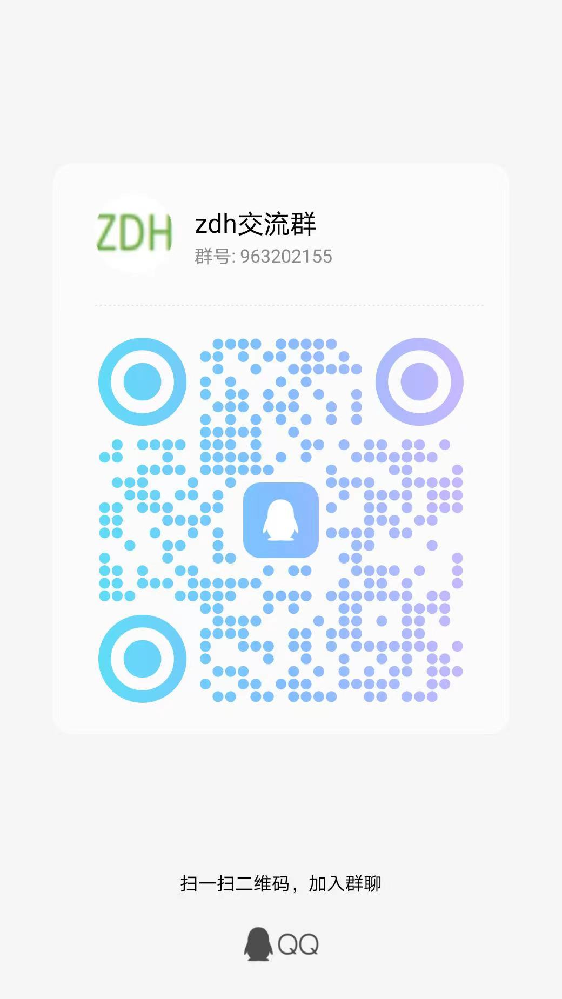

<!-- START doctoc generated TOC please keep comment here to allow auto update -->
<!-- DON'T EDIT THIS SECTION, INSTEAD RE-RUN doctoc TO UPDATE -->
**Table of Contents**  *generated with [DocToc](https://github.com/thlorenz/doctoc)*

- [READ MORE](#read-more)
- [数据采集,处理,监控,调度,管理一体化平台](#%E6%95%B0%E6%8D%AE%E9%87%87%E9%9B%86%E5%A4%84%E7%90%86%E7%9B%91%E6%8E%A7%E8%B0%83%E5%BA%A6%E7%AE%A1%E7%90%86%E4%B8%80%E4%BD%93%E5%8C%96%E5%B9%B3%E5%8F%B0)
- [整体系统层次图](#%E6%95%B4%E4%BD%93%E7%B3%BB%E7%BB%9F%E5%B1%82%E6%AC%A1%E5%9B%BE)
- [项目模块划分](#%E9%A1%B9%E7%9B%AE%E6%A8%A1%E5%9D%97%E5%88%92%E5%88%86)
- [开源/闭源版本](#%E5%BC%80%E6%BA%90%E9%97%AD%E6%BA%90%E7%89%88%E6%9C%AC)
- [下载编译包](#%E4%B8%8B%E8%BD%BD%E7%BC%96%E8%AF%91%E5%8C%85)
- [在线预览](#%E5%9C%A8%E7%BA%BF%E9%A2%84%E8%A7%88)
- [快速开始](#%E5%BF%AB%E9%80%9F%E5%BC%80%E5%A7%8B)
  - [基础环境](#%E5%9F%BA%E7%A1%80%E7%8E%AF%E5%A2%83)
  - [配置修改(最少修改如下配置)](#%E9%85%8D%E7%BD%AE%E4%BF%AE%E6%94%B9%E6%9C%80%E5%B0%91%E4%BF%AE%E6%94%B9%E5%A6%82%E4%B8%8B%E9%85%8D%E7%BD%AE)
  - [源码编译](#%E6%BA%90%E7%A0%81%E7%BC%96%E8%AF%91)
  - [运行](#%E8%BF%90%E8%A1%8C)
- [FAQ](#faq)
- [提示](#%E6%8F%90%E7%A4%BA)
- [特色](#%E7%89%B9%E8%89%B2)
- [使用场景](#%E4%BD%BF%E7%94%A8%E5%9C%BA%E6%99%AF)
- [主要功能](#%E4%B8%BB%E8%A6%81%E5%8A%9F%E8%83%BD)
- [用到的技术体系](#%E7%94%A8%E5%88%B0%E7%9A%84%E6%8A%80%E6%9C%AF%E4%BD%93%E7%B3%BB)
- [个人联系方式](#%E4%B8%AA%E4%BA%BA%E8%81%94%E7%B3%BB%E6%96%B9%E5%BC%8F)
- [权益](#%E6%9D%83%E7%9B%8A)
- [界面预览](#%E7%95%8C%E9%9D%A2%E9%A2%84%E8%A7%88)
- [支持&赞赏](#%E6%94%AF%E6%8C%81%E8%B5%9E%E8%B5%8F)

<!-- END doctoc generated TOC please keep comment here to allow auto update -->

# READ MORE
[English description](README_en.md)

# 数据采集,处理,监控,调度,管理一体化平台
    因本项目没有其他文档,请使用者及开发者详细阅读完本readme 文档,后期会以博客的形式对本项目进行详细功能说明
   博客目录地址：  [https://blog.csdn.net/zhaoyachao123/article/details/113913947](https://blog.csdn.net/zhaoyachao123/article/details/113913947)
   
   欢迎你对本项目提出相关issue
   
   本平台主要目的
   + 高效的进行数据采集,构建自己的大数据平台
   + 统一数据管理,对数据进行高效分析及对外输出
   + 通过工具完成大部分工作,减少开发者的工作量
   + 降低使用者标准,通过拖拉拽实现数据的采集(任务依赖关系由自带调度完成-优势)
   + 本平台的初衷及目的尽量减少开发者的工作量及降低数据开发者的使用门槛
   + 基于当前大数据平台开发智能营销风控系统
   + 学习技术并结合场景迭代产品
   
# 整体系统层次图

   
# 项目模块划分
      项目涉及方向较多,技术杂乱
      包含以下几个项目,以下几个项目都是单独的git仓库
      zdh_web: zdh系列项目web管理端,提供可视化配置,比如ETL,调度,mock服务,权限管理,数仓模块等
      zdh_spark: 基于spark的etl处理,必须依赖zdh_web github: https://github.com/zhaoyachao/zdh_server
      zdh_flinkx: 基于flink sql的etl处理,必须依赖zdh_web github: https://github.com/zhaoyachao/zdh_flinkx
      zdh_mock: 基于netty的http-mock服务,必须依赖zdh_web github: https://github.com/zhaoyachao/zdh_mock
      zdh_rqueue: 计划开发一个非高性能的优先级可控队列(用于etl任务优先级控制),github: https://github.com/zhaoyachao/zdh_rqueue
      zdh_auth: 大数据统一权限管理(hadoop,hive,hbase,presto),开发中
      zdh_magic_mirror: 是一个客户管理模块,客户画像,智能营销等服务,主要包括common,label, plugin, ship, variable, 5个模块 github: https://github.com/zhaoyachao/zdh_magic_mirror
         common: 公共模块
         label: 客户管理-标签服务,必须依赖zdh_web,主要提供离线批量圈人功能
         plugin: 客户管理-通用插件服务,提供id_mapping,过滤,触达用户(发送短信,邮件等)
         ship: 客户管理-实时经营服务,实时接入用户流量,对用户做经营
         variable: 客户管理-变量服务,和label服务能力一样,区别在于一个离线处理,一个实时处理
     
   
    
   
# 开源/闭源版本
   + 全部开放源代码
   
# 下载编译包   
   + 编译包下载地址(只提供最新编译包下载,历史版本需要手动从源码构建)：
   + 执行编译好的包需要提前安装mysql8,redis
   
   + 历史版本不进行维护,可下载历史版本, 建议使用最新版本(功能更多)
     
   + 4.7.18版本全部采用maven管理,并重构quartz源码,4.7.18不可和之前任何历史版本重用
   + 4.7.18为4.x最后一个版本,5.x版本会重构所有代码,自2022-02-06~2022-06-01不进行新功能开发,此段时间会完善使用文档
     
   + 5.1.0之后版本不提供编译包下载,需要用户在github上自行编译
     

#  在线预览
   [http://zycblog.cn:8081/login](http://zycblog.cn:8081/login)
   
    用户名：zyc
    密码：123456
    
    服务器资源有限,界面只供预览,不包含数据处理部分,谢码友们手下留情

# 快速开始

## 基础环境
    1 执行编译好的包需要提前安装mysql8,redis
    2 jdk1.8
    
## 配置修改(最少修改如下配置)
    1 修改服务器端口默认8081
       对应参数server.port = 8081
    2 修改数据源连接(默认支持mysql8),外部数据库必须引入
       
    3 修改redis配置
        spring.redis.开头参数
        
    4 修改application-*配置文件中myid(多个服务依次1,2,3,...)
       对应参数myid=1
       
    5 修改bin/start.sh  bin/zdh_web.sh 脚本RUN_MODE参数用于选择配置文件
       此步骤最为重要,不可缺少, 默认RUN_MODE=prod 使用application-prod配置文件
    
## 源码编译
    sh build.sh

## 运行
    4.7.13 之前
      在target 目录下找到zdh_web.jar
      执行 java  -Dfile.encoding=utf-8 -jar zdh_web.jar  
    4.7.13及之后5.1.1之前
      进入在xxx-RELEASE 目录下
      执行 java -jar -Dfile.encoding=utf-8 -Dloader.path=libs/,conf zdh_web.jar 
      
    5.1.1及之后
      进入在xxx-RELEASE 目录下
      启动执行 sh bin/start.sh 或者 sh bin/zdh_web.sh start
      关闭执行 sh bin/stop.sh 或者 sh bin/zdh_web.sh stop
      
    idea开发工具运行源码须知
       需要提前设置环境变量,edit configurations->enviorment variables-> 新增ZDH_RUN_MODE=prod, 可选值tmp,prod,dev

# FAQ

   + sql结构报错
     quartz 相关的表必须大写
     
   + 日志级别修改
     修改日志文件logback 相关等级即可
     
   + 调度串行并行模式
     串行模式:会判断上次任务运行状态
     并行模式:不判断上次任务状态,时间会自动生成 
     
   + 数据表结构以release/db/zdh_xxx.sql 为准
   
   + 暂不支持读取kerberos 认证的hadoop,hive,hbase 服务,预计在5.x 版本实现kerberos 认证      
    
# 提示
   
    zdh 分2部分,前端配置+后端数据ETL处理,此部分只包含前端配置
    后端数据etl 请参见项目 https://github.com/zhaoyachao/zdh_server.git
    zdh_web 和zdh_server 保持同步 大版本会同步兼容 如果zdh_web 选择版本1.0 ,zdh_server 使用1.x 都可兼容
    二次开发同学 请选择dev 分支,dev 分支只有测试通过才会合并master,所以master 可能不是最新的,但是可保证可用性
    
    zdh 智能营销模块-还为完全开发完成,只有部分功能可用,之后可能会是一个类似saas服务的平台

# 特色
    开箱即用
    完全开源且免费
    大数据套件可选择性部署
    智能经营+风控
    二次开发
    弹性扩展(单台能跑,千台万台也能跑)
    
   
# 使用场景
  + 数据采集(本地上传数据,hdfs,jdbc,http,cassandra,mongodb,redis,kafka,hbase,es,sftp,hive)
  + 数据加密
  + 数据转换,数据离线同步,实时数据同步
  + 数据迁移
  + 质量检测
  + 元数据,指标管理
  + 调度系统(需要二开)
  + 智能经营, 金融风控
  + 企业数字化转型
  + oa系统辅助能力,权限,审批流等

# 主要功能
 zdh 主要的作用 是从hdfs,hive,jdbc,http-json接口 等数据源拉取数据,并转存到hdfs,hive,jdbc等其他数据源
 支持集群式部署
 
 
  + 支持sql标准函数
  + 支持界面选择配置
  + 支持快速复制已有任务
  + 支持外部调度工具(需要修改,新增特定接口)
  + 弹性扩展(可单机,可集群)
  + 支持客户级权限
  + 简单易用支持二次开发
  + 自带简单调度工具,可配置定时任务,时间序列任务,设定次数
  + 调度依赖
  + SQL数据仓库数据处理(单一数仓)
  + 质量检测,及对应报告
  + 支持SHELL 命令,SHELL 脚本,JDBC查询调度,HDFS查询调度
  + 支持本地上传,下载文件
  + 支持多源ETL
  + 任务监控
  + 灵活动态drools规则清理
  
# 用到的技术体系

    前端：Bootstrap
    后端：Springboot+shiro+redis+mybatis
    数据ETL引擎:Spark(hadoop,hive 可选择部署)

# 个人联系方式
    邮件：1209687056@qq.com
    代码所有都以开源,敢兴趣的码友可以下载自行研究,个人也可有偿进行定制化开发

# 权益
    因代码全部开源,谨防一些不法分子利用项目做违法等事情,均和本人无关,本人不承担任何责任,当他人因任何利益等和本人产生冲突时，最终解释权归本人所有
    
# 界面预览

[版本更新及迁移说明](release.md)

# 交流群

# 支持&赞赏
  如果当前项目对你有帮助或者提供便利, 你的赞赏会给作者带来更多的动力
  
 
 