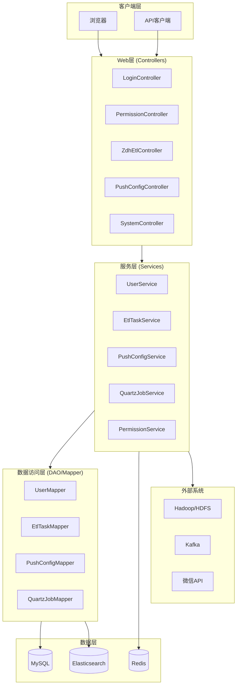

# ZDH Web 项目完整说明文档

## 1. 项目整体概述

### 1.1 项目定位
ZDH Web 是一个企业级数据集成与处理平台，专注于提供一站式的数据处理解决方案，包括 ETL 任务管理、数据质量监控、权限管理、推送配置等核心功能。

### 1.2 核心功能
- **ETL 任务管理**：支持多种类型的 ETL 任务，包括 DataX、Kettle、Flink、JDBC、SSH 等
- **数据推送配置**：管理推送配置，包括开关配置、数字配置和时间段配置
- **权限管理与用户认证**：基于 Shiro 的权限管理系统，支持用户、角色、权限的管理
- **数据质量监控**：监控数据质量，执行质量规则检查
- **工作流管理**：支持流程定义和执行
- **微信相关功能**：管理微信菜单、标签、模板消息等
- **系统监控与日志**：系统运行状态监控和日志管理

### 1.3 业务场景
- **数据仓库构建**：通过 ETL 任务将数据从源系统抽取、转换、加载到数据仓库
- **数据集成**：整合来自不同系统的数据，实现数据的统一管理
- **数据质量保障**：通过质量规则检查，确保数据的准确性和完整性
- **自动化数据处理**：通过任务调度，实现数据处理的自动化
- **权限与资源管理**：确保数据和系统资源的安全访问

## 2. 技术栈清单

### 2.1 编程语言
- **Java**：1.8 版本，后端主要开发语言
- **JavaScript**：前端开发语言
- **HTML/CSS**：前端页面构建

### 2.2 框架
- **Spring Boot**：2.3.4.RELEASE，后端应用框架
- **MyBatis**：3.x，ORM 框架
- **Shiro**：1.7.1，安全框架
- **Quartz**：2.3.2，任务调度框架
- **Bootstrap**：3.x，前端 UI 框架
- **jQuery**：2.x，前端 JavaScript 库
- **Layer**：3.x，前端弹出层组件

### 2.3 中间件
- **Redis**：缓存中间件
- **ActiveMQ**：消息队列
- **Elasticsearch**：搜索引擎
- **MongoDB**：文档数据库
- **Kafka**：消息队列

### 2.4 工具
- **Maven**：项目构建工具
- **Git**：版本控制工具
- **DataX**：数据迁移工具
- **Kettle**：ETL 工具
- **Flink**：流处理框架

## 3. API 接口详细信息（来自 smart_doc）

### 3.1 API 登录服务 (api.html)
| 接口名称 | 方法 | 路径 | 说明 |
|---------|------|------|------|
| 登录 | POST | /api/login | 用户登录 |
| 测试登录 | POST | /api/testLogin | 测试登录接口 |
| 退出 | GET | /api/logout | 用户登出 |
| 已废弃 | - | - | 已废弃接口 |

### 3.2 API 权限服务 (PermissionApi.html)
**注意**：ak,sk都是加密后的,接收到ak,sk需要提前解密验证

| 接口名称 | 方法 | 路径 | 说明 |
|---------|------|------|------|
| 申请产品获取ak,sk | - | - | 暂未实现 |
| 新增用户 | POST | /api/permission/user/add | 新增用户 |
| 更新用户信息 | PUT | /api/permission/user/update | 更新用户 |
| 启用/禁用用户 | PUT | /api/permission/user/enable | 启用禁用用户 |
| 批量启用/禁用用户 | PUT | /api/permission/user/batchEnable | 批量操作 |
| 根据用户名密码获取用户信息 | GET | /api/permission/user/getByUserName | 获取用户信息 |
| 获取用户信息 | GET | /api/permission/user/get | 获取用户详情 |
| 批量获取用户信息 | POST | /api/permission/user/getBatch | 批量获取用户 |
| 获取产品下所有用户 | GET | /api/permission/user/list | 产品用户列表 |
| 新增用户组 | POST | /api/permission/userGroup/add | 新增用户组 |
| 增加角色 | POST | /api/permission/role/add | 增加角色 |
| 禁用/启用角色 | PUT | /api/permission/role/enable | 角色启停 |
| 角色增加资源 | POST | /api/permission/role/addResource | 全量方式增加资源 |
| 根据role_code获取角色 | GET | /api/permission/role/getByCode | 获取角色详情 |
| 获取产品线下所有角色 | GET | /api/permission/role/list | 角色列表 |
| 获取角色下的用户列表 | GET | /api/permission/role/users | 角色用户列表 |
| 新增资源 | POST | /api/permission/resource/add | 新增资源 |
| 批量增加资源 | POST | /api/permission/resource/addBatch | 批量新增资源 |
| 通过用户账户获取资源信息 | GET | /api/permission/resource/getByUserAccount | 用户资源 |
| 通过角色code获取资源 | GET | /api/permission/resource/getByRoleCode | 角色资源 |
| 获取产品线下所有维度code | GET | /api/permission/dimension/list | 维度列表 |
| 获取产品线下所有维度值 | GET | /api/permission/dimensionValue/list | 维度值列表 |
| 获取用户在产品线下绑定的维度信息 | GET | /api/permission/dimensionValue/getUserDimValue | 用户维度 |
| 获取用户在产品线下所有维度值 | GET | /api/permission/dimensionValue/getUserAllDimValue | 用户全部维度值 |
| 获取用户组在产品线下绑定所有维度信息 | GET | /api/permission/dimensionValue/getUserGroupDimValue | 用户组维度 |
| 获取用户组在产品线下所有维度值信息 | GET | /api/permission/dimensionValue/getUserGroupAllDimValue | 用户组维度值 |

### 3.3 API 审批流服务 (ProcessFlowApi.html)
| 接口名称 | 方法 | 路径 | 说明 |
|---------|------|------|------|
| 测试流程审批回调 | POST | /api/processFlow/callback | 外部系统调用审批流 |
| 创建审批流 | POST | /api/processFlow/create | 创建审批流 |
| 获取审批流信息 | GET | /api/processFlow/info | 获取审批流信息 |
| 审批流操作 | POST | /api/processFlow/action | 审批、不通过、撤销 |

### 3.4 烽火台服务模块
#### 3.4.1 烽火台信息服务 (BeaconFireController.html)
| 接口名称 | 方法 | 说明 |
|---------|------|------|
| 烽火台信息列表首页 | GET | 列表页展示 |
| 烽火台信息列表 | GET | 分页查询列表 |
| 烽火台信息新增首页 | GET | 新增表单页 |
| 烽火台-脚本demo首页 | GET | 脚本示例页 |
| xx明细 | GET | 明细查询 |
| 烽火台信息更新 | PUT | 更新烽火台配置 |
| 烽火台信息新增 | POST | 新增烽火台配置 |
| 烽火台信息删除 | DELETE | 删除配置 |
| 告警任务-开启/关闭 | PUT | 控制告警开关 |

#### 3.4.2 烽火台告警信息服务 (BeaconFireAlarmMsgController.html)
| 接口名称 | 方法 | 说明 |
|---------|------|------|
| 烽火台告警信息列表首页 | GET | 告警列表页 |
| 烽火台告警信息列表 | GET | 分页查询告警 |
| 烽火台告警信息删除 | DELETE | 删除告警记录 |

#### 3.4.3 烽火台告警组信息服务 (BeaconFireAlarmGroupController.html)
| 接口名称 | 方法 | 说明 |
|---------|------|------|
| 烽火台告警组信息列表首页 | GET | 告警组列表页 |
| 烽火台告警组信息列表 | GET | 分页查询告警组 |
| 烽火台告警组信息新增首页 | GET | 新增告警组页 |
| xx明细 | GET | 告警组明细 |
| 烽火台告警组信息更新 | PUT | 更新告警组 |
| 烽火台告警组信息新增 | POST | 新增告警组 |
| 烽火台告警组信息删除 | DELETE | 删除告警组 |

### 3.5 ETL 任务管理模块
#### 3.5.1 ETL 主控制器 (ZdhEtlController.html)
| 接口名称 | 方法 | 说明 |
|---------|------|------|
| ETL任务列表首页 | GET | 任务列表页 |
| ETL任务列表 | GET | 分页查询任务 |
| ETL任务新增首页 | GET | 新增任务页 |
| ETL任务明细 | GET | 任务详情 |
| ETL任务更新 | PUT | 更新任务 |
| ETL任务新增 | POST | 新增任务 |
| ETL任务删除 | DELETE | 删除任务 |
| ETL任务执行 | POST | 执行任务 |
| ETL任务停止 | POST | 停止任务 |

#### 3.5.2 DataX 任务控制器 (ZdhDataxController.html)
| 接口名称 | 方法 | 说明 |
|---------|------|------|
| DataX任务列表首页 | GET | DataX列表页 |
| DataX任务列表 | GET | 分页查询DataX任务 |
| DataX任务新增首页 | GET | 新增DataX任务页 |
| DataX任务明细 | GET | DataX任务详情 |
| DataX任务更新 | PUT | 更新DataX任务 |
| DataX任务新增 | POST | 新增DataX任务 |
| DataX任务删除 | DELETE | 删除DataX任务 |
| DataX任务执行 | POST | 执行DataX任务 |
| DataX任务停止 | POST | 停止DataX任务 |

#### 3.5.3 其他ETL控制器
- **ZdhDataxAutoController.html**：DataX自动任务管理
- **ZdhJdbcController.html**：JDBC类型ETL任务
- **ZdhSshController.html**：SSH类型ETL任务
- **ZdhSqlController.html**：SQL类型ETL任务
- **ZdhKettleController.html**：Kettle类型ETL任务
- **ZdhFlinkController.html**：Flink类型ETL任务
- **ZdhUnstructureController.html**：非结构化数据处理
- **ZdhBatchController.html**：批量任务处理
- **ZdhDroolsController.html**：Drools规则引擎任务
- **ZdhMoreEtlController.html**：多源ETL任务
- **ZdhApplyController.html**：申请类ETL任务
- **ZdhQualityController.html**：数据质量检查任务

### 3.6 推送配置模块
#### 3.6.1 推送配置控制器 (PushConfigController.html)
| 接口名称 | 方法 | 说明 |
|---------|------|------|
| 推送配置列表首页 | GET | 配置列表页 |
| 推送配置列表 | GET | 分页查询配置 |
| 推送配置新增首页 | GET | 新增配置页 |
| 推送配置明细 | GET | 配置详情 |
| 推送配置更新 | PUT | 更新配置 |
| 推送配置新增 | POST | 新增配置 |
| 推送配置删除 | DELETE | 删除配置 |

#### 3.6.2 推送相关控制器
- **PushAppController.html**：推送应用管理
- **PushChannelController.html**：推送渠道管理
- **PushChannelPoolController.html**：推送渠道池管理
- **PushTemplateController.html**：推送模板管理
- **PushTaskController.html**：推送任务管理

### 3.7 权限管理模块
- **PermissionController.html**：权限控制
- **PermissionApiController.html**：API权限控制
- **PermissionDimensionController.html**：维度管理
- **PermissionDimensionValueController.html**：维度值管理
- **PermissionUserDimensionValueController.html**：用户维度值
- **PermissionUserGroupDimensionValueController.html**：用户组维度值

### 3.8 微信管理模块
- **WechatController.html**：微信主控
- **WechatMenuController.html**：微信菜单管理
- **WechatTagController.html**：微信标签管理
- **WechatMediaController.html**：微信素材管理
- **WechatQrcodeController.html**：微信二维码管理
- **WechatQrsceneController.html**：微信场景二维码
- **WechatRuleController.html**：微信规则管理
- **WechatDraftController.html**：微信草稿箱
- **WechatFollowController.html**：微信关注管理
- **WechatCommentController.html**：微信评论管理
- **WechatSendNewsController.html**：微信群发消息
- **WechatUserTagController.html**：微信用户标签

### 3.9 智能营销模块
- **StrategyGroupController.html**：策略组服务
- **ServiceManagerController.html**：服务控制
- **RiskEventController.html**：风控事件服务
- **PluginController.html**：插件服务
- **LabelController.html**：标签服务
- **IdMappingController.html**：ID转换服务
- **FilterController.html**：过滤服务
- **FunctionController.html**：函数服务
- **CrowdRuleController.html**：人群规则
- **CrowdFileController.html**：人群文件
- **CustomerManagerController.html**：客户经理
- **CustomerManageController.html**：客户管理
- **DataCodeController.html**：数据编码
- **TouchController.html**：触达配置
- **CommonController.html**：通用配置页面
- **VariableController.html**：变量管理
- **ProductTagController.html**：产品标签

### 3.10 系统管理模块
- **SystemController.html**：系统配置
- **LoginController.html**：登录认证
- **ProjectController.html**：项目管理
- **NodeController.html**：节点管理
- **DataSourcesController.html**：数据源管理
- **DataTagController.html**：数据标识（已废弃）
- **DataTagGroupController.html**：数据标识组（已废弃）
- **BloodSourceController.html**：血缘关系
- **ZdhEnumController.html**：枚举管理
- **ZdhParamController.html**：参数管理
- **ZdhOperateLogController.html**：操作日志
- **ZdhMonitorController.html**：监控管理
- **ZdhDispatchController.html**：调度管理
- **ZdhDownController.html**：下载管理
- **ZdhEtlLogController.html**：ETL日志
- **ZdhApprovalController.html**：审批管理
- **ZdhIssueDataController.html**：问题数据
- **ZdhSelfServiceController.html**：自助服务
- **ZdhRedisApiController.html**：Redis API
- **ZdhTestController.html**：测试接口
- **QueueController.html**：队列管理
- **CloudController.html**：云控制台
- **SecondaryDataSourceController.html**：第二数据源
- **AuthorController.html**：联系开发者
- **HelpDocumentController.html**：帮助文档
- **TestController.html**：测试控制器
- **MyErrorConroller.html**：错误处理
- **ProcessFlowApi.html**：审批流API

## 4. Java 实体类字段详解

### 4.1 EtlTaskInfo（ETL任务实体）
| 字段名 | 类型 | 说明 |
|-------|------|------|
| id | String | 主键ID |
| etl_context | String | 任务说明 |
| data_sources_choose_input | String | 输入数据源id |
| data_source_type_input | String | 输入数据源类型 |
| data_sources_table_name_input | String | 输入数据源表名 |
| data_sources_file_name_input | String | 输入数据源文件名 |
| data_sources_file_columns | String | 输入数据源文件中字段名 |
| data_sources_table_columns | String | 输入数据源表字段名 |
| file_type_input | String | 文件类型 |
| encoding_input | String | 文件编码 |
| header_input | String | 是否有头标题 |
| repartition_num_input | String | 重新洗牌个数 |
| repartition_cols_input | String | 重新洗牌字段 |
| sep_input | String | 文件分割符 |
| data_sources_params_input | String | 输入数据源其他参数 |
| data_sources_filter_input | String | 输入数据源过滤条件 |
| data_sources_choose_output | String | 输出数据源id |
| data_source_type_output | String | 输出数据源类型 |
| data_sources_table_name_output | String | 输出数据源表名 |
| data_sources_file_name_output | String | 输出数据源文件名 |
| file_type_output | String | 文件类型 |
| encoding_output | String | 文件编码 |
| header_output | String | 是否有头标题 |
| sep_output | String | 文件分割符 |
| model_output | String | 写入模式 |
| partition_by_output | String | 分区字段 |
| merge_output | String | 合并小文件个数 |
| data_sources_params_output | String | 输出数据源其他参数 |
| column_datas | String | 输入-输出字段映射关系json |
| data_sources_clear_output | String | 输出数据源删除条件 |
| owner | String | 拥有者 |
| create_time | Timestamp | 创建时间 |
| company | String | 公司 |
| section | String | 部门 |
| service | String | 业务 |
| update_context | String | 更新内容 |
| primary_columns | String | 主键字段(多个逗号分割) |
| column_size | String | 字段量 |
| rows_range | String | 行范围(xxx-xxx) |
| error_rate | String | 容错率 |

### 4.2 QuartzJobInfo（调度任务实体）
| 字段名 | 类型 | 说明 |
|-------|------|------|
| job_id | String | 调度任务ID |
| job_context | String | 任务说明 |
| more_task | String | 多源任务(MORE_ETL,ETL,SQL) |
| job_type | String | 任务类型(EMAIL,RETRY,CHECK,ETL) |
| start_time | Timestamp | 开始时间 |
| end_time | Timestamp | 结束时间 |
| step_size | String | 步长(自定义调度间隔) |
| job_model | String | 执行模式(1:顺时间执行,2:执行一次,3:重复执行) |
| plan_count | String | 计划执行次数 |
| count | long | 执行次数 |
| params | String | 自定义参数 |
| last_status | String | 上次任务执行状态 |
| last_time | Timestamp | 上次任务执行时间 |
| next_time | Timestamp | 下次执行时间 |
| expr | String | quartz表达式 |
| status | String | 任务状态(create,running,pause,finish,remove,error) |
| interval_time | String | 失败重试间隔 |
| alarm_account | String | 告警账号 |
| time_out | String | 超时时间(默认86400秒) |
| priority | String | 优先级(默认5) |
| quartz_time | Timestamp | quartz时间 |
| use_quartz_time | String | 是否使用quartz触发时间(on/off/null) |
| time_diff | String | 回退时间差(单位秒) |
| jsmind_data | String | 任务信息json字符串 |
| alarm_email | String | 开启邮箱告警(on/off) |
| alarm_sms | String | 开启短信告警(on/off) |
| alarm_zdh | String | 开启zdh告警(on/off) |
| notice_error | String | 开启失败通知(on/off) |
| notice_finish | String | 开启完成通知(on/off) |
| owner | String | 拥有者 |

### 4.3 PushConfigInfo（推送配置实体）
| 字段名 | 类型 | 说明 |
|-------|------|------|
| id | String | 主键ID |
| config_key | String | 配置标识(唯一key) |
| config_name | String | 配置名称 |
| config_type | String | 配置类型(switch/number/schedule) |
| config | String | app配置(json结构) |
| config_json | Map<String,Object> | 配置JSON(map类型,直接使用) |
| product_code | String | 产品代码 |

**config_json 结构示例**：
```json
{
  "status": 1,
  "thread_size": 2,
  "schedule_time": "0 0 8 * * ?"
}
```

### 4.4 User（用户实体）
| 字段名 | 类型 | 说明 |
|-------|------|------|
| id | String | ID |
| userName | String | 用户账号 |
| password | String | 密码 |
| email | String | 邮箱 |
| is_use_email | String | 是否开启邮箱(on/off) |
| phone | String | 手机号 |
| is_use_phone | String | 是否开启手机(on/off) |
| enable | String | 是否启用(true/false) |
| user_group | String | 用户组 |
| signature | String | 签名 |
| product_code | String | 产品代码 |
| roles | List<String> | 角色列表 |

### 4.5 RoleInfo（角色实体）
| 字段名 | 类型 | 说明 |
|-------|------|------|
| id | String | ID |
| code | String | 角色code |
| name | String | 角色名称 |
| enable | String | 是否启用(true/false) |
| create_time | Timestamp | 创建时间 |
| update_time | Timestamp | 修改时间 |
| product_code | String | 产品代码 |

### 4.6 BaseProductAuthInfo（基础权限实体）
| 字段名 | 类型 | 说明 |
|-------|------|------|
| product_code | String | 产品代码 |
| auth | Auth | 权限对象 |
| auth.is_manager | String | 是否管理员 |
| auth.actions | Map<String,String> | 操作权限映射 |

## 5. 枚举值定义

### 5.1 RETURN_CODE（返回码枚举）
| 值 | code | desc | 说明 |
|---|------|------|------|
| SUCCESS | 200 | success | 成功 |
| FAIL | 201 | fail | 失败 |

### 5.2 JobStatus（任务状态枚举）
| 值 | desc | 说明 |
|---|------|------|
| non | 无状态 | 异步数据一致性 |
| create | 实例创建 | 任务创建完成 |
| dispatch | 调度中 | 调度程序调度中(依赖型检查任务) |
| check_dep | 检查依赖中 | 正在检查任务依赖 |
| check_dep_finish | 检查依赖完成 | 依赖检查完成 |
| wait_retry | 等待重试中 | 等待重试 |
| error | 异常 | 任务执行异常 |
| etl | 数据采集中 | 正在执行ETL |
| kill | 杀死中 | 正在停止任务 |
| killed | 已杀死 | 任务已被停止 |
| finish | 完成 | 数据采集完成 |
| sub_task_dispatch | 子任务调度中 | 子任务正在调度 |
| skip | 跳过 | 任务被跳过 |
| pause | 暂停 | 仅适用调度发现模块 |

### 5.3 JobType（任务类型枚举）
| 值 | desc | 说明 |
|---|------|------|
| ETL | ETL任务 | 数据采集任务 |
| EMAIL | 邮件任务 | 发送邮件任务 |
| RETRY | 重试任务 | 重试执行任务 |
| CHECK | 检查任务 | 检查类任务 |

### 5.4 Const（常量类）- 关键常量
```java
// 日志相关
MDC_LOG_ID = "logId"
MDC_USER_ID = "user_id"
SHIRO_SESSION_CACHE_NAME = "shiro-activeSessionCache1"

// 角色相关
SUPER_ADMIN_ROLE = "super_admin"
SYSTEM_ALARM_USER = "system_alarm_user"

// 状态常量
STATUS_COMMON_INIT = "1"        // 初始化状态
STATUS_COMMON_RUNNING = "2"      // 运行中状态
STATUS_COMMON_SUCCESS = "3"      // 成功状态
STATUS_COMMON_FAIL = "4"         // 失败状态

// 开关常量
ON = "on"
OFF = "off"
TRUE = "true"
FALSE = "false"

// 数据源类型
DATA_SOURCE_TYPE_MYSQL = "mysql"
DATA_SOURCE_TYPE_ORACLE = "oracle"
DATA_SOURCE_TYPE_POSTGRESQL = "postgresql"
DATA_SOURCE_TYPE_SQLSERVER = "sqlserver"
DATA_SOURCE_TYPE_HIVE = "hive"
DATA_SOURCE_TYPE_ES = "elasticsearch"
DATA_SOURCE_TYPE_MONGODB = "mongodb"
DATA_SOURCE_TYPE_HDFS = "hdfs"
DATA_SOURCE_TYPE_SFTP = "sftp"
DATA_SOURCE_TYPE_FTP = "ftp"

// 文件类型
FILE_TYPE_CSV = "csv"
FILE_TYPE_EXCEL = "excel"
FILE_TYPE_JSON = "json"
FILE_TYPE_TXT = "txt"
FILE_TYPE_PARQUET = "parquet"

// ETL任务类型
ETL_TASK_TYPE_DATAX = "datax"
ETL_TASK_TYPE_KETTLE = "kettle"
ETL_TASK_TYPE_FLINK = "flink"
ETL_TASK_TYPE_JDBC = "jdbc"
ETL_TASK_TYPE_SSH = "ssh"
ETL_TASK_TYPE_SQL = "sql"
ETL_TASK_TYPE_UNSTRUCTURE = "unstructure"
```

## 6. HTML 页面字段信息

### 6.1 推送配置页面 (push_config_index.html)
**表格列定义**：
| 列名 | 字段 | 类型 | 说明 |
|-----|------|------|------|
| 配置ID | id | string | 主键ID |
| 配置标识 | config_key | string | 唯一key |
| 配置名称 | config_name | string | 配置显示名称 |
| 配置类型 | config_type | string | switch/number/schedule |
| 开关状态 | status | number | 从config_json解析(0/1) |
| 线程数 | thread_size | number | 从config_json解析 |
| 时间段 | schedule_time | string | Cron表达式 |
| 操作 | - | button | 编辑/删除按钮 |

### 6.2 推送配置添加/编辑页面 (push_config_add_index.html)
**表单字段**：
| 字段名 | 字段ID | 类型 | 必填 | 说明 |
|-------|--------|------|------|------|
| 配置标识 | config_key | text | 是 | 唯一标识 |
| 配置名称 | config_name | text | 是 | 显示名称 |
| 配置类型 | config_type | select | 是 | switch/number/schedule |
| 开关状态 | status | switch | 否 | 0关闭/1开启 |
| 线程数量 | thread_size | number | 否 | 数字配置 |
| 时间段表达式 | schedule_time | text | 否 | Cron格式 |
| Cron帮助链接 | - | link | 否 | 打开Cron生成器 |

**JavaScript 函数**：
- `saveConfig()`：保存配置（封装为局部函数，避免全局污染）
- `loadConfig(id)`：加载配置详情
- `validateForm()`：表单验证
- `generateCronLink()`：生成Cron表达式帮助链接

### 6.3 ETL任务页面 (etl_task_add_index.html)
**主要字段分组**：

**输入数据源配置**：
- 输入数据源选择：data_sources_choose_input
- 数据源类型：data_source_type_input
- 表名/文件名：data_sources_table_name_input / data_sources_file_name_input
- 字段映射：data_sources_file_columns / data_sources_table_columns
- 文件属性：file_type_input, encoding_input, header_input, sep_input
- 高级设置：repartition_num_input, repartition_cols_input
- 过滤条件：data_sources_filter_input
- 其他参数：data_sources_params_input

**输出数据源配置**：
- 输出数据源选择：data_sources_choose_output
- 数据源类型：data_source_type_output
- 表名/文件名：data_sources_table_name_output / data_sources_file_name_output
- 文件属性：file_type_output, encoding_output, header_output, sep_output
- 写入模式：model_output
- 分区设置：partition_by_output
- 合并设置：merge_output
- 清理条件：data_sources_clear_output
- 其他参数：data_sources_params_output

**字段映射配置**：
- column_datas：JSON格式的字段映射关系

**任务基本信息**：
- 任务说明：etl_context
- 拥有者：owner
- 公司/部门/业务：company, section, service
- 主键字段：primary_columns
- 行范围：rows_range
- 容错率：error_rate

## 7. 数据库表结构概览

### 7.1 核心业务表
| 表名 | 对应实体 | 说明 |
|-----|---------|------|
| etl_task_info | EtlTaskInfo | ETL任务配置表 |
| quartz_job_info | QuartzJobInfo | 调度任务表 |
| push_config_info | PushConfigInfo | 推送配置表 |
| user_info | User | 用户信息表 |
| role_info | RoleInfo | 角色信息表 |
| data_sources_info | DataSourcesInfo | 数据源配置表 |
| project_info | ProjectInfo | 项目信息表 |
| task_log_instance | TaskLogInstance | 任务日志实例表 |
| etl_task_log_info | EtlTaskLogInfo | ETL任务日志表 |

### 7.2 权限相关表
| 表名 | 说明 |
|-----|------|
| user_group_info | 用户组信息 |
| permission_resource_info | 权限资源 |
| role_resource_info | 角色资源关联 |
| permission_dimension_info | 维度定义 |
| permission_dimension_value_info | 维度值定义 |

### 7.3 推送相关表
| 表名 | 说明 |
|-----|------|
| push_app_info | 推送应用 |
| push_channel_info | 推送渠道 |
| push_channel_pool_info | 渠道池 |
| push_template_info | 推送模板 |
| push_task_log | 推送任务日志 |

## 8. 系统架构图



## 9. 核心配置文件说明

### 9.1 application.properties（基础配置）
```properties
# 服务器端口
server.port=8080

# 数据库连接
spring.datasource.url=jdbc:mysql://localhost:3306/zdh?useUnicode=true&characterEncoding=utf-8
spring.datasource.username=root
spring.datasource.password=root
spring.datasource.driver-class-name=com.mysql.jdbc.Driver

# Druid连接池配置
spring.datasource.type=com.alibaba.druid.pool.DruidDataSource
spring.datasource.initialSize=5
spring.datasource.minIdle=5
spring.datasource.maxActive=20
spring.datasource.maxWait=60000

# Redis配置
spring.redis.host=localhost
spring.redis.port=6379
spring.redis.database=0

# MyBatis配置
mybatis.mapper-locations=classpath:mapper/*.xml
mybatis.type-aliases-package=com.zyc.zdh.entity
mybatis.configuration.map-underscore-to-camel-case=true

# Shiro配置
shiro.loginUrl=/login
shiro.successUrl=/index
shiro.unauthorizedUrl=/403

# Quartz配置
org.quartz.scheduler.instanceName=ZDHScheduler
org.quartz.threadPool.threadCount=10
```

### 9.2 多数据源配置（application-tmp.properties）
```properties
# 第一数据源（主库）
spring.datasource.url=jdbc:mysql://localhost:3306/zdh
spring.datasource.username=zdh_user
spring.datasource.password=zdh_password

# 第二数据源（从库）
datasource2.url=jdbc:mysql://localhost:3306/mydb
datasource2.username=mydb_user
datasource2.password=mydb_password
```

## 10. 启动&部署指南

### 10.1 本地运行步骤
1. **环境准备**
   - JDK 1.8+
   - MySQL 5.7+
   - Redis 3.x+
   - Maven 3.6+

2. **数据库初始化**
   ```sql
   source release/db/zdh.sql
   ```

3. **配置修改**
   - 编辑 `release/conf/application.properties`
   - 修改数据库连接信息
   - 修改Redis连接信息

4. **启动应用**
   ```bash
   # 方式1：IDE启动
   运行 com.zyc.zdh.ZdhApplication.main()
   
   # 方式2：Maven启动
   mvn spring-boot:run
   
   # 方式3：打包运行
   mvn clean package
   sh bin/start.sh prod
   ```

5. **访问应用**
   - 地址：http://localhost:8080
   - 默认账号：admin/admin123

### 10.2 打包部署命令
```bash
# Windows环境
build.bat

# Linux环境
./build.sh

# 或使用Maven
mvn clean package -Dmaven.test.skip=true
```

### 10.3 生产部署注意事项
- 使用 `application-prod.properties` 配置文件
- 配置数据库连接池参数优化
- 启用Redis持久化
- 配置日志输出路径
- 设置合理的JVM参数
- 配置反向代理（Nginx）

## 11. 开发规范

### 11.1 目录命名规范
- 包名：全小写，`com.zyc.zdh.xxx`
- Controller：`xxxController`
- Service：`xxxService` / `xxxServiceImpl`
- DAO/Mapper：`xxxMapper` / `xxxDao`
- Entity：`xxxInfo` / `xxxEntity`
- 页面目录：按功能模块划分（etl/push/admin等）

### 11.2 编码风格
- 缩进：4个空格
- 类命名：大驼峰（PascalCase）
- 方法/变量命名：小驼峰（camelCase）
- 常量命名：全大写下划线分隔（UPPER_SNAKE_CASE）
- 注释：Javadoc风格

### 11.3 API设计规范
- RESTful风格
- 统一返回格式：ReturnInfo<T>
- 统一错误码：RETURN_CODE
- 统一权限注解：@RequiresPermissions
- 统一日志记录：@LogAnnotation

### 11.4 数据库规范
- 表名：小写+下划线（snake_case）
- 主键：id (varchar32)
- 通用字段：create_time, update_time, owner, product_code
- 软删除：is_delete (0/1)
- 权限字段：product_code, dim_group_id

## 12. 关键技术点说明

### 12.1 多数据源实现
- 使用Druid连接池管理多个数据源
- 通过@MapperScan指定不同数据源的Mapper扫描路径
- 使用AOP或ThreadLocal切换数据源
- 支持读写分离配置

### 12.2 权限控制机制
- 基于Shiro的RBAC权限模型
- 支持产品级隔离（product_code）
- 支持维度级权限控制
- 支持数据权限过滤
- API接口支持AK/SK认证

### 12.3 任务调度系统
- 基于Quartz的任务调度
- 支持Cron表达式配置
- 支持任务依赖关系
- 支持失败重试机制
- 支持任务优先级设置
- 支持超时控制

### 12.4 ETL引擎架构
- 插件化设计，支持多种ETL工具
- 统一的任务抽象层
- 支持多种数据源类型
- 支持字段自动映射
- 支持断点续传
- 支持错误容错

### 12.5 推送配置系统
- 支持多种配置类型（开关/数字/时间段）
- JSON格式存储配置项
- Map类型直接读取，无需JSON解析
- 支持Cron表达式定时
- 支持多渠道推送

## 13. 常见问题与解决方案

### 13.1 数据源连接问题
**问题**：dataSource already closed
**原因**：多数据源配置不当，连接被重复关闭
**解决**：
- 设置removeAbandoned=false
- 明确destroyMethod="close"
- 检查Bean生命周期管理

### 13.2 Mapper扫描问题
**问题**：Table 'mydb.xxx' doesn't exist
**原因**：Mapper扫描路径错误，使用了错误的数据源
**解决**：
- 检查@MapperScan的basePackages配置
- 确保不同数据源的Mapper在不同包下
- 验证数据源URL对应的数据库

### 13.3 任务调度问题
**问题**：任务不按时执行
**原因**：Cron表达式错误或时区问题
**解决**：
- 验证Cron表达式正确性
- 检查服务器时区配置
- 使用use_quartz_time参数控制

### 13.4 权限问题
**问题**：403无权限访问
**原因**：用户缺少对应权限或角色
**解决**：
- 检查用户角色分配
- 检查角色资源配置
- 检查product_code是否匹配
- 检查维度权限配置

## 14. 扩展与集成指南

### 14.1 新增ETL任务类型
1. 创建新的Entity类继承BaseProductAndDimGroupAuthInfo
2. 创建新的Controller处理HTTP请求
3. 创建新的Service实现业务逻辑
4. 创建新的Mapper操作数据库
5. 在smart_doc中添加API文档
6. 在前端添加对应页面

### 14.2 新增数据源类型
1. 在Const类中添加新的数据源类型常量
2. 在DataSourcesInfo中添加新类型的配置字段
3. 实现对应的数据读取逻辑
4. 在前端添加数据源配置表单

### 14.3 新增推送渠道
1. 在PushChannelInfo中添加渠道配置
2. 实现渠道发送逻辑
3. 在PushConfigInfo中添加渠道相关配置
4. 在前端添加渠道选择和配置

## 15. 版本历史

| 版本 | 日期 | 主要变更 |
|-----|------|---------|
| v5.6.0 | 2024-12-31 | 废弃DataTag模块 |
| v5.7.3 | 当前版本 | 多数据源支持、推送配置优化 |

## 16. 附录

### 16.1 有用的链接
- [Cron表达式在线生成器](https://cron.qqe2.com/)
- [Smart-Doc文档](https://github.com/smart-doc-group/smart-doc)
- [Druid官方文档](https://github.com/alibaba/druid/wiki/)
- [Shiro参考手册](http://shiro.apache.org/reference.html)

### 16.2 联系方式
- 作者邮箱：见 AuthorController
- 问题反馈：通过系统内"联系开发者"功能

---

**文档版本**：v2.0  
**最后更新**：2026-04-27  
**维护团队**：ZDH开发团队
