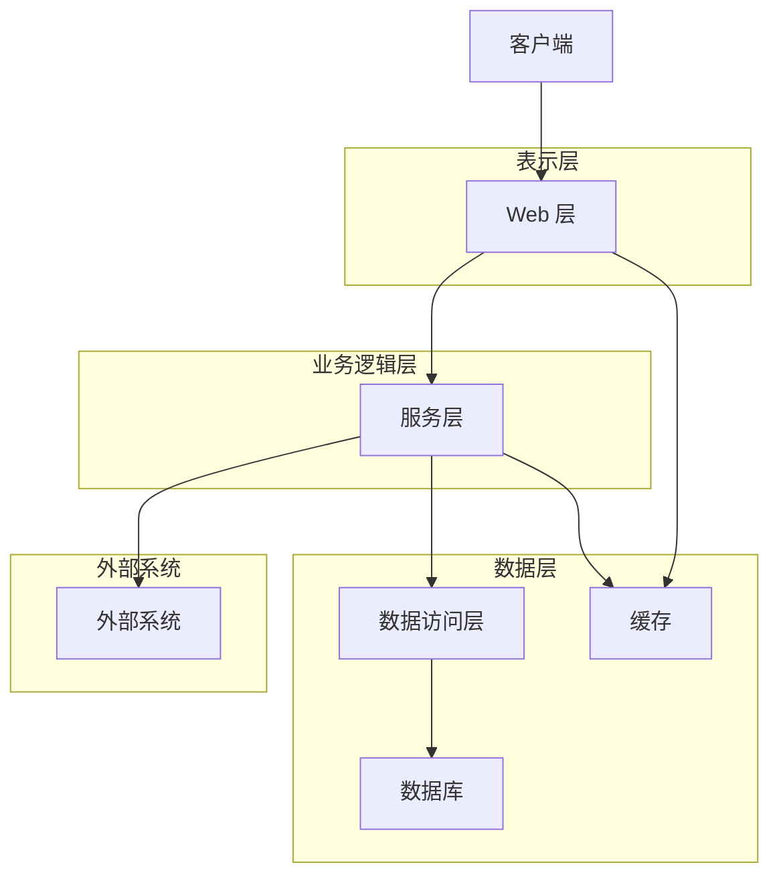

# ZDH Web 项目结构文档

## 1. 项目整体概述

### 1.1 项目名称
ZDH Web

### 1.2 技术栈
- **后端**：Java、Spring Boot、MyBatis、Shiro、Quartz、Redis
- **前端**：HTML、CSS、JavaScript、Bootstrap、jQuery、Layer
- **数据库**：支持多种数据库（通过 JDBC 驱动）
- **构建工具**：Maven

### 1.3 核心功能
- ETL 任务管理（包括 DataX、Kettle、Flink、JDBC 等多种任务类型）
- 数据推送配置与管理
- 权限管理与用户认证
- 系统监控与日志管理
- 数据质量检查
- 工作流管理
- 微信相关功能

### 1.4 适用场景
- 企业级数据集成与处理平台
- 数据仓库构建与管理
- 自动化数据处理流程
- 数据质量监控与管理
- 权限与资源管理系统

### 1.5 开发/构建工具
- IDE：IntelliJ IDEA 或 Eclipse
- 构建工具：Maven
- 版本控制：Git

## 2. 目录结构全景

```
zdh_web/
├── img/                  # 项目图片资源
├── lib/                  # 第三方依赖库（JDBC 驱动等）
├── release/              # 发布相关文件
│   ├── bin/              # 启动脚本
│   ├── conf/             # 配置文件
│   └── db/               # 数据库脚本
├── src/                  # 源代码
│   └── main/             # 主要源码
│       ├── java/         # Java 源代码
│       │   └── com/zyc/  # 包结构
│       │       ├── notscan/  # 不扫描的基础代码
│       │       └── zdh/      # 核心代码
│       └── webapp/       # Web 资源
│           └── WEB-INF/   # Web 配置和页面
│               └── zdh/   # 项目页面和资源
├── .gitattributes        # Git 属性配置
├── .gitignore            # Git 忽略配置
├── LICENSE               # 许可证
├── README.md             # 项目说明
├── README_en.md          # 英文项目说明
├── build.bat             # Windows 构建脚本
├── build.sh              # Linux 构建脚本
├── mvnw                  # Maven 包装器
├── mvnw.cmd              # Maven 包装器（Windows）
├── pom.xml               # Maven 配置文件
├── refash_readme.sh      # README 更新脚本
├── release.md            # 发布说明
├── screw.sh              # 数据库文档生成脚本
└── smart-doc.sh          # API 文档生成脚本
```

### 2.1 关键目录说明

#### 2.1.1 src/main/java/com/zyc/zdh/
- **annotation/**：自定义注解
- **aop/**：AOP 配置和切面
- **api/**：API 接口
- **cache/**：缓存管理
- **config/**：系统配置
- **dao/**：数据访问层（Mapper 接口）
- **datax_generator/**：DataX 配置生成器
- **entity/**：实体类
- **es/**：Elasticsearch 相关
- **exception/**：异常处理
- **filter/**：过滤器
- **hadoop/**：Hadoop 相关工具
- **ZdhApplication.java**：应用主入口

#### 2.1.2 src/main/webapp/WEB-INF/zdh/
- **admin/**：管理后台页面
- **beaconfire/**： Beacon Fire 相关页面
- **cron/**：Cron 表达式相关页面
- **css/**：样式文件
- **digitalmarket/**：数字营销相关页面
- **etl/**：ETL 任务相关页面
- **fonts/**：字体文件
- **html/**：通用 HTML 模板
- **js/**：JavaScript 文件
- **push/**：推送配置相关页面

#### 2.1.3 release/
- **bin/**：启动和停止脚本
- **conf/**：环境配置文件
- **db/**：数据库初始化脚本

## 3. 核心模块解析

### 3.1 ETL 任务管理模块
- **用途**：管理各种类型的 ETL 任务，包括 DataX、Kettle、Flink、JDBC 等
- **入口文件**：`src/main/java/com/zyc/zdh/controller/EtlTaskController.java`
- **核心类/函数**：
  - `EtlTaskService`：ETL 任务服务
  - `EtlTaskMapper`：ETL 任务数据访问
- **依赖组件**：Quartz（任务调度）、DataX、Kettle、Flink

### 3.2 推送配置模块
- **用途**：管理推送配置，包括开关配置、数字配置和时间段配置
- **入口文件**：`src/main/java/com/zyc/zdh/controller/PushConfigController.java`
- **核心类/函数**：
  - `PushConfigService`：推送配置服务
  - `PushConfigMapper`：推送配置数据访问
- **依赖组件**：Redis（缓存）

### 3.3 权限管理模块
- **用途**：管理用户、角色和权限
- **入口文件**：`src/main/java/com/zyc/zdh/controller/UserController.java`
- **核心类/函数**：
  - `ShiroConfig`：Shiro 安全配置
  - `UserService`：用户服务
  - `RoleService`：角色服务
- **依赖组件**：Shiro（安全框架）

### 3.4 数据质量模块
- **用途**：监控和管理数据质量
- **入口文件**：`src/main/java/com/zyc/zdh/controller/QualityController.java`
- **核心类/函数**：
  - `QualityService`：数据质量服务
  - `QualityRuleMapper`：质量规则数据访问
- **依赖组件**：Quartz（任务调度）

### 3.5 微信管理模块
- **用途**：管理微信相关功能，如菜单、标签、模板消息等
- **入口文件**：`src/main/java/com/zyc/zdh/controller/WechatController.java`
- **核心类/函数**：
  - `WechatService`：微信服务
  - `WechatMapper`：微信数据访问
- **依赖组件**：微信 SDK

## 4. 架构设计

### 4.1 分层架构图



### 4.2 分层职责
- **表示层（Web 层）**：处理 HTTP 请求，参数验证，返回响应
- **业务逻辑层（服务层）**：实现核心业务逻辑
- **数据层**：
  - 数据访问层：负责与数据库交互
  - 数据库：存储数据
  - 缓存：提高性能，减轻数据库压力
- **外部系统**：与外部系统集成，如微信、Hadoop 等

### 4.3 数据流
1. 客户端发送 HTTP 请求到 Web 层
2. Web 层接收请求，进行参数验证
3. Web 层调用服务层处理业务逻辑
4. 服务层可能会：
   - 调用数据访问层操作数据库
   - 访问缓存
   - 与外部系统交互
5. 服务层返回处理结果给 Web 层
6. Web 层将结果转换为 HTTP 响应返回给客户端

### 4.4 关键设计模式
- **MVC 模式**：Web 层使用 MVC 模式
- **单例模式**：服务层和工具类使用单例模式
- **工厂模式**：任务创建使用工厂模式
- **模板方法模式**：ETL 任务执行使用模板方法模式
- **策略模式**：不同类型的 ETL 任务使用策略模式

## 5. 核心文件说明

### 5.1 ZdhApplication.java
- **路径**：`src/main/java/com/zyc/zdh/ZdhApplication.java`
- **用途**：应用主入口，启动 Spring Boot 应用
- **关键逻辑**：
  - 标注 `@SpringBootApplication` 注解
  - 包含 `main` 方法，启动应用

### 5.2 ShiroConfig.java
- **路径**：`src/main/java/com/zyc/zdh/config/ShiroConfig.java`
- **用途**：配置 Shiro 安全框架
- **关键逻辑**：
  - 配置 SecurityManager
  - 配置 Realm
  - 配置过滤器链

### 5.3 QuartzConfig.java
- **路径**：`src/main/java/com/zyc/zdh/config/QuartzConfig.java`
- **用途**：配置 Quartz 任务调度
- **关键逻辑**：
  - 配置 SchedulerFactoryBean
  - 配置任务执行器

### 5.4 RedisConfig.java
- **路径**：`src/main/java/com/zyc/zdh/config/RedisConfig.java`
- **用途**：配置 Redis 缓存
- **关键逻辑**：
  - 配置 RedisTemplate
  - 配置缓存管理器

### 5.5 EtlTaskMapper.java
- **路径**：`src/main/java/com/zyc/zdh/dao/EtlTaskMapper.java`
- **用途**：ETL 任务数据访问接口
- **关键逻辑**：
  - 定义 ETL 任务的 CRUD 操作

### 5.6 PushConfigMapper.java
- **路径**：`src/main/java/com/zyc/zdh/dao/PushConfigMapper.java`
- **用途**：推送配置数据访问接口
- **关键逻辑**：
  - 定义推送配置的 CRUD 操作

### 5.7 UserMapper.java
- **路径**：`src/main/java/com/zyc/zdh/dao/AccountMapper.java`
- **用途**：用户数据访问接口
- **关键逻辑**：
  - 定义用户的 CRUD 操作
  - 定义用户登录验证操作

### 5.8 push_config_add_index.html
- **路径**：`src/main/webapp/WEB-INF/zdh/push/push_config_add_index.html`
- **用途**：推送配置添加/编辑页面
- **关键逻辑**：
  - 包含配置表单
  - 支持开关配置、数字配置和时间段配置

### 5.9 push_config.js
- **路径**：`src/main/webapp/WEB-INF/zdh/js/push/push_config.js`
- **用途**：推送配置列表页面的 JavaScript
- **关键逻辑**：
  - 初始化 Bootstrap Table
  - 处理表格事件
  - 格式化配置详情

### 5.10 push_config_add.js
- **路径**：`src/main/webapp/WEB-INF/zdh/js/push/push_config_add.js`
- **用途**：推送配置添加/编辑页面的 JavaScript
- **关键逻辑**：
  - 加载配置数据
  - 保存配置数据
  - 表单验证

## 6. 技术选型说明

### 6.1 后端技术
- **Spring Boot**：选择原因是快速开发、自动配置、内嵌容器。版本：2.x
- **MyBatis**：选择原因是灵活的 SQL 映射、易于集成。版本：3.x
- **Shiro**：选择原因是轻量级、易于使用的安全框架。版本：1.4.x
- **Quartz**：选择原因是成熟的任务调度框架。版本：2.x
- **Redis**：选择原因是高性能缓存、支持多种数据结构。版本：5.x+

### 6.2 前端技术
- **Bootstrap**：选择原因是响应式设计、丰富的组件。版本：3.x
- **jQuery**：选择原因是简化 DOM 操作、丰富的插件。版本：2.x
- **Layer**：选择原因是轻量级、美观的弹出层组件。版本：3.x

### 6.3 替代方案对比
- **Spring Boot vs Spring MVC**：Spring Boot 提供了更多自动配置，开发效率更高
- **MyBatis vs JPA**：MyBatis 提供了更灵活的 SQL 控制，适合复杂查询
- **Shiro vs Spring Security**：Shiro 更轻量级，配置更简单
- **Quartz vs Spring Task**：Quartz 提供了更丰富的调度功能
- **Redis vs Ehcache**：Redis 支持分布式缓存，适合集群环境

## 7. 开发规范

### 7.1 目录命名
- 使用小写字母和下划线
- 按功能模块组织目录
- 保持目录结构清晰

### 7.2 文件命名
- Java 文件：首字母大写，驼峰命名法
- HTML 文件：小写字母和下划线，使用 `_index.html` 后缀
- JavaScript 文件：小写字母和下划线
- CSS 文件：小写字母和下划线

### 7.3 代码风格
- 缩进：4 个空格
- 命名：
  - 类名：首字母大写，驼峰命名法
  - 方法名：首字母小写，驼峰命名法
  - 变量名：首字母小写，驼峰命名法
  - 常量名：全大写，下划线分隔
- 注释：使用 Javadoc 风格注释

### 7.4 注释规范
- 类注释：说明类的用途、作者、创建日期
- 方法注释：说明方法的用途、参数、返回值
- 关键代码注释：说明关键逻辑

### 7.5 提交规范
- 提交消息格式：`[模块] 描述`
- 提交内容：一次提交只包含一个功能或修复
- 提交前：运行代码检查和测试

## 8. 启动/部署流程

### 8.1 本地启动步骤
1. 克隆代码仓库：`git clone <仓库地址>`
2. 导入 IDE：使用 IntelliJ IDEA 或 Eclipse 导入 Maven 项目
3. 配置数据库：修改 `application.properties` 中的数据库连接信息
4. 启动应用：运行 `ZdhApplication.java` 的 `main` 方法
5. 访问应用：打开浏览器访问 `http://localhost:8080`

### 8.2 环境变量说明
- `SERVER_PORT`：服务器端口，默认 8080
- `DB_URL`：数据库连接 URL
- `DB_USERNAME`：数据库用户名
- `DB_PASSWORD`：数据库密码
- `REDIS_HOST`：Redis 主机地址
- `REDIS_PORT`：Redis 端口

### 8.3 打包/部署命令
- 打包：`mvn clean package`
- 部署：
  - Windows：运行 `release/bin/start.bat`
  - Linux：运行 `release/bin/start.sh`
- 停止：
  - Windows：运行 `release/bin/stop.bat`
  - Linux：运行 `release/bin/stop.sh`

## 9. 依赖说明

### 9.1 核心依赖包
- **spring-boot-starter-web**：Web 应用支持
- **mybatis-spring-boot-starter**：MyBatis 集成
- **shiro-spring-boot-starter**：Shiro 集成
- **spring-boot-starter-quartz**：Quartz 集成
- **spring-boot-starter-data-redis**：Redis 集成
- **mysql-connector-java**：MySQL 驱动
- **druid**：数据库连接池
- **commons-lang3**：工具类库
- **jackson-databind**：JSON 处理
- **logback-classic**：日志处理

### 9.2 版本约束
- Spring Boot：2.x
- MyBatis：3.x
- Shiro：1.4.x
- Quartz：2.x
- Redis：5.x+
- MySQL：5.7+

### 9.3 第三方库
- **DataX**：数据迁移工具
- **Kettle**：ETL 工具
- **Flink**：流处理框架
- **各种 JDBC 驱动**：支持多种数据库
